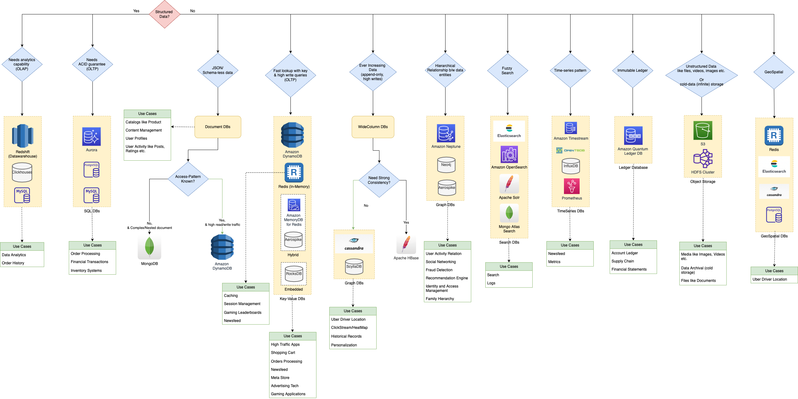
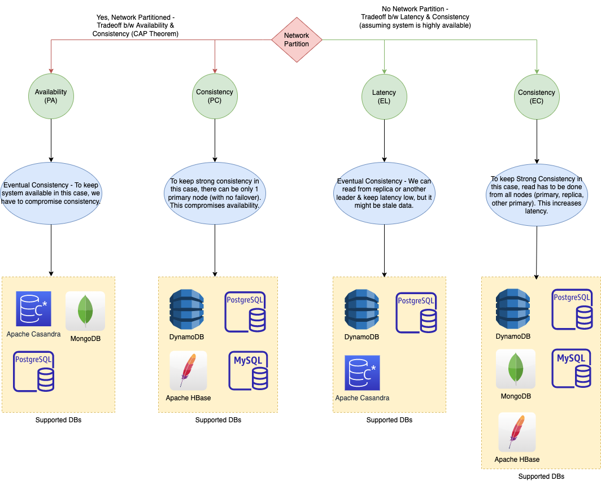

# Key Considerations

| Title                                                                | Category      | Remarks                                                                                                                                                                                                                                                                         |
|----------------------------------------------------------------------|---------------|---------------------------------------------------------------------------------------------------------------------------------------------------------------------------------------------------------------------------------------------------------------------------------|
| Microservices - Purpose built DB for each microservice               | Microservices | With modern application design such as [microservice architectures](../5_MicroServicesSOA/Readme.md), it is easier to scale and faster to develop applications with a denormalized schema because each service stores and processes data related to a single business function. |
| [SQL vs NoSQL](../SQLvsNoSQL/Readme.md)                              |               |                                                                                                                                                                                                                                                                                 |
| [All Databases list](../All-DBs-List.md)                             |               |                                                                                                                                                                                                                                                                                 |
| [DynamoDB vs MongoDB vs Casandra](DynamoDBVsMongoDBVsCasandra.md)    | NoSQL DB      |                                                                                                                                                                                                                                                                                 |
| [Sharding of the database](../PartitioningSharding/Readme.md)        | Sharding      | To scale the data store horizontally (& improve write scalability), shard the databases using [consistent hashing technique](PartitioningSharding/ConsistentHashing.md).                                                                                                        |
| [Partitioning Key Tips](../PartitioningSharding/PartitionKeyTips.md) | Sharding      | Decide partition key carefully (to prevent hot partition problem).                                                                                                                                                                                                              |

# Database design tips - How to choose database in the system design?

[Read more](../Readme.md)

# PACLEC Theorem

[Read more](../CAP&PACELCTheorems/Readme.md)