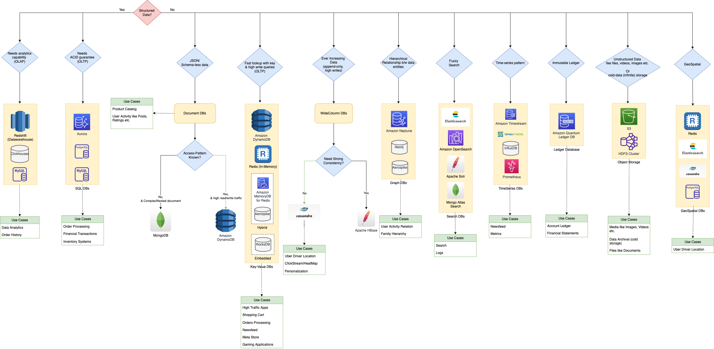
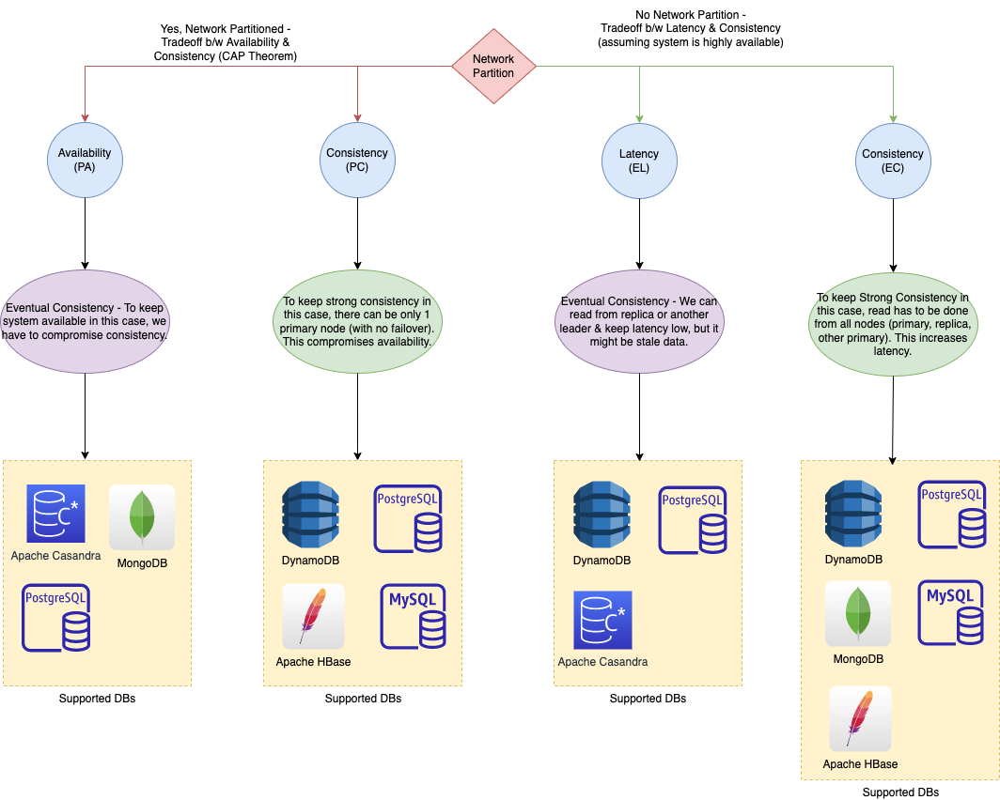

# NoSQL-DB types

| Feature              | :star: Key-Value Databases                                                                                                                                                            | Document Databases                                                                                                                                                           | Wide-Column Databases                                                                                                              | Graph Databases                                                                                                                                                                                                                                                               | [Time-Series DB](TimeSeriesDB)                                                                                                                           | [In-Memory](../In-Memory-DB)                                                                                                                                                                                  | Ledger                                                                                                                              |
|----------------------|---------------------------------------------------------------------------------------------------------------------------------------------------------------------------------------|------------------------------------------------------------------------------------------------------------------------------------------------------------------------------|------------------------------------------------------------------------------------------------------------------------------------|-------------------------------------------------------------------------------------------------------------------------------------------------------------------------------------------------------------------------------------------------------------------------------|----------------------------------------------------------------------------------------------------------------------------------------------------------|---------------------------------------------------------------------------------------------------------------------------------------------------------------------------------------------------------------|-------------------------------------------------------------------------------------------------------------------------------------|
| Key Strength         | High throughput/low latency reads/writes, endless scale.                                                                                                                              | Mobile, content management, personalization etc.                                                                                                                             | High number of writes, low reads etc.                                                                                              | Easily create and navigate relationship between data                                                                                                                                                                                                                          | Collect, store and process data sequenced by time.                                                                                                       | Query by key with microsecond latency                                                                                                                                                                         | Collect, Immutable and verifiable history of changes to app data.                                                                   |
| Use Case             | High-traffic web apps - Shopping Cart - Product catalogs - Gaming applications - Advertising tech etc.                                                                | Content management, catalogs, user profiles, Mobile Games, IOT etc.                                                                                                          | High-scale industrial apps for equipment maintenance - Fleet management - Route optimization - Historical records etc. | [Social networking, User Activity Relationship](../../0_HLDUseCasesProblems/SocialNetworkFacebookInstagram/Readme.md) - Fraud detection - Recommendation engines - Logistics & spatial data - Identity and access management etc.                             | Home screen feed - Monitoring/Dashboard - Application metrics - Internet of Things sensor data - Real-time analytics, Event tracing etc. | Caching - Session management - Gaming leaderboards - Geospatial applications etc.                                                                                                                 | Systems of record - Supply chain - Registrations - Banking transactions etc.                                            |
| Open Source Services |                                                                                                                                                                                       | [MongoDB](MongoDB/Readme.md), [Elastic Search](../Search-Databases/ElasticSearch), [CouchDB](https://couchdb.apache.org) etc.                                                | [Apache Casandra](WideColumnDB/ApacheCasandra.md) - [Apache HBase](WideColumnDB/ApacheHBase.md)                                | [Neo4j](GraphDB/Neo4j.md).                                                                                                                                                                                                                                                    |                                                                                                                                                          | [Redis](../In-Memory-DB/Redis/Readme.md)                                                                                                                                                                      |                                                                                                                                     |
| AWS Services         | [Amazon DynamoDB](../../2_AWSServices/6_DatabaseServices/AmazonDynamoDB/Readme.md)                                                                                                    | [Amazon DocumentDB (with MongoDB compatibility)](../../2_AWSServices/6_DatabaseServices), [Amazon DynamoDB](../../2_AWSServices/6_DatabaseServices/AmazonDynamoDB/Readme.md) | [Amazon Keyspaces (for Apache Cassandra)](../../2_AWSServices/6_DatabaseServices/AmazonKeySpaces.md)                               | [Amazon Neptune](https://aws.amazon.com/neptune/)                                                                                                                                                                                                                             | [InfluxDB](TimeSeriesDB/InfluxDB.md), [Amazon Timestream](https://aws.amazon.com/timestream/)                                                            | [Amazon Elastic Cache](../../2_AWSServices/6_DatabaseServices/AmazonElasticCache/Readme.md)                                                                                                                   | [Amazon Quantum Ledger Database (QLDB)](https://aws.amazon.com/qldb/)                                                               |
| Strength             | Very flexible, predictable performance and cost. - More than 20 million requests per second  - Less than 10-20 ms latency. - Able to handle a wide variety of data types. | Data is stored in [JSON-like documents](https://aws.amazon.com/nosql/document/) (complex/nested structure). - Each document can have an entirely different structure.    |                                                                                                                                    | Allow simple, fast retrieval of complex hierarchical structures - Great for real-time big data mining - Can rapidly identify common data points between nodes - Great for making relevant recommendations and allowing for rapid querying of those relationships. |                                                                                                                                                          | Support the most demanding applications requiring sub-millisecond response times - Great for caching, gaming, and session store - Adapt to changes in demands by scaling out and in without downtime. | Data that is rapidly changing or is seldom accessed - Application using the in-memory store has a low tolerance for stale data. |

# How to choose database in the system design?

[Read more](../../DatabaseDesignTips.md)

# PACLEC Theorem

[Read more](../Glossaries/PACELCTheorem/Readme.md)