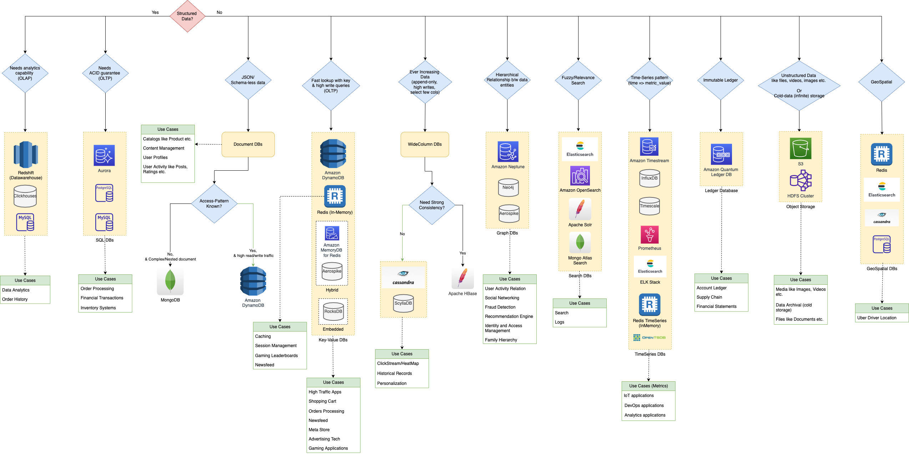

# NoSQL-DB types

| Feature      | :star: Key-Value Databases                                                                                                                                                            | Document Databases                                                                                                                                                        | Wide-Column Databases                                                                               | Graph Databases                                                                                                                                                                                                                                                               | [Time-Series DB](TimeSeriesDB)                                                                | [In-Memory](../In-Memory-Databases)                                                                                                                                                                                  | Ledger                                                                                                         |
|--------------|---------------------------------------------------------------------------------------------------------------------------------------------------------------------------------------|---------------------------------------------------------------------------------------------------------------------------------------------------------------------------|-----------------------------------------------------------------------------------------------------|-------------------------------------------------------------------------------------------------------------------------------------------------------------------------------------------------------------------------------------------------------------------------------|-----------------------------------------------------------------------------------------------|---------------------------------------------------------------------------------------------------------------------------------------------------------------------------------------------------------------|----------------------------------------------------------------------------------------------------------------|
| Key Strength | High throughput/low latency queries, endless scale.                                                                                                                                   | JSON storage with complex/nested structure                                                                                                                                | High number of writes, low reads etc.                                                               | Easily create and navigate relationship between data                                                                                                                                                                                                                          | Collect, store and process data sequenced by time.                                            | Query by key with microsecond latency                                                                                                                                                                         | Collect, Immutable and verifiable history of changes to app data.                                              |
| Services     | [Amazon DynamoDB](../../2_AWSServices/6_DatabaseServices/AmazonDynamoDB/Readme.md)                                                                                                    | [MongoDB](DocumentDB/MongoDB/Readme.md), [Elastic Search](../Search-Databases/ElasticSearch), [CouchDB](https://couchdb.apache.org) etc.                                             | [Apache Casandra](WideColumnDB/ApacheCasandra.md) - [Apache HBase](WideColumnDB/ApacheHBase.md) | [Neo4j](GraphDB/Neo4j.md), [Amazon Neptune](../../2_AWSServices/6_DatabaseServices/AmazonNeptune.md)                                                                                                                                                                          | [InfluxDB](TimeSeriesDB/InfluxDB.md), [Amazon Timestream](https://aws.amazon.com/timestream/) | [Redis](../In-Memory-Databases/Redis/Readme.md), [Amazon Elastic Cache](../../2_AWSServices/6_DatabaseServices/AmazonElasticCache/Readme.md)                                                                         | [Amazon Quantum Ledger Database (QLDB)](../../2_AWSServices/6_DatabaseServices/AmazonQuantumLedgerDatabase.md) |
| Remarks      | Very flexible, predictable performance and cost. - More than 20 million requests per second  - Less than 10-20 ms latency. - Able to handle a wide variety of data types. | Data is stored in [JSON-like documents](https://aws.amazon.com/nosql/document/) (complex/nested structure). - Each document can have an entirely different structure. |                                                                                                     | Allow simple, fast retrieval of complex hierarchical structures - Great for real-time big data mining - Can rapidly identify common data points between nodes - Great for making relevant recommendations and allowing for rapid querying of those relationships. |                                                                                               | Support the most demanding applications requiring sub-millisecond response times - Great for caching, gaming, and session store - Adapt to changes in demands by scaling out and in without downtime. |                                                                                                                |

# Database design tips - How to choose database in the system design?

[Read more](../DatabaseDesignTips.md)

# PACLEC Theorem

[Read more](../CAP&PACELCTheorems/Readme.md)