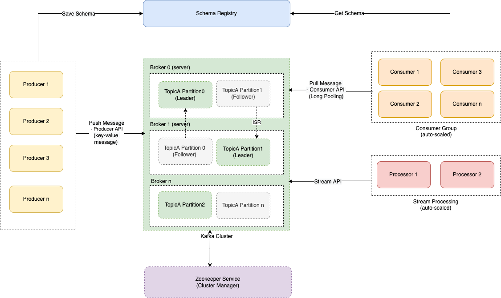

# Partitioning/Sharding
- For very large datasets, or very high query throughput, replication is not sufficient - we need to break the data up into partitions, also known as [sharding](https://aws.amazon.com/what-is/database-sharding/).
- Instead of one shard for writes, we partition/shard the database based on a partition key. 
- This would increase query throughput and overall system write throughput.

> Note - This partitioning is not related to network partition (in [CAP Theorem](../CAP&PACELCTheorems/CAPTheorem.md)).

# Key Terminologies

| Terminology                | Examples                                                                                                                                                  | Description                                                                                                                                                                             |
|----------------------------|-----------------------------------------------------------------------------------------------------------------------------------------------------------|-----------------------------------------------------------------------------------------------------------------------------------------------------------------------------------------|
| Partition Key              | User ID, Location ID, Photo ID etc.                                                                                                                       | Partitioning would be done based on a partition key.  - Hence we need to carefully [choose this key to distribute the data evenly b/w partitions](PartitionKeyTips.md).             |
| Hash Function              | MD5 as a hash function used in [Casandra](../NoSQL-Databases/WideColumnDB/ApacheCasandra.md), [MongoDB](../NoSQL-Databases/DocumentDB/MongoDB/Readme.md). | Hash function helps to determine the partition for a given key.                                                                                                                         |
| Secondary Indexes          | [Global Secondary Indexes in DynamoDB](../../2_AWSServices/6_DatabaseServices/AmazonDynamoDB/Readme.md)                                                   | [Read more](../DataStructuresUsedInDB/Indexing/Readme.md)                                                                                                                               |
| Consistent Hashing         |                                                                                                                                                           | This handles data sharding with dynamic number of servers.                                                                                                                              |
| Record-Unique-ID-Generator | DB Ticket Servers, which generates unique UUIDs. - [Social Network facebook](../../0_HLDUseCasesProblems/SocialNetworkFacebookInstagram/Readme.md)    | This is for non-sharding-builtin-DBs like Postgres.  - Since data is being inserted into many databases at the same time, we would have generate unique ID on the application side. |

# Supported Clusters

## Kafka Cluster

## ElasticSearch Cluster

## Redis Cluster

[Read more](../../2_AWSServices/6_DatabaseServices/AmazonElasticCache/Readme.md)

## Others
- [Amazon DynamoDB Cluster](../../2_AWSServices/6_DatabaseServices/AmazonDynamoDB/Partioning.md)
- [Apache Casandra](../NoSQL-Databases/WideColumnDB/ApacheCasandra.md) etc.
- [Instagram - Postgres Sharding](../../0_HLDUseCasesProblems/SocialNetworkFacebookInstagram/Readme.md)

# References
- [How Sharding Works?](https://medium.com/@jeeyoungk/how-sharding-works-b4dec46b3f6)
- [Sharding with Amazon Relational Database Service](https://aws.amazon.com/blogs/database/sharding-with-amazon-relational-database-service/)
- [Interviewbit - Sharding a database](https://www.interviewbit.com/problems/sharding-a-database/)
- [Sharding in MySQL Cluster](https://www.mysql.com/products/cluster/scalability.html)
- [Amazon RDS - Back to Basics: Database Sharding to Horizontally Scale Databases](https://www.youtube.com/watch?v=9q-ZA6WtVy4)