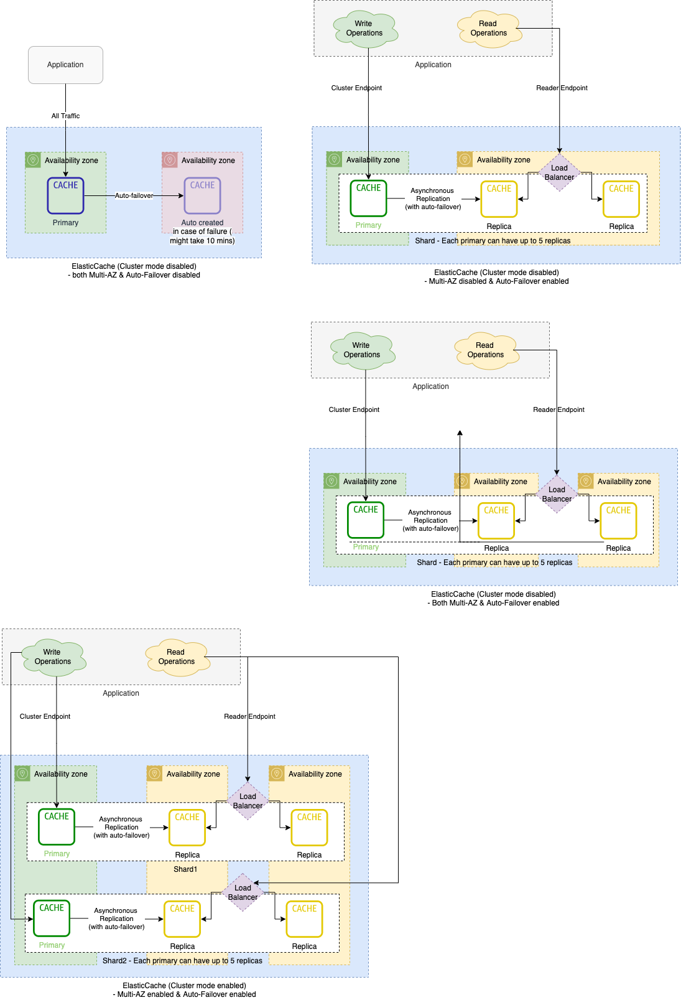

# DB Scalability Techniques

| Technique                                                                              | Type   | Use Cases                                                                                                                                                                                                                                                                                                             | Description                                                                                                                                                                                                                                                                                                                                                                         |
|----------------------------------------------------------------------------------------|--------|-----------------------------------------------------------------------------------------------------------------------------------------------------------------------------------------------------------------------------------------------------------------------------------------------------------------------|-------------------------------------------------------------------------------------------------------------------------------------------------------------------------------------------------------------------------------------------------------------------------------------------------------------------------------------------------------------------------------------|
| :star: [Single-leader technique](4_Consistency&Replication/SingleLeaderReplication.md) | Reads  | Almost all data-stores & message brokers use this for read scalability and reliability etc.                                                                                                                                                                                                                           | Being able to handle a higher volume of reads than a single machine could handle, by performing reads on replicas.                                                                                                                                                                                                                                                                  |
| :star: [Partitioning/Sharding](/3_DatabaseServices/3_PartitioningSharding/Readme.md)   | Writes | [Kafka Cluster](../4_MessageBrokersEDA/Kafka/Readme.md) - [Redis Cluster](8_InMemory-Databases/Redis/RedisCluster.md) - [Amazon Elastic Cache Cluster](../2_AWSServices/6_DatabaseServices/AmazonElasticCache/ClusterMode.md) - [ElasticSearch Cluster](9_Search-Databases/ElasticSearch/Cluster.md) etc. | For very large datasets, or very high query throughput, we would need to break the data up into partitions, also known as sharding - Instead of one shard for writes, we partition/shard the database based on a partition key which would increase query throughput. - In order to improve system reliability and read scalability, systems implement replication as well. |
| Vertical Scale-up (not-recommended)                                                    | Writes | SQL-DBs etc.                                                                                                                                                                                                                                                                                                          | Generally, it's NOT recommended to do vertical scalability (due to cost, other limitations)  - Horizontal scalability is more preferred.                                                                                                                                                                                                                                        |

# Amazon RDS Cluster

# Kafka Cluster

# ElasticSearch Cluster

# Redis Cluster

# References
- [Scalability and High Availability](https://dzone.com/refcardz/scalability)