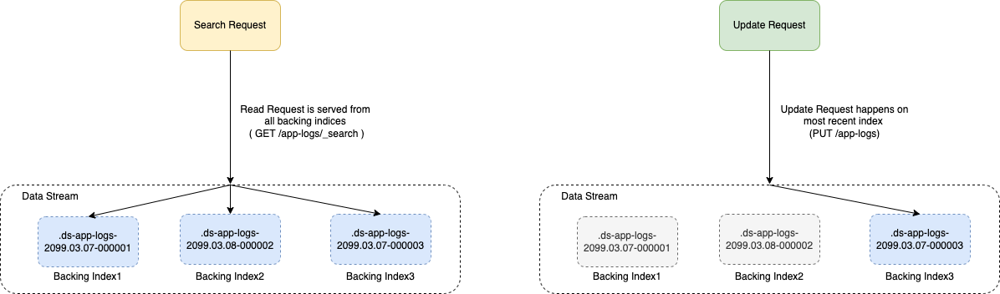

# Introduction
- [ElasticSearch](https://www.elastic.co/elasticsearch/) is a distributed, [RESTful modern search](../../../2_APITechOptions/REST.md) and analytics engine based on [Apache Lucene](../Readme.md).
- We can only interact with ElasticSearch through [REST APIs](../../../2_APITechOptions/REST.md).
- ElasticSearch can be deployed using [Amazon OpenSearch](../../../11_AWSServices/6_DatabaseServices/AmazonOpenSearch.md) service, on [AWS](../../../11_AWSServices).
- For data analysis, it operates alongside Kibana, and Logstash to form the [ELK stack](../../../8_ObservabilityLogsServices/ELK.md).
- ElasticSearch is [Paid and NOT open-sourced](https://www.elastic.co/pricing/).

# :star: Real world use cases of ElasticSearch
- [Zomato - HLD Design](../../../12_HLDDesignProblemsUC/FoodOrderingZomatoSwiggy/Readme.md)
- [Uber Driver Allocation](../../../12_HLDDesignProblemsUC/DriverAllocationUberGoJek/Readme.md)
- [Logging Solution in Distributed Systems](../../../12_HLDDesignProblemsUC/ObervabilityLoggingSolution/LoggingFileAggregation/Readme.md)
- [Flight Booking Search](../../../12_HLDDesignProblemsUC/FlightBookingSearchMakeMyTrip/Readme.md)
- [Grab - Search Index Optimization](../../../13_TechStacksRealWorld/GrabTechStack/SearchIndexing.md)
- [Shopify: Powering the search for better help documentation using Elastic Site Search](https://www.elastic.co/customers/shopify)

# :star: General Use Cases of Search-Indexes
- [Search - Full-text, Partial etc.](https://www.elastic.co/guide/en/elasticsearch/reference/current/full-text-queries.html)
- [Search - Fuzzy Query](https://www.elastic.co/guide/en/elasticsearch/reference/current/query-dsl-fuzzy-query.html)
- [Logs-analysis](../../../8_ObservabilityLogsServices/ELK.md)
- [Dashboard, Visualize data, Metrics etc.](../../../8_ObservabilityLogsServices/ELK.md)
- [Security, SIEM with ELK](../../../8_ObservabilityLogsServices/ELK.md)

# Key Features of ElasticSearch

## Different data types supported
- Textual
- Numerical
- [GeoSpatial (geo-point, geo-shape data types etc.)](#star-elasticsearch-geo-spatial-supportelasticsearchgeospatialsupportmd)
- Unstructured etc.

## REST APIs (JSON based)
- [Search APIs](https://www.elastic.co/guide/en/elasticsearch/reference/current/search.html) (`GET /my-index-000001/_search`)
- Document APIs
- Aggregation APIs
- Index APIs (`GET /_cat/indices`)
- Cluster APIs

## :star: ElasticSearch Cluster


[Read more](ElasticSearchCluster.md)

## ElasticSearch Data Streaming



[Read more](ElasticSearchDataStreams.md)

## :star: [ElasticSearch Geo Spatial Support](ElasticSearchGeoSpatialSupport.md)

## Data Storage Architecture
- Settings, index mapping, alternative cluster states, and other metadata are saved to Elasticsearch files outside the [Lucene](../Readme.md) environment.
- In [Apache Lucene](../Readme.md), data updates are resource-intensive operations, because segments are immutable, and every commit creates a new segment, then segments are merged automatically. 
- To avoid this excessive I/O, Elasticsearch creates dedicated transactional index logs, preventing low-level Lucene commits for each indexing procedure. 
- These logs can also be used for recovery in case of data corruption.

# What is NRT in Elasticsearch?
- NRT is a full form of [(Near Real-Time Search) platform](https://www.elastic.co/guide/en/elasticsearch/reference/current/near-real-time.html). 
- It is a near real-time search platform. 
- It means there is a slight latency (mostly one second) from when you index a document until it becomes very searchable.


# What is Ingest node?
- Ingest node is use for pre-process documents before the actual document indexing happens. 
- It helps you to intercepts bulk and index requests.
- It also applies transformations, and then it passes the documents back to the bulk API and index.

# Other Points
- [Installation using Docker ELK](https://github.com/deviantony/docker-elk)
- [GraphQL with ElasticSearch](ElasticSearchWithGraphQL.md)

# Sample Queries

## Sort Search Results
- [Read more](https://www.elastic.co/guide/en/elasticsearch/reference/current/sort-search-results.html)

API - `GET /my-index-000001/_search`

Request Body
````json
{
  "sort" : [
    { "post_date" : {"order" : "asc", "format": "strict_date_optional_time_nanos"}},
    "user",
    { "name" : "desc" },
    { "age" : "desc" },
    "_score"
  ],
  "query" : {
    "term" : { "user" : "kimchy" }
  }
}
````

# References
- [ElasticSearch from the Bottom Up](https://www.elastic.co/blog/found-elasticsearch-from-the-bottom-up)
- [ElasticSearch Interview Questions - JavaPoint](https://www.javatpoint.com/elasticsearch-interview-questions)
- [What are the top alternatives to Elasticsearch, and how do they compare?](https://www.quora.com/What-are-the-top-alternatives-to-Elasticsearch-and-how-do-they-compare)