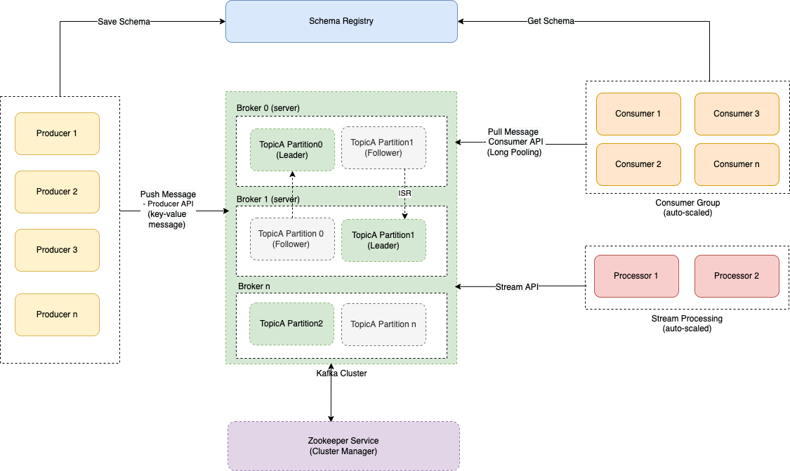

# Partitioning/Sharding
- For very large datasets, or very high query throughput, replication is not sufficient - we need to break the data up into partitions, also known as [sharding](https://aws.amazon.com/what-is/database-sharding/).
- Instead of one shard for writes, we partition/shard the database based on a partition key. 
- This would increase query throughput and overall system write throughput.

> Note - This partitioning is not related to network partition (in [CAP Theorem](../../2_CAP&PACELCTheorems/CAPTheorem.md)).

# Key Terminologies

| Terminology         | Description                                                                                                                                                                                                          |
|---------------------|----------------------------------------------------------------------------------------------------------------------------------------------------------------------------------------------------------------------|
| Partition Key       | Partitioning would be done based on a partition key.  - Hence we need to carefully [choose this key to distribute the data evenly b/w partitions](PartitionKey/Readme.md).                                       |
| Hash Function       | Hash function helps to determine the partition for a given key. - MD5 as a hash function used in [Casandra](../../11_WideColumn-Databases/ApacheCasandra.md), [MongoDB](../../10_Document-Databases/MongoDB.md). |
| Secondary Indexes   | [Read more](../../5_DatabaseInternals/Indexing.md)                                                                                                                                                                   |
| Consistent Hashing  | This handles data sharding with dynamic number of servers.                                                                                                                                                           |
| Unique-ID-Generator | Since NoSQL dbs don't generate primary key automatically, we would have generate unique ID on the application side.                                                                                                  |

# Kafka Cluster

# Other Supported Clusters
- [Amazon DynamoDB Cluster](../../../2_AWS/6_DatabaseServices/AmazonDynamoDB/Partioning.md)
- [ElasticSearch Cluster](../../9_Search-Databases/ElasticSearch/Readme.md)
- [Redis Cluster](../../../2_AWS/6_DatabaseServices/AmazonElasticCache/Readme.md)
- [Apache Casandra](../../11_WideColumn-Databases/ApacheCasandra.md)

# Sharding Examples

| Example                                                                                                        |
|----------------------------------------------------------------------------------------------------------------|
| [MySql Sharding @ Pinterest](../../../1_TechStacks/Pinterest/MySQLSharding.md)                                 |
| [PostgreSQL Sharding @ Instagram](../../../1_TechStacks/Instagram/PostgreSharding.md)                          |
| [PostgreSQL Sharding - System Design](../../../0_HLDUseCasesProblems/SocialNetworkFacebookInstagram/Readme.md) |

# References
- [How Sharding Works?](https://medium.com/@jeeyoungk/how-sharding-works-b4dec46b3f6)
- [Sharding with Amazon Relational Database Service](https://aws.amazon.com/blogs/database/sharding-with-amazon-relational-database-service/)
- [Interviewbit - Sharding a database](https://www.interviewbit.com/problems/sharding-a-database/)
- [Amazon RDS - Back to Basics: Database Sharding to Horizontally Scale Databases](https://www.youtube.com/watch?v=9q-ZA6WtVy4)
- [Database Sharding: Concepts and Examples](https://www.mongodb.com/resources/products/capabilities/database-sharding-explained)