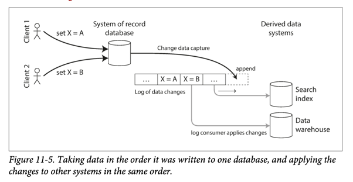

# Change Data Capture
- [Change data capture (CDC)](https://en.wikipedia.org/wiki/Change_data_capture), which is the process of observing all data changes written to a database and extracting them in a form in which they can be replicated to other systems. 
- [CDC]() is especially interesting if changes are made available as a stream, immediately as they are written.
- A [log-based message broker like Kafka](../../../4_MessageBrokersEDA/Readme.md) is well suited for transporting the change events from the source database, since it preserves the ordering of messages (avoiding the reordering issue).

# Tools
- [Debezium](Debezium.md)
- [Oracle GoldenGate](https://docs.oracle.com/goldengate/c1230/gg-winux/GGCON/introduction-oracle-goldengate.htm#GGCON-GUID-EF513E68-4237-4CB3-98B3-2E203A68CBD4)

# Change Data Capture Techniques
- [Timestamp based technique](https://hevodata.com/learn/change-data-capture/#timestamp)
- [Triggers Based Technique](https://hevodata.com/learn/change-data-capture/#triggers)
- [Snapshot Based Technique](https://hevodata.com/learn/change-data-capture/#snapshot) 
- [Log Based Technique](https://hevodata.com/learn/change-data-capture/#log)

# References
- [Swiggy - Architecture of CDC System](https://bytes.swiggy.com/architecture-of-cdc-system-a975a081691f)