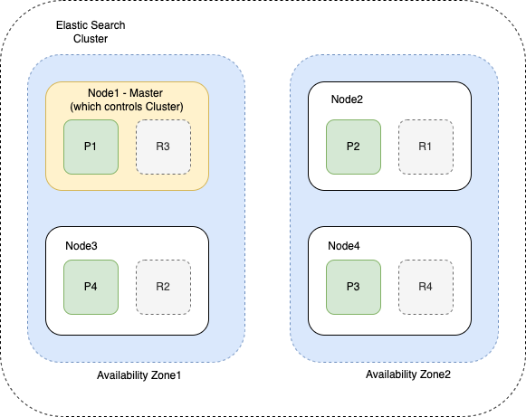

# ElasticSearch Cluster
- In [Elasticsearch](https://www.elastic.co/guide/en/elasticsearch/reference/current/add-elasticsearch-nodes.html), a [cluster](../../../7_Scalability/ServersCluster.md) is a collection of nodes.
- Cluster and nodes work together and hold the data, where node is an instance of Elasticsearch.
- A cluster provides [joined indexing](../../5_Database-Internals/Indexing.md) as well as search capabilities to Elasticsearch users.

# How to increase ElasticSearch throughput and concurrency capacity?
- If you have an Elasticsearch cluster & you want to maximize the QPS and concurrency, its recommended to run the benchmark test that includes increasing and decreasing the number of shards per index / read replicas/indexes.
- [Read more](https://medium.com/explorium-ai/how-to-dramatically-increase-your-elasticsearch-throughput-and-concurrency-capacity-c32d7bb02ac2)
