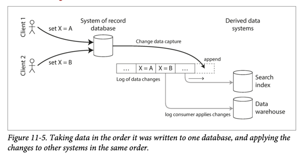

# Change Data Capture
- [Change data capture (CDC)](https://en.wikipedia.org/wiki/Change_data_capture), which is the process of observing all data changes written to a database and extracting them in a form in which they can be replicated to other systems. 
- [CDC]() is especially interesting if changes are made available as a stream, immediately as they are written.
- A [log-based message broker like Kafka](../../../4_MessageBrokersEDA/Readme.md) is well suited for transporting the change events from the source database, since it preserves the ordering of messages (avoiding the reordering issue).

# Tools

| Name                             | Remarks                                                                                                                                                                                                                                                                                                                                                                                          |
|----------------------------------|--------------------------------------------------------------------------------------------------------------------------------------------------------------------------------------------------------------------------------------------------------------------------------------------------------------------------------------------------------------------------------------------------|
| [Debezium](https://debezium.io/) | Stream changes from your database. Debezium is an open source distributed platform for change data capture. Start it up, point it at your databases, and your apps can start responding to all of the inserts, updates, and deletes that other apps commit to your databases. Debezium is durable and fast, so your apps can respond quickly and never miss an event, even when things go wrong. |

# References
- [Swiggy - Architecture of CDC System](https://bytes.swiggy.com/architecture-of-cdc-system-a975a081691f)