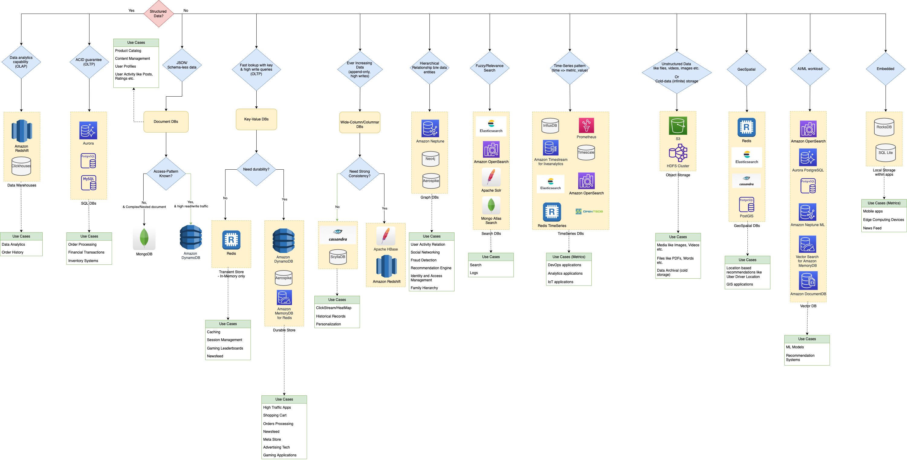

# Database Design Tips | Choosing the Best Database in a System Design

[Read more](https://www.youtube.com/watch?v=cODCpXtPHbQ)

# Key Parameters

| Title                 | Remarks                                                                                                                                                        |
|-----------------------|----------------------------------------------------------------------------------------------------------------------------------------------------------------|
| :star: Query Patterns | How complex are your query patterns?  - Do you just need retrieval by key, or also by various other parameters? Do you also need fuzzy search on the data? |
| Consistency           | Is strong consistency required (read after write, especially when you switch writes to a different data-center) or eventual consistency is OK?                 |
| Storage Capacity      | How much storage capacity is needed?                                                                                                                           |
| Performance           | What is the needed throughput and latency?                                                                                                                     |

[Read more](https://medium.com/wix-engineering/how-to-choose-the-right-database-for-your-service-97b1670c5632)

# Key Considerations

| Title                                                                                        | Category | Remarks                                                                                                                                                                                          |
|----------------------------------------------------------------------------------------------|----------|--------------------------------------------------------------------------------------------------------------------------------------------------------------------------------------------------|
| [SQL vs NoSQL](SQLvsNoSQL.md)                                                                | General  | [Terms Comparison - SQL vs NoSQL](Terminologies.md)                                                                                                                                              |
| [All Databases list](All-DBs-List.md)                                                        | General  |                                                                                                                                                                                                  |
| [DB Scalability Techniques](3_ScalabilityTechniques/Readme.md)                               | General  |                                                                                                                                                                                                  |
| [OLTP vs OLAP](OLTPvsOTAP.md)                                                                | General  |                                                                                                                                                                                                  |
| [Sharding the database](3_ScalabilityTechniques/PartitioningSharding/Readme.md)           | Sharding | To scale the data store horizontally (& improve write scalability), shard the databases using [consistent hashing technique](3_ScalabilityTechniques/PartitioningSharding/ConsistentHashing.md). |
| [Partitioning Tips](3_ScalabilityTechniques/PartitioningSharding/PartitionKey/Readme.md) | Sharding | Decide partition key carefully (to prevent hot partition problem).                                                                                                                               |
| [DynamoDB vs MongoDB vs Casandra](DynamoDBVsMongoDBVsCasandra.md)                            | NoSQL DB |                                                                                                                                                                                                  |
| [SQL Tunning](3_ScalabilityTechniques/SQLTuning.md)                                          | SQL DB   | Tune queries, to improve performance of SQL Queries.                                                                                                                                             |

# NoSQL - Tips & Patterns

| Tips                                                      | Description                                                                                                                                                                                                                                                                                                                                      |
|-----------------------------------------------------------|--------------------------------------------------------------------------------------------------------------------------------------------------------------------------------------------------------------------------------------------------------------------------------------------------------------------------------------------------|
| Data that is accessed together, should be stored together | Instead of distributing related data items across multiple tables, you should keep related items in your NoSQL system as close together as possible.                                                                                                                                                                                             |
| Vertical partitioning                                     | Breaks items into multiple items using [partition key](3_ScalabilityTechniques/PartitioningSharding/PartitionKey/Readme.md) & [sort key](3_ScalabilityTechniques/PartitioningSharding/PartitionKey/SortKey.md). - [Read more](https://aws.amazon.com/blogs/database/use-vertical-partitioning-to-scale-data-efficiently-in-amazon-dynamodb/) |
| Use sort order                                            | All items with the same partition key value are stored together, in sorted order by [sort key value](3_ScalabilityTechniques/PartitioningSharding/PartitionKey/SortKey.md).                                                                                                                                                                      |
| Distribute Queries                                        | Design [data keys](3_ScalabilityTechniques/PartitioningSharding/PartitionKey/Readme.md) to distribute traffic evenly across partitions as much as possible, avoiding [hot spots](3_ScalabilityTechniques/PartitioningSharding/PartitionKey/HotPartition.md).                                                                                     |
| Use secondary indexes                                     | By creating specific [secondary indexes](../2_AWS/1_DatabaseServices/AmazonDynamoDB/SecondaryIndexes.md), you can enable different queries than your main table can support, and that are still fast and relatively inexpensive.                                                                                                         |

# PACLEC Theorem

[Read more](2_CAP&PACELCTheorems/Readme.md)

# ACID Transactions

[Read more](1_ACIDTransactions/Readme.md)

# References
- :star: [AWS re:Invent 2021 - Which NoSQL database is right for you?](https://www.youtube.com/watch?v=ivBaro-8PhI)
- [How To Choose The Right Database?](https://www.youtube.com/watch?v=kkeFE6iRfMM)
- [AWS re:Invent 2022 - From RDBMS to NoSQL (PRT314)](https://www.youtube.com/watch?v=eEENrNKxCdw)
- [Databases on AWS: The Right Tool for the Right Job](https://www.youtube.com/watch?v=WE8N5BU5MeI&t=3710s)
- [Wix Engineering - How to choose the right database for your service](https://medium.com/wix-engineering/how-to-choose-the-right-database-for-your-service-97b1670c5632)
- [Wix Engineering - 5 Database technologies used by 2000 Wix microservices](https://medium.com/wix-engineering/5-database-technologies-used-by-2000-wix-microservices-e4769638b8c3)
- [AWS - What Is a Document Database?](https://aws.amazon.com/nosql/document/)
