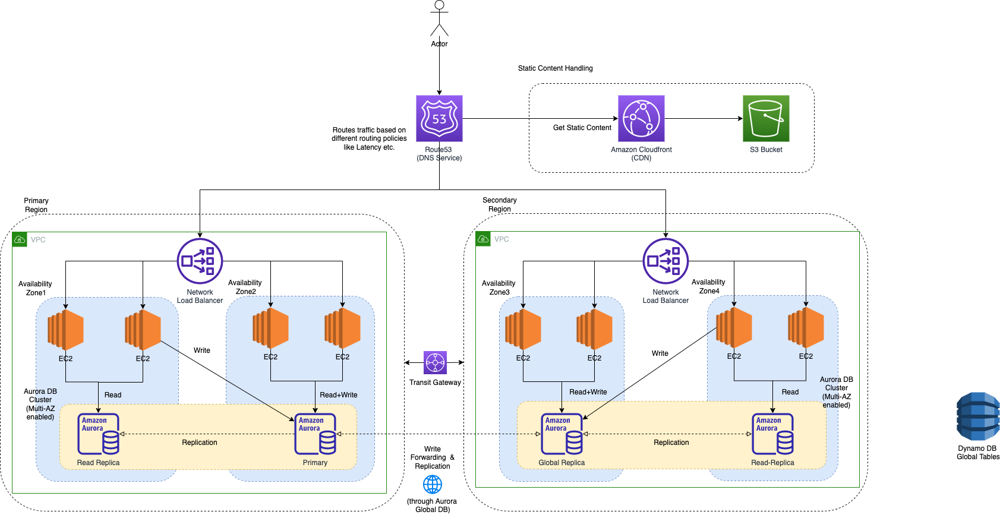

# Design Multi-Region Active-Active Architecture On AWS

# Why bother with multi-region architectures?

| Title                                              | Remarks                                                                                                                                                                                           |
|----------------------------------------------------|---------------------------------------------------------------------------------------------------------------------------------------------------------------------------------------------------|
| Improve latency for end-users                      | [Multi-region](../../2_AWSComponents/AWS-Global-Architecture-Region-AZ.md) backend setup might be needed for dynamic API calls, to improve latency (roughly 150-400 ms).                          |
| Disaster Recovery                                  | [Multi-region](../../2_AWSComponents/AWS-Global-Architecture-Region-AZ.md) setup helps in the [disaster recovery](../../1_HLDDesignComponents/0_SystemGlossaries/Reliability/DisasterRecovery.md) |
| Business Requirements like GDPR, Localization etc. |                                                                                                                                                                                                   |

# AWS Global Services

| Service                                                                                                                  |
|--------------------------------------------------------------------------------------------------------------------------|
| [Amazon S3](../../2_AWSComponents/7_StorageServices/3_ObjectStorageS3/Readme.md#cross-region-supported)                  |
| [Amazon Aurora Global Database](../../2_AWSComponents/6_DatabaseServices/AmazonRDS/AmazonAurora/AuroraGlobalDatabase.md) |
| [Amazon Dynamo DB Global Tables](../../2_AWSComponents/6_DatabaseServices/AmazonDynamoDB/Readme.md)                      |

# How to build multi-region active-active architecture in AWS?

| Title                            | Remarks                                                                                                                                                                                                                                          |
|----------------------------------|--------------------------------------------------------------------------------------------------------------------------------------------------------------------------------------------------------------------------------------------------|
| Reliable data replication        | [Eventual consistency](../../1_HLDDesignComponents/3_DatabaseComponents/1_Glossaries/Consistency&Replication/Readme.md) would have to be done, as databases are spread across multi-regions.                                                     |
| Global network infrastructure    | [AWS Regions](../../2_AWSComponents/AWS-Global-Architecture-Region-AZ.md) are connected to a private global network backbone, which provides lower cost and more consistent cross-region network latency when compared with the public internet. |
| Build Stateless applications     | [Read more](../../1_HLDDesignComponents/0_SystemGlossaries/StatefulVsStateless.md)                                                                                                                                                               |
| DNS routing using Amazon Route53 | [Read more](../../2_AWSComponents/1_NetworkingAndContentDelivery/1_EdgeNetworking/AmazonRoute53/Readme.md)                                                                                                                                       |

# Source(s) and further reading
- [How to build a multi-region active-active architecture on AWS?](https://acloudguru.com/blog/engineering/why-and-how-do-we-build-a-multi-region-active-active-architecture)
