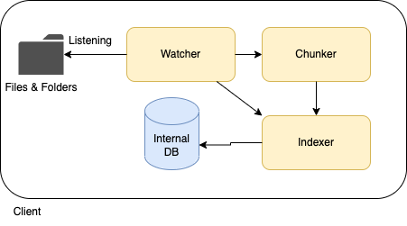

# Dropbox - High Level Design

# Client Components

## Watcher
- Watcher is responsible for monitoring the sync folder for all the activities performed by the user such as create, update or delete files/folders. 
- It gives notification to the indexer and chunker if any action is performed in the files or folders.

## Chunker
- Chunker breaks the files into multiple small pieces called chunks and upload it to the cloud storage with a unique id or hash of these chunks.
- To recreate the files these chunks can be joined together. 
- For any changes in the files, the chunking algorithm detects the specific chunk which is modified and only saves that specific part/chunks to the cloud storage. 
- It reduces the bandwidth usage, synchronization time, and storage space in the cloud.

## Indexer
- Indexer is responsible for updating the internal database when it receives the notification from the watcher (for any action performed in folders/files).
- It receives the URL of the chunks from the chunker along with the hash and updates the file with modified chunks. 
- Indexer communicates with the Synchronization Service using the Message Queuing Service, once the chunks are successfully submitted to the cloud Storage.

## Internal database
- It stores all the files and chunks information, their versions, and their location in the file system.

# Server Components

## Synchronization Service
- Synchronization service can be communicated to either to receive the latest update from the cloud storage or to send the latest request/updates to the Cloud Storage.
- The synchronization service receives the request from the request queue of the messaging services and updates the metadata database with the latest changes. 
- Also, the synchronization service broadcast the latest update to the other clients (if there are multiple clients) through the response queue so that the other client’s indexer can fetch back the chunks from the cloud storage and recreate the files with the latest update. It also updates the local database with the information stored in the Metadata Database. 
- If a client is not connected with the internet or offline for some time, it polls the system for new updates as soon as it goes online.

# References
- [Design Dropbox – A System Design Interview Question](https://www.geeksforgeeks.org/design-dropbox-a-system-design-interview-question/)
- 
