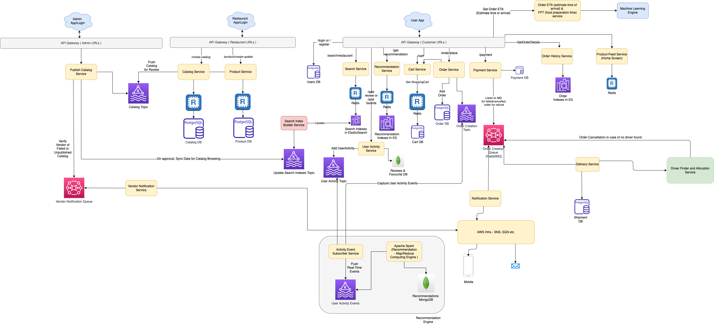

# Microservices design
- [Microservices](https://microservices.io/index.html) are a modern [Service-Oriented Architecture](https://www.geeksforgeeks.org/service-oriented-architecture/).
- In a [Microservice Architecture](), each service is self-contained, implements a [single responsibility and business capability](https://github.com/Anshul619/LLD-OOPs-Design-Patterns/tree/main/DomainDrivenDevelopment/Readme.md).
- [Microservice architecture]() makes it easier and fastest way to build and work on individual parts of an application, and thus the application as a whole.
- Example - User Management, Order Management, Checkout, Address etc.

# Features
- [Design Patterns](DesignPatterns.md)
- [Spring Cloud vs K8s vs AWS](SpringCloudVsK8sVsAWS.md)
- [API Gateway](1_APIGateway/Readme.md)
- [Service Registry and Discovery](2_ServiceRegistry&Discovery/Readme.md)
- [ServiceMesh](ServiceMesh.md)
- [OnPerm - Microservice Implementation in Spring Boot](https://github.com/Anshul619/Programming-Languages/tree/main/1_Java/SpringBootAndMicroServices/Readme.md)

# :thumbsup: Advantages of Microservices design

| Title                                          | Remarks                                                                                                                      |
|------------------------------------------------|------------------------------------------------------------------------------------------------------------------------------|
| :star: Separation of Concern, loosely coupled  | Each service can be scaled independently and would have its team which owns the microservice. (more agility and flexibility) |
| Scalability                                    | Scalability would become easy.                                                                                               |
| :sunglasses: Engineering                       | Dedicated data store & own programming language for each microservice.                                                       |
| :rocket: Deployment becomes independent & fast | Deployment becomes easy, independent & fast. - A large monolithic code can take up to 1 day, to deploy.                  |

# :thumbsdown: Disadvantages of Microservices design

| Title                       | Remarks                                                                                                    |
|-----------------------------|------------------------------------------------------------------------------------------------------------|
| :family_man_woman_boy: Team | Monolithic is good for small team while Microservice is good for large team.                               |
| :moneybag: Budget           | With microservices, the budget increases (deployment, time to make change, team size etc.)                 |
| Obviousness                 | With large number of services, it would be a bit tricky to find the microservice for the required change.  |
| Complexity & Data Chaos     | Wide variety of resources, exponential complexity increase.                                                |
| Safety                      | The contract should be defined properly between microservices.                                             |
| Resilience                  | Client should be able to handle failure scenarios properly.                                                |
| Dependency                  | Microservices would be dependent to each other.  - Sometimes, there can be circular dependencies also. |
| DevOps and Observability    | With microservices, the devops/logs and observability increases.                                           |

# Sample System design using microservices

# References
- [What Are Microservices Really All About? (And When Not To Use It)](https://www.youtube.com/watch?v=lTAcCNbJ7KE)
- [Difference between Microservice and API](https://www.geeksforgeeks.org/difference-between-microservice-and-api/)
- [Moving from Monoliths to Microservices](https://www.youtube.com/watch?v=rckfN7xFig0&list=PLMCXHnjXnTnvo6alSjVkgxV-VH6EPyvoX&index=34)
- [The Human Side of Airbnb’s Microservice Architecture](https://www.infoq.com/presentations/airbnb-culture-soa/)
- [Handling Microservices with gRPC and REST API](https://fonradar.medium.com/ali-okan-kara-a3d0b61610d)
- [Materialized View Pattern](https://medium.com/design-microservices-architecture-with-patterns/materialized-view-pattern-f29ea249f8f8)
- [Uber - Service Oriented Architecture](https://eng.uber.com/service-oriented-architecture/)
- [Build microservices using Akka](https://developer.lightbend.com/docs/akka-guide/microservices-tutorial/index.html)
- [Using Containers to Build a Microservices Architecture](https://medium.com/aws-activate-startup-blog/using-containers-to-build-a-microservices-architecture-6e1b8bacb7d1)