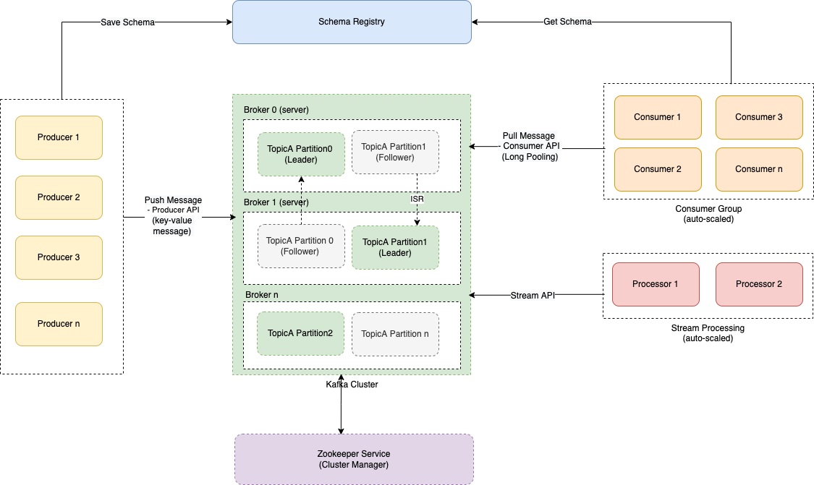

# Apache Kafka 
- [Apache Kafka](https://kafka.apache.org/) is an [open-source distributed event streaming platform](../EventDrivenArchitecture/Readme.md) used by thousands of companies for high-performance data pipelines, streaming analytics, data integration, and mission-critical applications.
- [Kafka](https://kafka.apache.org/) is based on [Publish-Subscriber Model](../EventDrivenArchitecture/PubSubModel.md). And can be used for [Event-Driven Architecture](../EventDrivenArchitecture/Readme.md).
- Kafka can process a [large amount of data](../../7_PropertiesDistributedSystem/Scalability/Throughput.md) in a short amount of time (**1 million messages/sec**).
- It also has [low latency](../../7_PropertiesDistributedSystem/Scalability/Latency.md), making it possible to process data in real-time.

# Basic Architecture of Kafka Cluster

# General use cases of Kafka

| Use Case                                                   | Description                                                                                                                                                                                                  |
|------------------------------------------------------------|--------------------------------------------------------------------------------------------------------------------------------------------------------------------------------------------------------------|
| Message broker (PubSub model) in Event-Driven Architecture | Use Kafka when your application has a high throughput i.e. application has to process a large volume of messages, [event driven services](../EventDrivenArchitecture/Readme.md) etc.                         |
| Data Ingestion - Real-time events, analytics etc.          | If we want to build our own Google Analytics or Amplitude (to track app activities, events etc.), we can use Kafka as a broker.                                                                              |
| Distributed Logging - Logs Aggregation, Metrics            | Various systems in the IT infrastructure can push events/messages/logs in the Kafka. (example - [ELK stack](../../12_ObservabilityLogsServices/ELK.md))                                                      |
| Stream Processing - Data Pipelines, Microservices etc.     | [Kafka Streams](../../6_BigDataServices/DataProcessing/KafkaStreams/Readme.md) can be helpful in stream processing the events (map/reduce, aggregation, counts etc.).                        |
| Data Pipelines - CDC of DBs                                | [Kafka connectors](../../6_BigDataServices/DataConnectors/KafkaConnect.md) can be helpful to migrate from one DB to another, i.e. handle [CDC](../../3_DatabaseServices/Others/ChangeDataCapture/Readme.md). |

# :star: Real world use cases of Kafka

| Use Case                                                                                                                                         |
|--------------------------------------------------------------------------------------------------------------------------------------------------|
| [LinkedIn](../../1_TechStacks/LinkedIn/Readme.md)                                                                                              |
| [Personalization at Spotify using Cassandra & Kafka](../../1_TechStacks/Spotify/Readme.md)                                        |
| [Zomato - HLD Design](../../0_HLDUseCasesProblems/FoodOrderingZomatoSwiggy/Readme.md)                                                            |
| [Uber Driver Allocation - HLD Design](../../0_HLDUseCasesProblems/DriverAllocationUberGoJek/Readme.md)                                           |
| [Twillo Send Message API Design - HLD Design](../../0_HLDUseCasesProblems/SendSMSMessageAPITwillo/Readme.md)                                     |
| [Logging Solution in Distributed Systems - HLD Design](../../0_HLDUseCasesProblems/ObervabilityLoggingSolution/LoggingFileAggregation/Readme.md) |
| [Flight Booking Search - HLD Design](../../0_HLDUseCasesProblems/FlightBookingSearchMakeMyTrip/Readme.md)                                        |
| [Amplitude - Reducing costs with AZ-awareness for Kafka](../../1_TechStacks/Amplitude/Readme.md)                                                 |
| [BigCommerce - Real-time events](../../1_TechStacks/BigCommerce/Readme.md)                                                                       |
| [Paypal - Kafka](../../1_TechStacks/PayPalTechStack.md)                                                                                          |
| [Grab - Orders Processing](../../1_TechStacks/Grab/OrdersProcessing.md)                                                                          |
| [Swiggy (through Confluent)](../../1_TechStacks/SwiggyTechStack.md)                                                                              |
| [Split.io - Messsage Broker](../../1_TechStacks/SplitIOTechStack.md)                                                                             |

# Top Features of Kafka

| Feature                              | Description                                                                                                                                                                                                                                                                                                                                                                                     |
|--------------------------------------|-------------------------------------------------------------------------------------------------------------------------------------------------------------------------------------------------------------------------------------------------------------------------------------------------------------------------------------------------------------------------------------------------|
| Scalability - Horizontal scalability | Kafka can be [horizontally scaled](../../3_DatabaseServices/3_ScalabilityTechniques/Readme.md) easily across the cluster. - A cluster of brokers is used to partition and streamline the data thereby, scaling up the storage capacity.                                                                                                                                                                      |
| Performance - High Throughput        | Each Kafka broker can serve more than **1 million messages per second** and can hold TBs of data. - Default configured message size in Kafka is **1MB**.                                                                                                                                                                                                                                    |
| High Volume                          | Large amount of data can be stored in the Kafka pool.                                                                                                                                                                                                                                                                                                                                           |
| Durability                           | The data is kept [persistent (as per retention policy)](../../3_DatabaseServices/1_ACIDTransactions/Durability.md) and tolerant to any hardware failures by copying the data in the clusters.                                                                                                                                                                                                     |
| High Availability, Fault Tolerance   | The [distributed, partitioned, replicated](../../3_DatabaseServices/4_Consistency&Replication/Replication.md), and [fault-tolerant](../../7_PropertiesDistributedSystem/Reliability/FaultTolerance.md) nature of Kafka makes it very reliable. - Kafka connector can handle failures with three strategies summarised as **fast-fail**, **ignore** and **re-queue** (sends to another topic). |
| Extensibility                        | Allows multiple ways for applications to plugin and make use of Kafka. - Also, it has provisions for [new connectors](../../6_BigDataServices/DataConnectors/KafkaConnect.md) that you can write as needed.                                                                                                                                                                                 |
| Data Processing/Transformation       | Using [Kafka Stream API](../../6_BigDataServices/DataProcessing/KafkaStreams/Readme.md), Kafka allows for deriving new data streams using the existing data streams from producers.                                                                                                                                                                                               |

# Kafka - Partitioning Layout

# Major Components of Kafka

| Component                                | Description                                                                                                                                                                                                                                                                                                                                                                                                                                                                                                                                                                             |
|------------------------------------------|-----------------------------------------------------------------------------------------------------------------------------------------------------------------------------------------------------------------------------------------------------------------------------------------------------------------------------------------------------------------------------------------------------------------------------------------------------------------------------------------------------------------------------------------------------------------------------------------|
| Topic                                    | Topic is a category or feed where messages (or events) would be saved and published.                                                                                                                                                                                                                                                                                                                                                                                                                                                                                                    |
| Producer                                 | Producer writes data into the topics (1 or more) in the Kafka.                                                                                                                                                                                                                                                                                                                                                                                                                                                                                                                          |
| Consumer                                 | A consumer can subscribe (listen) to the topics (1 or more) and read data from those in the Kafka.                                                                                                                                                                                                                                                                                                                                                                                                                                                                                      |
| Consumer Group                           | A consumer group in Kafka is a collection of consumers who work together to ingest data from the same topic or range of topics.                                                                                                                                                                                                                                                                                                                                                                                                                                                         |
| Consumer Offset                          | Consuming a partition sequentially makes it easy to tell which messages have been processed. - All messages with an offset less than a consumer’s current offset have already been processed - And all messages with a greater offset have not yet been seen.  - Thus, the broker does not need to track acknowledgments for every single message— it only needs to periodically record the consumer offsets.  - The reduced bookkeeping overhead and the opportunities for batching and pipelining in this approach help increase the throughput of log-based systems. |
| Broker (i.e. Server)                     | A Kafka cluster is made up of a number of brokers (servers), which provides load balancing, reliable redundancy & fail-over. - Without sacrificing performance, each broker instance can handle read and write volumes of hundreds of thousands per second (and gigabytes of messages).                                                                                                                                                                                                                                                                                             |
| Kafka Controller                         | [The Kafka controller](https://stackoverflow.com/questions/49525141/how-many-kafka-controllers-are-there-in-a-cluster-and-what-is-the-purpose-of-a-c) is brain of the Kafka cluster. - It monitors the liveliness of the brokers and acts on broker failures. - Kafka Controller does [leader election for the topic & in-charge of partition leaders and replication](https://stackoverflow.com/questions/49525141/how-many-kafka-controllers-are-there-in-a-cluster-and-what-is-the-purpose-of-a-c) (if leader goes down).                                                    |
| Partitioning                             | Topics can be parallelized via [partitions](../../3_DatabaseServices/3_ScalabilityTechniques/PartitioningSharding/Readme.md), which split data into a single topic among numerous brokers.                                                                                                                                                                                                                                                                                                                                                                                                                      |
| Partition Key                            | [Partition key](../../3_DatabaseServices/3_ScalabilityTechniques/PartitioningSharding/PartitionKey/Readme.md) helps in deciding partition and maintaining the order of the messages.                                                                                                                                                                                                                                                                                                                                                                                                                               |
| Partition - Replication                  | Each partition would be replicated across the brokers/servers in the cluster (as per configured replication factor).                                                                                                                                                                                                                                                                                                                                                                                                                                                                    |
| Partition - Leader                       | Only one partition (of the topic) would be active at the time, called **Leader**. - Write requests on the partition, would be handled by Leader.                                                                                                                                                                                                                                                                                                                                                                                                                                    |
| Partition - Follower                     | Other partitions (of the topic) would only replicate message, called **Followers**.                                                                                                                                                                                                                                                                                                                                                                                                                                                                                                     |
| Replication Factor                       | Based on configured replication factor ([replication.factor](https://kafka.apache.org/documentation/#replication)), the number of followers would be decided. - Example - 3 replication factor means there would be 1 leader and 2 followers.                                                                                                                                                                                                                                                                                                                                       |
| Log Compaction                           | [Log compaction](LogCompaction.md) is a mechanism to give finer-grained per-record retention, rather than the coarser-grained time-based retention.                                                                                                                                                                                                                                                                                                                                                                                                                                     |
| Core APIs - Producer, Consumer apis etc. | [Kafka HTTP APIs](CoreAPIs/Readme.md) can be integrated in the client apis, to push the message to the specific topic (& partition key).                                                                                                                                                                                                                                                                                                                                                                                                                                                |
| In-Sync Replicas (ISR)                   | An [in-sync replica (ISR)](https://www.conduktor.io/blog/how-replication-and-isr-work-in-kafka) is a broker that has the latest data for a given partition. - A leader is always an in-sync replica. - A follower is an in-sync replica only if it has fully caught up to the partition it’s following. - Read requests on the partition, would be handled by in-sync replicas.                                                                                                                                                                                             |
| ACK levels                               | **acks** denotes the number of brokers that must receive the record before we consider the write as successful.                                                                                                                                                                                                                                                                                                                                                                                                                                                                         |
| **acks=0** - Ack level                   | With a value of 0, the producer won’t even wait for a response from the broker.                                                                                                                                                                                                                                                                                                                                                                                                                                                                                                         |
| **acks=1** - ACK level                   | With a setting of 1, the producer will consider the write successful when the leader receives the record. - The leader broker will know to immediately respond the moment it receives the record and not wait any longer.                                                                                                                                                                                                                                                                                                                                                           |
| **acks=all** - ACK level                 | When set to all, the producer will consider the write successful when all of the in-sync replicas receive the record. - This is achieved by the leader broker being smart as to when it responds to the request – it’ll send back a response once all the in-sync replicas receive the record themselves.                                                                                                                                                                                                                                                                           |
| Security Considerations                  | All components (brokers, zookeeper, producers, consumers etc.) should authenticate each other and setup an encrypted (SSL) channel for communication. - **Authorization** - ACLs should be defined and enforced to control which users can perform what action?                                                                                                                                                                                                                                                                                                                     |

# High Availability Config

| Config                                   | Min. Value |
|------------------------------------------|------------|
| Replication Factor                       | 3          |
| In-sync replicas (`min.insync.replicas`) | 2          |
| Kafka Brokers (in different AZs)         | 3          |

# Kafka Ecosystem - External Components

| Component       | Remarks                                                                                                                                                                                                                                                                  |
|-----------------|--------------------------------------------------------------------------------------------------------------------------------------------------------------------------------------------------------------------------------------------------------------------------|
| Kafka Connect   | [Kafka Connect](../../6_BigDataServices/DataConnectors/KafkaConnect.md) is a tool for scalably and reliably streaming data between [Apache Kafka]() and other systems.                                                                                                   |
| Schema Registry | [Schema Registry](SchemaRegistry.md) holds schemas & ensures that schema used by producer and consumer, are identical.                                                                                                                                                   |
| Kafka Streams   | [Streams API](../../6_BigDataServices/DataProcessing/KafkaStreams/Readme.md) is a client library for building applications and [microservices](../../5_MicroServicesSOA/Readme.md), where the input and output data are stored in [Kafka clusters](Readme.md). |
| kSQL            | [kSQL](kSQL.md) is a database purpose-built for stream processing applications.                                                                                                                                                                                          |
| Zookeeper       | [Zookeeper](../../10_ClusterCoordinationServices/ApacheZookeeper.md) manages Kafka Cluster (new broker, new partition etc.), brokers coordination & election process (leader, Controller election etc.)                                                                  |

# In-Sync Replicas (ISR)
- **Broker1** & **Broker2** are in sync replicas (i.e. all messages are same in both the brokers).
- While **Broker3** is out of sync replica.

[Read more](https://accu.org/journals/overload/28/159/kozlovski/)

# acks=1 - example
- If **ack=1** is set as ack level, producer is acknowledged only when message (example message id - **6**) is stored in one of the broker (**Broker 1** in this case) successfully.

[Read more](https://accu.org/journals/overload/28/159/kozlovski/)

# acks=all - example
- If **ack=all** is set as ack level, producer is acknowledged only when message (example message id - **6**) is stored in all the brokers successfully.

[Read more](https://accu.org/journals/overload/28/159/kozlovski/)

# Other Points
- [Kafka vs Others](../KafkaVsRabbitMQVsSQSVsSNS.md)
- [Kafka Estimates](KafkaEstimations.md)
- [Apache Kafka - Benchmarking@LinkedIn](../../SystemEstimations&Benchmarking/Benchmarking/KafkaBenchmarking.md)
- [Why Kafka is so fast?](WhyKafkaSoFast.md)
- [Amazon Managed Streaming for Apache Kafka (MSK)](../../2_AWSServices/5_MessageBrokerServices/AmazonMSK.md) can be used to deploy Kafka on [AWS](../../2_AWSServices).

# References
- [Kafka official documentation](https://kafka.apache.org/documentation/#theproducer)
- [Martin Kleppmann | Kafka Summit London 2019 Keynote | Is Kafka a Database?](https://youtu.be/BuE6JvQE_CY)
- [Kafka Interview Question](https://www.interviewbit.com/kafka-interview-questions/)
- [How to minimize the latency involved in kafka messaging framework?](https://stackoverflow.com/questions/20520492/how-to-minimize-the-latency-involved-in-kafka-messaging-framework)
- [Apache Kafka on AWS using Amazon MSK](https://aws.amazon.com/msk/what-is-kafka/)
- [Kafka Talk by Tri Hug](https://www.slideshare.net/mumrah/kafka-talk-tri-hug)
- [Role of ZooKeeper in Kafka](https://www.youtube.com/watch?v=bnHWrSwPvig)
- [Replication in Kafka](https://medium.com/@_amanarora/replication-in-kafka-58b39e91b64e)
- [Swiggy - BehindTheBug — Kafka Under The Water](https://bytes.swiggy.com/behindthebug-kafka-under-the-water-288c3d05b202)
- [Designing and testing a highly available Kafka cluster on Kubernetes (without zookeeper)](https://learnk8s.io/kafka-ha-kubernetes)
- [ETL Is Dead, Long Live Streams: real-time streams w/ Apache Kafka](https://www.youtube.com/watch?v=I32hmY4diFY)