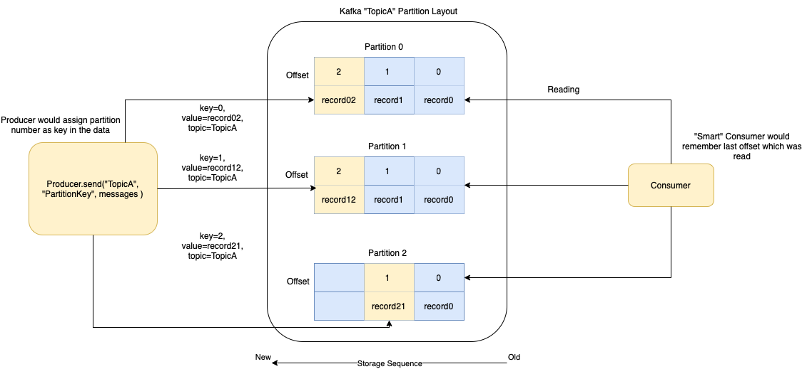

# :star: Apache Kafka 
- [Apache Kafka](https://kafka.apache.org/) is an [open-source distributed event streaming platform](../Glossaries/EventDrivenArchitecture.md) used by thousands of companies for high-performance data pipelines, streaming analytics, data integration, and mission-critical applications.
- [Kafka](https://kafka.apache.org/) is based on [Publish-Subscriber Model](../Glossaries/PubSubModel.md). And can be used for [Event-Driven Architecture](../Glossaries/EventDrivenArchitecture.md).
- Kafka can process a large amount of data in a short amount of time (1 million messages/sec).
- It also has [low latency](../../7_SystemGlossaries/Scalability/LatencyThroughput.md), making it possible to process data in real-time.
- [Amazon Managed Streaming for Apache Kafka (MSK)](../../2_AWSServices/5_MessageBrokerServices/AmazonMSK.md) can be used to deploy Kafka on [AWS](../../2_AWSServices).

# Basic Architecture of Kafka Cluster

# General use cases of Kafka

| Use Case                                                                                           | API                                                                                         | Description                                                                                                                                                                                                                                           |
|----------------------------------------------------------------------------------------------------|---------------------------------------------------------------------------------------------|-------------------------------------------------------------------------------------------------------------------------------------------------------------------------------------------------------------------------------------------------------|
| Message broker in [Event-Driven Architecture](../Glossaries/EventDrivenArchitecture.md) | [Kafka Connect API](KafkaConnect.md)                                                        | Use Kafka when your application has a High Throughput (around `1 million messages/sec`), i.e. application has to process a large volume of messages, [event driven services](../Glossaries/EventDrivenArchitecture.md) etc.                |
| Data Ingestion - Real-time events, analytics etc.                                                  | [Kafka Connect API](KafkaConnect.md)                                                        | If we want to build our own Google Analytics or Amplitude (to track app activities, events etc.), we can use Kafka as a broker.                                                                                                                       |
| [Stream Processing](../../6_BigDataServices/ETLServices/StreamProcessing/Readme.md)                | [Kafka Stream API](../../6_BigDataServices/ETLServices/StreamProcessing/KafkaStreamsAPI.md) | When the event stream needs to process data in multi-stage pipelines, the pipelines can generate graphs of the real-time data flows, thus providing real-time monitoring of traffic in the pipelines. - Example - Video streaming in YouTube etc. |
| [CDC changes of DBs](../../3_DatabaseServices/Glossaries/ChangeDataCapture.md)                     | [Kafka Connect API](KafkaConnect.md)                                                        | Kafka connectors can be helpful to migrate from one DB to another.                                                                                                                                                                                    |
| To monitor metrics, logs of the IT infrastructure                                                  | [Kafka Connect API](KafkaConnect.md)                                                        | Various systems in the IT infrastructure can push events/messages/logs in the Kafka.  - And [logstash (in ELK)](../../12_ObservabilityLogsServices/ELK.md) can act as a consumer to the Kafka.                                                    |

# :star: Real world use cases of Kafka

| Use Case                                                                                                                                         |
|--------------------------------------------------------------------------------------------------------------------------------------------------|
| [LinkedIn](../../1_TechStacksRealApps/LinkedInTechStack.md)                                                                                      |
| [Personalization at Spotify using Cassandra & Kafka](../../1_TechStacksRealApps/PersonalizationSpotify/Readme.md)                                |
| [Zomato - HLD Design](../../0_HLDUseCasesProblems/FoodOrderingZomatoSwiggy/Readme.md)                                                            |
| [Uber Driver Allocation - HLD Design](../../0_HLDUseCasesProblems/DriverAllocationUberGoJek/Readme.md)                                           |
| [Twillo Send Message API Design - HLD Design](../../0_HLDUseCasesProblems/SendSMSMessageAPITwillo/Readme.md)                                     |
| [Logging Solution in Distributed Systems - HLD Design](../../0_HLDUseCasesProblems/ObervabilityLoggingSolution/LoggingFileAggregation/Readme.md) |
| [Flight Booking Search - HLD Design](../../0_HLDUseCasesProblems/FlightBookingSearchMakeMyTrip/Readme.md)                                        |
| [Amplitude - Reducing costs with AZ-awareness for Kafka](../../1_TechStacksRealApps/AmplitudeSystemDesign/Readme.md)                             |
| [BigCommerce - Real-time events](../../1_TechStacksRealApps/BigCommerce/Readme.md)                                                               |
| [Paypal - Kafka](../../1_TechStacksRealApps/PayPalTechStack.md)                                                                                  |
| [Grab - Orders Processing](../../1_TechStacksRealApps/GrabTechStack/OrdersProcessing.md)                                                         |
| [Swiggy (through Confluent)](../../1_TechStacksRealApps/SwiggyTechStack.md)                                                                      |
| [Split.io - Messsage Broker](../../1_TechStacksRealApps/SplitIOTechStack.md)                                                                     |

# Top Features of Kafka

| Feature                               | Description                                                                                                                                                                                                                                                                                                                                                                                        |
|---------------------------------------|----------------------------------------------------------------------------------------------------------------------------------------------------------------------------------------------------------------------------------------------------------------------------------------------------------------------------------------------------------------------------------------------------|
| Scalability - Horrizontal scalability | Kafka can be [horizontally scaled](../../3_DatabaseServices/Glossaries/ScalabilityDB.md) easily across the cluster. - A cluster of brokers is used to partition and streamline the data thereby, scaling up the storage capacity.                                                                                                                                                             |
| Performance - High Throughput         | Each Kafka broker can serve more than [1 million messages per second](../../7_SystemGlossaries/Scalability/LatencyThroughput.md#Throughput) and can hold TBs of data. - Default configured message size in Kafka is `1MB`.                                                                                                                                                                     |
| High Volume                           | Large amount of data can be stored in the Kafka pool.                                                                                                                                                                                                                                                                                                                                              |
| Durability                            | The data is kept [persistent (as per retention policy)](../../3_DatabaseServices/Glossaries/ACIDTransactions/Durability.md) and tolerant to any hardware failures by copying the data in the clusters.                                                                                                                                                                                                                |
| High Availability, Fault Tolerance    | The [distributed, partitioned, replicated](../../3_DatabaseServices/Glossaries/Consistency&Replication/Replication.md), and [fault-tolerant](../../7_SystemGlossaries/Reliability/FaultTolerance.md) nature of Kafka makes it very reliable. - Kafka connector can handle failures with three strategies summarised as `fast-fail`, `ignore` and `re-queue` (sends to another topic). |
| Extensibility                         | Allows multiple ways for applications to plugin and make use of Kafka. - Also, it has provisions for new connectors that you can write as needed.                                                                                                                                                                                                                                              |
| Data Processing/Transformation        | Using [Kafka Stream API](../../6_BigDataServices/ETLServices/StreamProcessing/KafkaStreamsAPI.md), Kafka allows for deriving new data streams using the existing data streams from producers.                                                                                                                                                                                                                                                            |

# Major Components of Kafka

| Component                                                           | Description                                                                                                                                                                                                                                                                                                                                                                                                                                                                                                                                     |
|---------------------------------------------------------------------|-------------------------------------------------------------------------------------------------------------------------------------------------------------------------------------------------------------------------------------------------------------------------------------------------------------------------------------------------------------------------------------------------------------------------------------------------------------------------------------------------------------------------------------------------|
| [Topic (i.e. Stream or Category or Queue)](../Glossaries/Readme.md) | Topic is a category or feed where messages (or events) would be saved and published.                                                                                                                                                                                                                                                                                                                                                                                                                                                            |
| [Producer](../Glossaries/Readme.md)                                 | Producer writes data into the topics (1 or more) in the Kafka.                                                                                                                                                                                                                                                                                                                                                                                                                                                                                  |
| [Consumer](../Glossaries/Readme.md)                                 | A consumer can subscribe (listen) to the topics ( 1 or more ) and read data from those in the Kafka. - Reading data out of Kafka is very fast thanks to `java.nio.channels.FileChannel#transferTo`. - This method uses `sendFile` system call which allows for very efficient transfer of data from a file to another file ( including sockets ).                                                                                                                                                                                       |
| Consumer Group                                                      | A consumer group in Kafka is a collection of consumers who work together to ingest data from the same topic or range of topics. -                                                                                                                                                                                                                                                                                                                                                                                                           |
| Broker (i.e. Server)                                                | A Kafka cluster is made up of a number of brokers (servers), which provides load balancing, reliable redundancy & fail-over. - Without sacrificing performance, each broker instance can handle read and write volumes of hundreds of thousands per second (and gigabytes of messages).                                                                                                                                                                                                                                                     |
| [Partitioning](../Glossaries/Readme.md)                             | Topics can be parallelized via partitions, which split data into a single topic among numerous brokers.                                                                                                                                                                                                                                                                                                                                                                                                                                         |
| [Partition Key](../Glossaries/Readme.md)                            | Partition key helps in maintaining the order of the messages.                                                                                                                                                                                                                                                                                                                                                                                                                                                                                   |
| Partition - Replication                                             | Each partition would be replicated across the brokers/servers in the cluster (as per configured replication factor).                                                                                                                                                                                                                                                                                                                                                                                                                            |
| Partition - Leader                                                  | Only one partition (of the topic) would be active at the time, called `Leader`. - Write requests on the partition, would be handled by Leader.                                                                                                                                                                                                                                                                                                                                                                                              |
| Partition - Follower                                                | Other partitions (of the topic) would only replicate message, called `Followers`. - Based on configured replication factor ([replication.factor](https://kafka.apache.org/documentation/#replication)), the number of followers would be decided. - Example - 3 replication factor means there would be 1 leader and 2 followers.                                                                                                                                                                                                       |
| [Zookeeper](../../10_ClusterCoordinationServices/ApacheZookeeper.md)  | [Zookeeper](../../10_ClusterCoordinationServices/ApacheZookeeper.md) manages Kafka Cluster (new broker, new partition etc.), brokers coordination & election process (leader, Controller election etc.)                                                                                                                                                                                                                                                                                                                                           |
| [Log Compaction](../Glossaries/Readme.md)                           | [Read more](https://medium.com/swlh/introduction-to-topic-log-compaction-in-apache-kafka-3e4d4afd2262)                                                                                                                                                                                                                                                                                                                                                                                                                                          |
| [Core APIs in Kafka](KafkaAPIs.md)                                  | [Kafka HTTP APIs](https://www.confluent.io/blog/http-and-rest-api-use-cases-and-architecture-with-apache-kafka/) can be integrated in the client apis, to push the message to the specific topic (& partition key).                                                                                                                                                                                                                                                                                                                             |
| In-Sync Replicas (ISR)                                              | An [in-sync replica (ISR)](https://www.conduktor.io/blog/how-replication-and-isr-work-in-kafka) is a broker that has the latest data for a given partition. - A leader is always an in-sync replica. - A follower is an in-sync replica only if it has fully caught up to the partition it’s following. - Read requests on the partition, would be handled by in-sync replicas.                                                                                                                                                     |
| ACK levels                                                          | `acks` denotes the number of brokers that must receive the record before we consider the write as successful.                                                                                                                                                                                                                                                                                                                                                                                                                                   |
| acks=0 - Ack level                                                  | With a value of 0, the producer won’t even wait for a response from the broker.                                                                                                                                                                                                                                                                                                                                                                                                                                                                 |
| acks=1 - ACK level                                                  | With a setting of 1, the producer will consider the write successful when the leader receives the record. - The leader broker will know to immediately respond the moment it receives the record and not wait any longer.                                                                                                                                                                                                                                                                                                                   |
| acks=all - ACK level                                                | When set to all, the producer will consider the write successful when all of the in-sync replicas receive the record. - This is achieved by the leader broker being smart as to when it responds to the request – it’ll send back a response once all the in-sync replicas receive the record themselves.                                                                                                                                                                                                                                   |
| Schema Registry                                                     | Schema Registry holds Avro schemas & ensures that schema used by producer and consumer, are identical. - Producer sends schema id while pushing the data and consumer look for schema id to get schema.                                                                                                                                                                                                                                                                                                                                     |
| Kafka Controller                                                    | [The Kafka controller is brain of the Kafka cluster](https://stackoverflow.com/questions/49525141/how-many-kafka-controllers-are-there-in-a-cluster-and-what-is-the-purpose-of-a-c). - It monitors the liveliness of the brokers and acts on broker failures. - [Kafka Controller does leader election for the topic & in-charge of partition leaders and replication](https://stackoverflow.com/questions/49525141/how-many-kafka-controllers-are-there-in-a-cluster-and-what-is-the-purpose-of-a-c) ( if existing leader goes down ). |
| Security                                                            | All components ( brokers, zookeeper, producers, consumers etc. ) should authenticate each other and setup an encrypted (SSL) channel for communication. - `Authorization` - ACLs should be defined and enforced to control which users can perform what action?                                                                                                                                                                                                                                                                             |
| Kafka Cluster for high availability                                 | A minimum in-sync replicas of 2. - A replication factor of 3 for topics. - At least 3 Kafka brokers, each running on different nodes. - Nodes spread across three availability zones.                                                                                                                                                                                                                                                                                                                                               |
| kSQL                                                                | [ksqlDB - The database purpose-built for stream processing applications](https://ksqldb.io/)                                                                                                                                                                                                                                                                                                                                                                                                                                                    |
| [Kafka vs Others](../KafkaVsRabbitMQVsSQSVsSNS.md)                  |                                                                                                                                                                                                                                                                                                                                                                                                                                                                                                                                                 |

# Partition Diagram

# In-Sync Replicas (ISR)

# ACK level - acks=1

# ACK level - acks=all

# Why Kafka is so fast?
- Kafka achieves [low latency](../../7_SystemGlossaries/Scalability/LatencyThroughput.md) message delivery through [Sequential I/O and Zero Copy Principle](https://twitter.com/alexxubyte/status/1506663791961919488/photo/1).
- Messages (events) in the [Kafka]() are immutable and can't be changed once it's pushed (due to [log based queue nature](../../3_DatabaseServices/Glossaries/DataStructuresDB/AppendOnlyProperty.md)).
- The same techniques are commonly used in much other messaging/streaming platforms.

Kafka is based on [Log Based Queue](../../3_DatabaseServices/Glossaries/DataStructuresDB/AppendOnlyProperty.md)
- :star: Messages are persisted to [append-only log files](../../3_DatabaseServices/Glossaries/DataStructuresDB/AppendOnlyProperty.md) by the broker.
- Producers are [appending these log files (sequential write)](../../3_DatabaseServices/Glossaries/DataStructuresDB/AppendOnlyProperty.md) & consumers are reading a range of these files ( `sequential reads` ).

# References
- [Kafka official documentation](https://kafka.apache.org/documentation/#theproducer)
- [Martin Kleppmann | Kafka Summit London 2019 Keynote | Is Kafka a Database?](https://youtu.be/BuE6JvQE_CY)
- [Kafka Interview Question](https://www.interviewbit.com/kafka-interview-questions/)
- [How to minimize the latency involved in kafka messaging framework?](https://stackoverflow.com/questions/20520492/how-to-minimize-the-latency-involved-in-kafka-messaging-framework)
- [Apache Kafka on AWS using Amazon MSK](https://aws.amazon.com/msk/what-is-kafka/)
- [Kafka Talk by Tri Hug](https://www.slideshare.net/mumrah/kafka-talk-tri-hug)
- [Role of ZooKeeper in Kafka](https://www.youtube.com/watch?v=bnHWrSwPvig)
- [Replication in Kafka](https://medium.com/@_amanarora/replication-in-kafka-58b39e91b64e)
- [Kafka Acks Explained](https://accu.org/journals/overload/28/159/kozlovski/)
- [Swiggy - BehindTheBug — Kafka Under The Water](https://bytes.swiggy.com/behindthebug-kafka-under-the-water-288c3d05b202)
- [Benchmarking Apache Kafka, Apache Pulsar, and RabbitMQ: Which is the Fastest?](https://www.confluent.io/blog/kafka-fastest-messaging-system/)
- [Designing and testing a highly available Kafka cluster on Kubernetes (without zookeeper)](https://learnk8s.io/kafka-ha-kubernetes)
- [ETL Is Dead, Long Live Streams: real-time streams w/ Apache Kafka](https://www.youtube.com/watch?v=I32hmY4diFY)