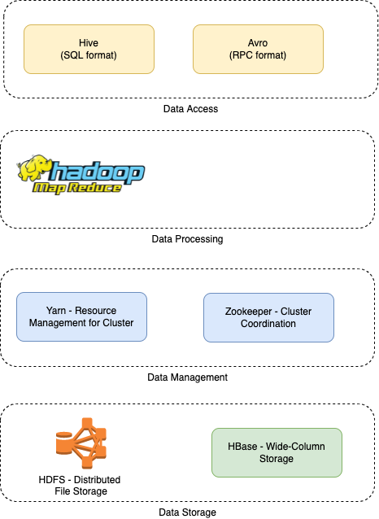

# Apache Hadoop
- [Apache Hadoop](https://hadoop.apache.org/) is an open source framework that is used to efficiently store and process **large datasets ranging in size from gigabytes to petabytes of data**. 
- Instead of using one large computer to store and process the data, Hadoop allows [clustering multiple computers to analyze massive datasets](../../4_Scalability/ServersCluster.md) in parallel more quickly.

# Apache Hadoop Stack

| Stack                                                                       | Remarks                                                              |
|-----------------------------------------------------------------------------|----------------------------------------------------------------------|
| [Apache MapReduce](../DataProcessing/ApacheMapReduce/Readme.md)             | Data Processing/ETL Batch Processing                                 |
| [Apache HDFS](../../11_FileStorages/ApacheHDFS.md)               | Distributed file storage                                             |
| [Apache Yarn](../../9_Container&Orchestration/ApacheYarn.md)        | Cluster Management                                                   |
| [Apache Zookeeper](../../10_ClusterCoordination/ApacheZookeeper.md) | Cluster coordination                                                 |
| [Apache Hive](../DataConsumption/ApacheHive.md)                             | Data Analytics                                                       |
| Hadoop Common                                                               | It contains packages and libraries which are used for other modules. |

# How Hadoop works?
- Hadoop makes it easier to use all the storage and processing capacity in cluster servers, and to execute distributed processes against huge amounts of data. 
- Hadoop provides the building blocks on which other services and applications can be built.
- Applications that collect data in various formats can place data into the Hadoop cluster by using an API operation to connect to the NameNode. 
- The NameNode tracks the file directory structure and placement of **chunks** for each file, replicated across DataNodes. 
- To run a job to query the data, provide a [MapReduce job](../DataProcessing/ApacheMapReduce/Readme.md) made up of many map and reduce tasks that run against the data in [HDFS](../../11_FileStorages/ApacheHDFS.md) spread across the DataNodes.
- Map tasks run on each node against the input files supplied, and reducers run to aggregate and organize the final output.

# :thumbsup: Advantages
- Ability to store a large amount of data. 
- High flexibility.
- Cost-effective.
- High computational power.
- Tasks are independent.
- Linear scaling.

# :thumbsdown: Disadvantages
- Not very effective for small data.
- Hard cluster management.
- Has stability issues.
- Security concerns.

# References
- [What is Hadoop?](https://aws.amazon.com/emr/details/hadoop/what-is-hadoop/)
- [Introduction to Hadoop](https://www.geeksforgeeks.org/hadoop-an-introduction/)
- [Hadoop Ecosystem](https://www.geeksforgeeks.org/hadoop-ecosystem/)