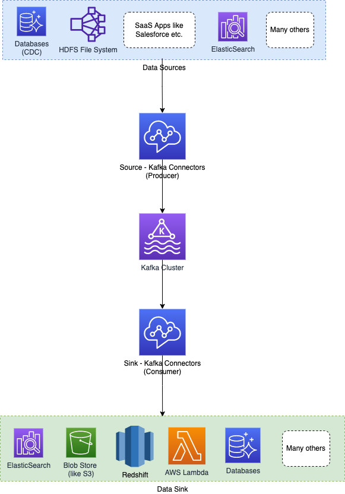

# Kafka Connect
- [Kafka Connect](https://kafka.apache.org/documentation.html#connect) is a tool for scalably and reliably streaming data between [Apache Kafka](../../2_MessageBrokersEDA/Kafka/Readme.md) and other systems.
- [Kafka Connect]() can ingest entire databases or collect metrics from all your application servers into [Kafka topics](../../2_MessageBrokersEDA/Kafka/Readme.md), making the data available for stream processing with low latency.
- This opens up possibilities for constructing and managing the operations of producers and consumers, as well as establishing reusable links between these solutions. 
- A connector, for example, may capture [all database updates](../../1_Databases/5_Database-Internals/ChangeDataCapture/Readme.md) and ensure that they are made available in a [Kafka topic](../../2_MessageBrokersEDA/Kafka/Readme.md).

# Key Features of Connectors
- Pluggable Software Components
- Interfaces to external system and to [Kafka](../../2_MessageBrokersEDA/Kafka/Readme.md)
- Also exist as runtime entities (war file)
- Source Connectors act as [Producers](../../2_MessageBrokersEDA/Kafka/Readme.md)
- Sink Connectors act as [Consumers](../../2_MessageBrokersEDA/Kafka/Readme.md)

# Kafka Connectors List - Confluent
- [Read more](https://www.confluent.io/hub/kafka-connectors-6)