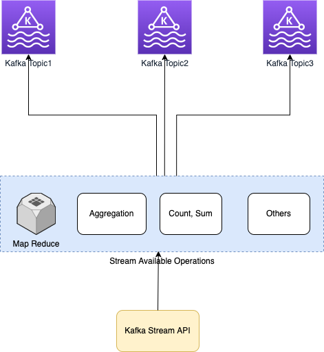

# Kafka Streams API
- [Kafka Streams](https://kafka.apache.org/documentation/streams/) is a client library for building applications and [microservices](../../../3_MicroServices/Readme.md), where the input and output data are stored in [Kafka clusters](../../../2_MessageBrokersEDA/Kafka/Readme.md). 
- It combines the simplicity of writing and deploying standard Java and Scala applications on the client side with the benefits of [Kafka's server-side cluster technology](../../../2_MessageBrokersEDA/Kafka/Readme.md).
- An application can use this API to take input streams from one or more topics, process them using streams operations, and generate output streams to transmit to one or more topics.



# Example1

````java
import org.apache.kafka.common.serialization.Serdes;
import org.apache.kafka.common.utils.Bytes;
import org.apache.kafka.streams.KafkaStreams;
import org.apache.kafka.streams.StreamsBuilder;
import org.apache.kafka.streams.StreamsConfig;
import org.apache.kafka.streams.kstream.KStream;
import org.apache.kafka.streams.kstream.KTable;
import org.apache.kafka.streams.kstream.Materialized;
import org.apache.kafka.streams.kstream.Produced;
import org.apache.kafka.streams.state.KeyValueStore;

import java.util.Arrays;
import java.util.Properties;

public class WordCountApplication {

   public static void main(final String[] args) throws Exception {
       Properties props = new Properties();
       props.put(StreamsConfig.APPLICATION_ID_CONFIG, "wordcount-application");
       props.put(StreamsConfig.BOOTSTRAP_SERVERS_CONFIG, "kafka-broker1:9092");
       props.put(StreamsConfig.DEFAULT_KEY_SERDE_CLASS_CONFIG, Serdes.String().getClass());
       props.put(StreamsConfig.DEFAULT_VALUE_SERDE_CLASS_CONFIG, Serdes.String().getClass());

       StreamsBuilder builder = new StreamsBuilder();
       KStream<String, String> textLines = builder.stream("TextLinesTopic");
       KTable<String, Long> wordCounts = textLines
           .flatMapValues(textLine -> Arrays.asList(textLine.toLowerCase().split("\\W+")))
           .groupBy((key, word) -> word)
           .count(Materialized.<String, Long, KeyValueStore<Bytes, byte[]>>as("counts-store"));
       wordCounts.toStream().to("WordsWithCountsTopic", Produced.with(Serdes.String(), Serdes.Long()));

       KafkaStreams streams = new KafkaStreams(builder.build(), props);
       streams.start();
   }
}
````

# Example2

````java
import org.apache.kafka.common.serialization.Serdes;
import org.apache.kafka.common.utils.Bytes;
import org.apache.kafka.streams.KafkaStreams;
import org.apache.kafka.streams.StreamsBuilder;
import org.apache.kafka.streams.StreamsConfig;
import org.apache.kafka.streams.kstream.KStream;
import org.apache.kafka.streams.kstream.KTable;
import org.apache.kafka.streams.kstream.Materialized;
import org.apache.kafka.streams.kstream.Produced;
import org.apache.kafka.streams.state.KeyValueStore;

import java.util.Arrays;
import java.util.Properties;

public class WordCountApplication {

    public static void main(final String[] args) throws Exception {
        StreamsBuilder builder = new StreamsBuilder();

        builder.stream("raw-movies", Consumed.with(Serdes.Long(), Serdes.String())).mapValues(Parser::parseMovie).map((key, movie) -> new KeyValue<>(movie.getMovieId(), movie)).to("movies", Produced.with(Serdes.Long(), movieSerde));

        KTable<Long, Movie> movies = builder.table("movies", Materialized.<Long, Movie, KeyValueStore<Bytes, byte[]>>as("movies-store").withValueSerde(movieSerde).withKeySerde(Serdes.Long()));

        KStream<Long, String> rawRatings = builder.stream("raw-ratings", Consumed.with(Serdes.Long(), Serdes.String()));
        KStream<Long, Rating> ratings = rawRatings.mapValues(Parser::parseRating).map((key, rating) -> new KeyValue<>(rating.getMovieId(), rating));

        KStream<Long, Double> numericRatings = ratings.mapValues(Rating::getRating);

        KGroupedStream<Long, Double> ratingsById = numericRatings.groupByKey();

        KTable<Long, Long> ratingCounts = ratingsById.count();
        KTable<Long, Double> ratingSums = ratingsById.reduce((v1, v2) -> v1 + v2);

        KTable<Long, Double> ratingAverage = ratingSums.join(ratingCounts, (sum, count) -> sum / count.doubleValue(), Materialized.as("average-ratings"));

        ratingAverage.toStream().to("average-ratings");

        KTable<Long, String> ratedMovies = ratingAverage.join(movies, (avg, movie) -> movie.getTitle() + "=" + avg);

        ratedMovies.toStream().to("rated-movies", Produced.with(Serdes.Long(), Serdes.String()));
    }
}
````
# References
- [What is Kafka Streams: A Comprehensive Guide 101](https://hevodata.com/learn/kafka-streams/)