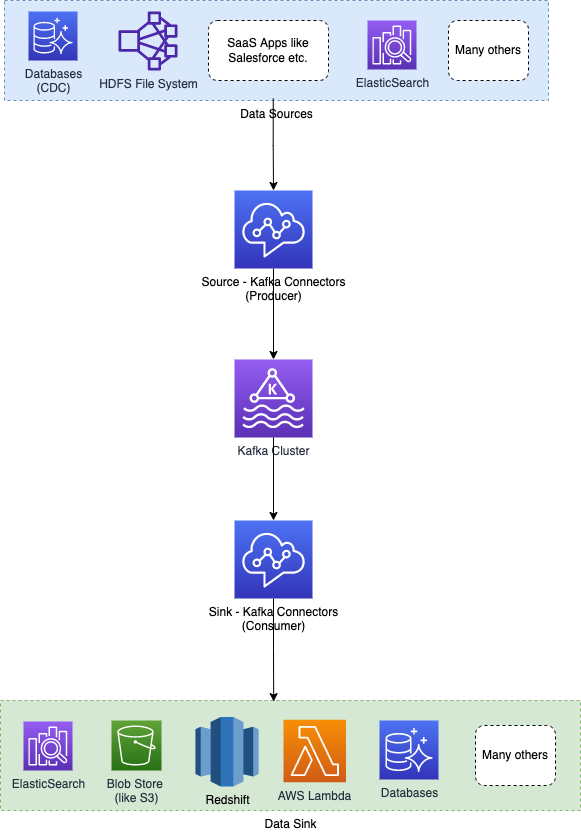

# Kafka Connect
- [Kafka Connect](https://kafka.apache.org/documentation.html#connect) is a tool for scalably and reliably streaming data between Apache Kafka and other systems.
- [Kafka Connect](KafkaConnect.md) can ingest entire databases or collect metrics from all your application servers into Kafka topics, making the data available for stream processing with low latency.
- This opens up possibilities for constructing and managing the operations of producers and consumers, as well as establishing reusable links between these solutions. 
- A connector, for example, may capture [all database updates](../../3_DatabaseServices/ChangeDataCapture/Readme.md) and ensure that they are made available in a Kafka topic.

# Key Features of Connectors
- Pluggable Software Components
- Interfaces to external system and to Kafka
- Also exist as runtime entities (war file)
- Source Connectors act as Producers
- Sink Connectors act as Consumers
- [Confluent - Kafka Connectors List](https://www.confluent.io/hub/kafka-connectors-6)