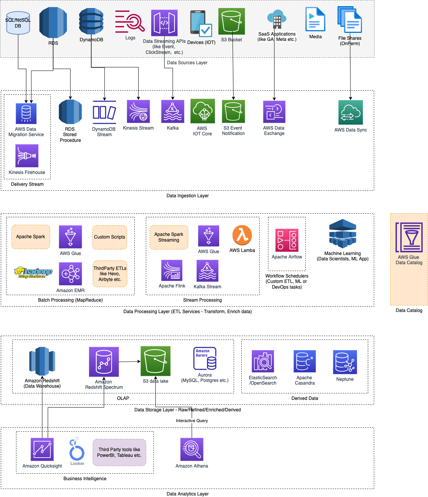

# Introduction
- [Apache Spark](https://spark.apache.org) is an open-source framework & compute engine that is known for its speed, easy-to-use nature in the field of `big data processing` and `analysis`.
- It also has built-in modules for graph processing, machine learning, streaming, SQL etc.
- The spark execution engine supports in-memory computation and cyclic data flow.
- It can run either on [cluster mode](../../7_PropertiesDistributedSystem/Scalability/ServersCluster.md) or standalone mode.

# Example Use Cases
- For running map-reduce jobs to select driver for efficient delivery and generate recommendations based on continuous streams of user activity, order activity, pricing and promo changes, etc.
- It will select the distributed data, create a map and then reduce the values to give proper data.

# :star: Real world use cases of Apache Spark
- [Zomato - HLD Design](../../0_HLDUseCasesProblems/FoodOrderingZomatoSwiggy/Readme.md)
- [Uber Driver Allocation](../../0_HLDUseCasesProblems/DriverAllocationUberGoJek/Readme.md)

# Tech Stack

# Data Sources
- [Kafka](../../5_MessageBrokersEDA/Kafka/Readme.md)
- [HBase](../../3_DatabaseServices/NoSQL-Databases/WideColumnDB/ApacheHBase.md)
- [HDFS](../../11_FileStorageServicesHDFS/ApacheHDFS.md) 
- [Cassandra](../../3_DatabaseServices/NoSQL-Databases/WideColumnDB/ApacheCasandra.md) etc.

# Apache Spark vs Others
- [Apache Spark vs Hadoop MapReduce](ApacheSparkVsMapReduce.md) 
- [Apach Spark vs Storm](StreamProcessing/ApacheStorm.md#apachestorm-vs-spark)

# References
- [Top Spark Interview Questions](https://www.interviewbit.com/spark-interview-questions/)
- [Spark vs Hadoop MapReduce](https://www.integrate.io/blog/apache-spark-vs-hadoop-mapreduce/)
- [Playing with 80 Million Amazon Product Review Ratings Using Apache Spark](https://minimaxir.com/2017/01/amazon-spark/)