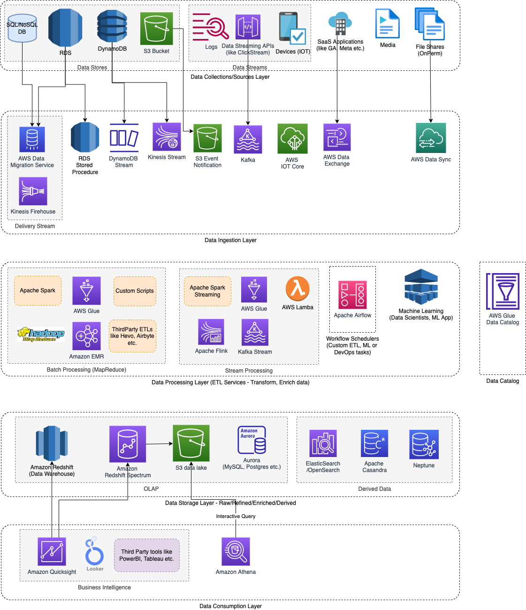

# Extract-Transform-Load (ETL)

|           | Remarks                                                                                                                                                          |
|-----------|------------------------------------------------------------------------------------------------------------------------------------------------------------------|
| EXTRACT   | EXTRACT data from multiple different data sources ([OLTP-DBs](../../3_DatabaseServices/OLTPvsOTAP.md), third-party-sources etc.).                                |
| TRANSFORM | TRANSFORM data by de-duplicating it, combining it, ensuring quality & best suited for analytics.                                                                 |
| LOAD      | LOAD data into one, centralized database ([OLAP db](../../3_DatabaseServices/OLTPvsOTAP.md) like [data warehouses](../StorageDBs/DataWarehouses/Readme.md)). |

[Read more](https://aws.amazon.com/what-is/etl/)

# Processing Types

| Processing Type                                 | Stream    | Description                                                                                                         |
|-------------------------------------------------|-----------|---------------------------------------------------------------------------------------------------------------------|
| [Batch Processing](BatchProcessing/Readme.md)   | Bounded   | It involves [MapReduce jobs](BatchProcessing/ApacheMapReduce.md) which runs at certain frequency to transform the data.   |
| [Stream Processing](StreamProcessing/Readme.md) | Unbounded | It involves processing data in near-real time.                                                                      |

# Building modern data architecture

# References
- [Batch, Stream, and Micro-batch Processing: A Cheat Sheet](https://www.upsolver.com/blog/batch-stream-a-cheat-sheet)