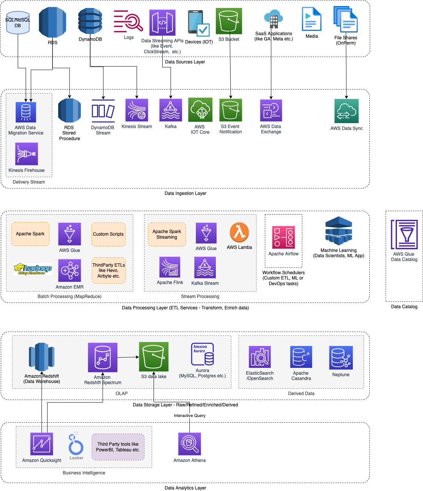

# Data Warehouses
- Data warehouse (part of [Online analytical processing - OLAP](../../../3_DatabaseServices/OLTPvsOTAP.md)) are used for data analytics (real-time) & insights.
- The process of getting data in Data Warehouse is called [Extract-Transform-Load (ETL)](../../ETLServices/Readme.md).
- Data model of a data warehouse is most commonly relational, because [SQL](../../../3_DatabaseServices/7_SQL-Databases/Readme.md) is generally a good fit for analytic queries.
- [Amazon Redshift](../../../2_AWSServices/10_BigDataServices/StorageDBs/DataWarehouse/AmazonRedshift.md) is most commonly used data warehouse on AWS.
- This type of database is also known as [Columnar Database](https://aws.amazon.com/nosql/columnar/).

# Why Data Warehouses?
- Usually an analytic query needs to scan over a huge number of records, only reading a few columns per record, and calculates aggregate statistics (such as count, sum, or average) rather than returning the raw data to the user.
- Hence, it's better to use separate database for analytics (than transaction database).
- Also, data warehouses are optimized for analytic access patterns ([SQL based](../../../3_DatabaseServices/7_SQL-Databases/Readme.md) with no indexes).
