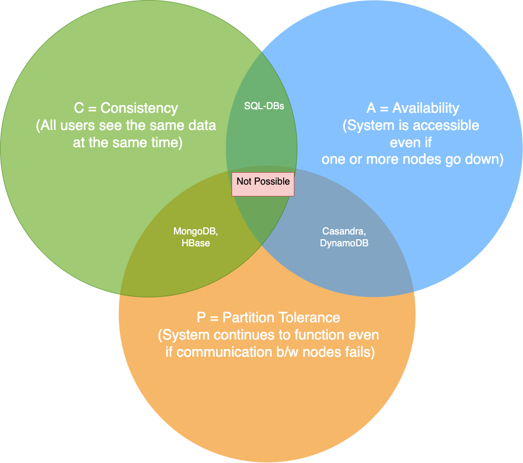

# CAP Theorem of the Distributed Systems

[CAP Theorem](https://www.geeksforgeeks.org/the-cap-theorem-in-dbms/) stands for:
- [Consistency](../Consistency&Replication/Readme.md)
- [Availability](../../../3_SystemGlossaries/Reliability/HighAvailability.md)
- [Partition Tolerance](NetworkPartition.md)

> Note - The use of the word [Consistency](../Consistency&Replication/Readme.md) in [CAP]() and its use in [ACID](../ACIDTransactions/Readme.md) do not refer to the same identical concept.
> - In [CAP](), the term [Consistency](../Consistency&Replication/Readme.md) refers to the data mismatch during [replication lag](../Consistency&Replication/Replication.md).
> - In [ACID](../ACIDTransactions/Readme.md), it refers to the fact that a transaction will not violate the integrity constraints specified on the database schema.

# Only 2 (of 3 CAP properties) possible at the same time
We can only build a system that has any two of these three CAP properties.
- Because, to be [consistent](../Consistency&Replication/Readme.md), all nodes should see the same set of updates in the same order.
- But if the [network loses a partition](NetworkPartition.md), updates in one partition might not make it to the other partitions before a client reads from the out-of-date partition after having read from the up-to-date one.
- The only thing that can be done to cope with this possibility is to stop serving requests from the out-of-date partition, but then the service is no longer 100% available.

# References
- [The CAP Theorem in DBMS](https://www.geeksforgeeks.org/the-cap-theorem-in-dbms/)