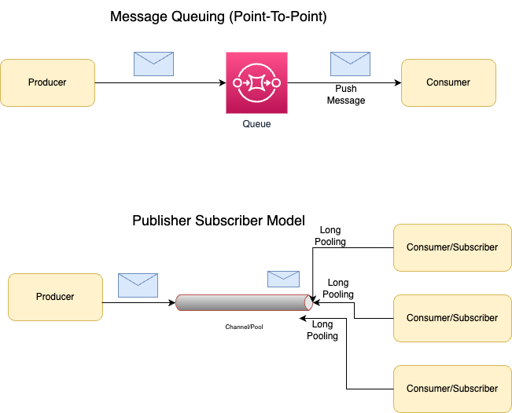

# Event Driven Architecture
- An [event-driven architecture](https://aws.amazon.com/event-driven-architecture/) uses events to trigger and communicate between loosely coupled services and is common in modern applications built with [microservices](../../3_MicroServices/Readme.md).
- [Message brokers]() like [Kafka](../../2_MessageBrokersEDA/Kafka/Readme.md), [Amazon SQS](https://github.com/Anshul619/AWS-Services/tree/main/4_MessageBrokers/AmazonSQS/Readme.md), [RabbitMQ](../../2_MessageBrokersEDA/RabbitMQ.md), can be used in the event-driven architecture.

# References
- [Event-Driven Architectures Done Right, Apache Kafka • Tim Berglund](https://www.youtube.com/watch?v=A_mstzRGfIE)
- [Materialized View Pattern](https://medium.com/design-microservices-architecture-with-patterns/materialized-view-pattern-f29ea249f8f8)
- [Event streaming: Build applications that keep up with business](https://tanzu.vmware.com/event-streaming)
- [Serverless Patterns Collection](https://serverlessland.com/)