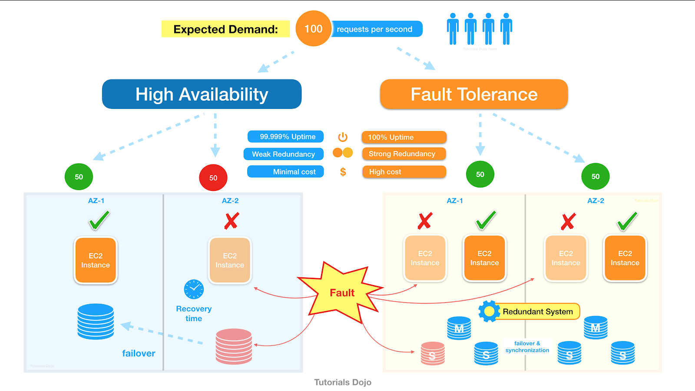

# Fault Tolerance vs High Availability
- If an application is said to be fault-tolerant then it is also considered highly available. But vice-verse is not true.
- In AWS, 100% fault tolerance (zero downtime) can be achieved through [active-active routing policy in Route53](../2_AWS/16_NetworkingAndContentDelivery/1_EdgeNetworking/AmazonRoute53/Readme.md#routing-policy) with at-least 2 regions (having same components & architecture).

|            | Fault Tolerance      | High Availability |
|------------|----------------------|-------------------|
| Complexity | More complex design. |                   |
| Redundancy | Higher redundancy.   |                   |
| Cost       | Higher cost.         |                   |

