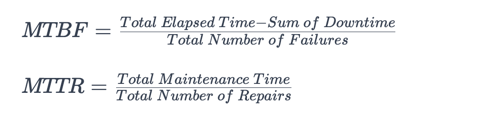

# Reliability
- Reliability is the probability that the service will perform its functions for a specified time. It measures how the service performs under varying operating conditions.

# Metrics
- MTBF - mean time between failures
- MTTR - mean time to repair

  

(We strive for a higher MTBF value and a lower MTTR value.)