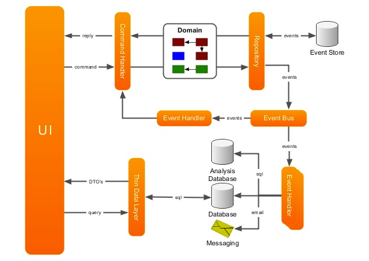

# Domain Driven Development
- Ubiquitous language across teams.
- Strategic and tactical patterns for consistency.
- Clear separation of domain bounded contexts.
- Consistent interpretation of domain entities & relationship.
- Use of domain lifecycle events to enable contextual and reliable requirements.
- Consistent architectural patterns to enable simplified developer experience.

# Domain Driven Architecture
- When we are developing software our focus should not be primarily on technology, rather it should be primarily on business/domain.
- Classes, modals, services, microservices, rest apis etc. should be designed according to the domains.
- [Read more](https://www.geeksforgeeks.org/domain-driven-design-ddd/)

# Example Design
- Think Domain-Driven Design, and with that in mind, you divide the logical structure of your project not as classes only, but as domains also.
- This means all operations have got to do with the `Product` are located within the `ProductsController` and consequently within the `ProductsRepository`
- Hence, its preferred each repository is equipped with operations to deal with some aspect of your project.
- Not all aspects may need a repository, but that is what you decide.

