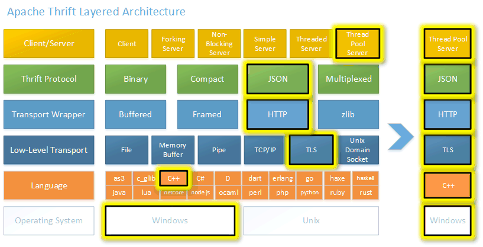

# Thrift
- [Thrift](https://thrift.apache.org) is a lightweight, language-independent software stack for point-to-point RPC implementation. 
- Thrift provides clean abstractions and implementations for data transport, data serialization, and application level processing. 
- The code generation system takes a simple definition language as input and generates code across programming languages that uses the abstracted stack to build interoperable RPC clients and servers.

# References
- [Thrift GitHub Code](https://github.com/apache/thrift)