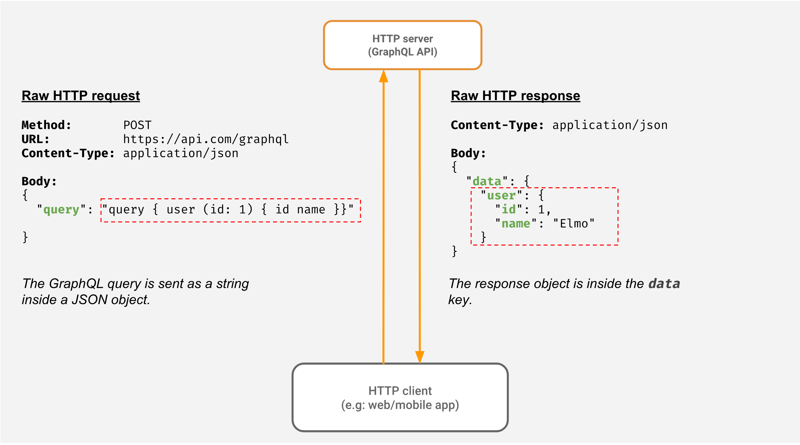

# GraphQL
- [GraphQL](https://graphql.org) can be used to dynamically get the data columns as needed.
- Client has control of what data it needs from server?
- GraphQL has a schema definition language for defining the types on a query.
- Additionally, with GraphQL, you can enquire multiple entities in one request, and because less bits will be transferred over the wire so your projects will perform faster than while using [REST](REST.md).

# Why GraphQL?
- There are some issues with the [REST Architecture](REST.md) style such as Multiple endpoints, Over-fetching, and Under-fetching of resources. 
- There is no efficient way of handling various versions of native applications.
- We can fetch multiple resources in a single endpoint. This reduces the time wasted in multiple round-trips from the browser. 
- With GraphQL, the client specifies the data it needs in the form of a query. 
- The server sends back the response in the exact same shape.
- This makes it easy to develop applications without making assumptions on the type of fields.

# :star: Real world use cases of GraphQL
- [Zomato - HLD Design](../0_HLDUseCasesProblems/FoodOrderingZomatoSwiggy/Readme.md#GraphQL)
- [Uber Driver Allocation](../../3_HLDDesignProblemsUC/DriverAllocationUberGoJek/Readme)
- [GraphQL with ElasticSearch](../3_DatabaseServices/9_Search-Databases/ElasticSearch/GraphQLSupport.md)

# References
- [What is GraphQL and why Facebook felt the need to build it?](https://buddy.works/tutorials/what-is-graphql-and-why-facebook-felt-the-need-to-build-it#why-facebook-built-graphql)
- [GraphQL vs REST APIs | What's the Best Kind of API?](https://www.youtube.com/watch?v=F0_pkxQMZnc)
- [Using GraphQL with Microservices in Go](https://outcrawl.com/go-graphql-gateway-microservices)