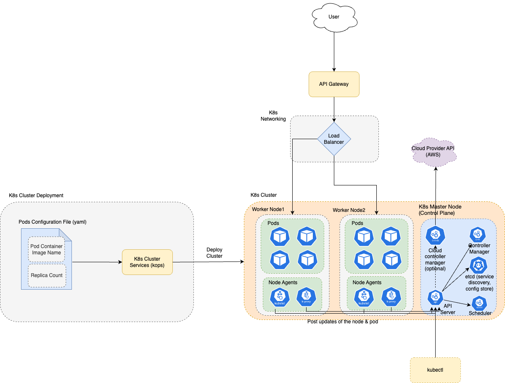

# Kubernates
- [Kubernetes](https://kubernetes.io), also known as K8s, is an OPEN-SOURCE system for automating deployment, [scaling](../../7_Scalability), and management of containerized applications. 
- [Kubernates]() is a [battle-tested container orchestration service](../Readme.md) i.e. manage, create containers (through pods, worker nodes).



> Kubernetes is a Greek word meaning `captain` in English.
> - Like the captain is responsible for the safe journey of the ship in the seas, Kubernetes is responsible for carrying and delivering those boxes safely to locations where they can be used.

# Real-world use cases

| Use Case                                                                 |
|--------------------------------------------------------------------------|
| [Zomato](../../0_HLDUseCasesProblems/FoodOrderingZomatoSwiggy/Readme.md) |
| [Swiggy](../../1_TechStacks/Swiggy.md)                          |
| [Spotify](../../1_TechStacks/Spotify/Readme.md)                          |
| [Grab](../../1_TechStacks/Grab/Readme.md)                                |
| [LinkedIn](../../1_TechStacks/LinkedIn/Readme.md)                        |
| [Split.io](../../1_TechStacks/SplitIO.md)                       |
| [Stripe](../../1_TechStacks/Stripe.md)                          |

# Resources and Limits

| Resource              | Limit                   |
|-----------------------|-------------------------|
| Max Pods Per Node     | 110 pods per node       |
| Max Pods Per Cluster  | 150000 pods per cluster |
| Max Nodes Per Cluster | 5000 nodes per cluster  |

# Components

| Component                   | Description                                                                                                                                                                                                                                                                                                                                                                                                                                                                                                                                                                                                                        |
|-----------------------------|------------------------------------------------------------------------------------------------------------------------------------------------------------------------------------------------------------------------------------------------------------------------------------------------------------------------------------------------------------------------------------------------------------------------------------------------------------------------------------------------------------------------------------------------------------------------------------------------------------------------------------|
| Control Plane (Master node) | [The control plane](https://kubernetes.io/docs/concepts/overview/components/) manages the worker nodes and the Pods in the cluster.<br/>- In production environments, the control plane usually runs across multiple computers and a cluster usually runs multiple nodes, providing [fault-tolerance and high availability](../../7a_HighAvailability/Readme.md).<br/>- [Nodes with controlplane]((https://kubernetes.io/docs/concepts/overview/components/)) role run the K8s master components (excluding [etcd](../../10_ClusterCoordination/etcd.md), as its separate role).           |
| Worker Nodes                | Each docker/Pod container would run the micro-service (golang, java, python service etc.)<br/>- And a [worker node can have one or multiple pods](https://kubernetes.io/docs/concepts/architecture/nodes/).<br/>- Kubernates would manage the [worker nodes](https://kubernetes.io/docs/concepts/architecture/nodes/) i.e. Create, Update, Delete, Auto-Scale based on the configuration and params.                                                                                                                                                                                                                               |
| Pods                        | [Pods](https://kubernetes.io/docs/concepts/workloads/pods/) are the smallest deployable units of computing that you can create and manage in Kubernetes.<br/>- A Pod (as in a pod of whales or pea pod) is a group of one or more containers, with shared storage and network resources, and a specification for how to run the containers.<br/>- A pod can contain one or multiple containers (but generally one container).<br/>- [Minimum and Maximum Memory Constraints for a Namespace needs to be configured for the pod](https://kubernetes.io/docs/tasks/administer-cluster/manage-resources/memory-constraint-namespace/) |
| Networking                  | K8s manages its own load balancer, service discovery (through [etcd](../../10_ClusterCoordination/etcd.md)) etc. [Read more](https://kubernetes.io/docs/concepts/services-networking/_print/)                                                                                                                                                                                                                                                                                                                                                                                                                              |
| Cluster                     | [A Kubernetes cluster](https://kubernetes.io/docs/concepts/overview/components/) consists of a set of worker machines, called [nodes](), that run containerized applications. <br/>- Every cluster has at least one worker node.                                                                                                                                                                                                                                                                                                                                                                                                   |
| Agents                      | Kubernetes agents perform various tasks on every node to manage the containers running on that node. For example:<br/>- cAdvisor collects and analyzes the resource usage of all containers on a node.<br/>- [kubelet](https://kubernetes.io/docs/reference/command-line-tools-reference/kubelet/) runs regular live-ness and readiness probes against each container on a node.                                                                                                                                                                                                                                                   |
| Labels                      | [Labels](https://kubernetes.io/docs/concepts/overview/working-with-objects/labels/) are key/value pairs that are attached to objects, such as pods.<br/>- Labels are intended to be used to specify identifying attributes of objects that are meaningful and relevant to users, but do not directly imply semantics to the core system.                                                                                                                                                                                                                                                                                           |

# Control Plan (Master node) Components

| K8s Master Components | Description                                                                                                                                                                                                                                                                                                                                                                                                                   |
|-----------------------|-------------------------------------------------------------------------------------------------------------------------------------------------------------------------------------------------------------------------------------------------------------------------------------------------------------------------------------------------------------------------------------------------------------------------------|
| API server            | The [Kubernetes API server](https://kubernetes.io/docs/reference/command-line-tools-reference/kube-apiserver/) validates and configures data for the api objects which include pods, services, replication controllers, and others. <br/>- The API Server services REST operations and provides the frontend to the cluster's shared state through which all other components interact.                                       |
| etcd                  | [etcd](../../10_ClusterCoordination/etcd.md) is used for [Configuration Store & Service Discovery](../../5_MicroServices/2_ServiceRegistry&Discovery).<br/>- etcd is a [Consistent](../../3_Databases/4_Consistency&Replication/Readme.md) and [highly-available key value store](../../7a_HighAvailability/Readme.md) used as Kubernetes backing store for all cluster data. |
| Controller manager    | The [K8s Controller Manager](https://kubernetes.io/docs/reference/command-line-tools-reference/kube-controller-manager/) is a daemon that embeds the core control loops (like ReplicationController, DeploymentController etc.) shipped with Kubernetes.                                                                                                                                                                      |
| Scheduler             | A [Scheduler](https://kubernetes.io/docs/concepts/scheduling-eviction/kube-scheduler/) is responsible for scheduling pods on the cluster. <br/>- It watches for newly created Pods that have no Node assigned. <br/>- For every Pod that the scheduler discovers, the scheduler becomes responsible for finding the best Node for that Pod to run on.                                                                         |
| ReplicationController | A [ReplicationController](https://kubernetes.io/docs/concepts/workloads/controllers/replicationcontroller/) ensures that a specified number of pod replicas are running at any one time. In other words, a ReplicationController makes sure that a pod or a homogeneous set of pods is always up and available.                                                                                                               |
| Deployment Controller | [Deployment Controller](https://docs.aws.amazon.com/AmazonECS/latest/APIReference/API_DeploymentController.html) manages the rolling update and rollback of deployments (docker containers etc.)                                                                                                                                                                                                                              |

## Workload Resources

### Deployments
- [A Deployment](https://kubernetes.io/docs/concepts/workloads/controllers/deployment/) provides declarative updates for Pods and ReplicaSets.
- You describe a desired state in a Deployment, and the Deployment Controller changes the actual state to the desired state at a controlled rate. 
- You can define Deployments to create new ReplicaSets, or to remove existing Deployments and adopt all their resources with new Deployments.
- Every microservice, app component can be a deployment in K8s.

### Replica Set
- [ReplicasSet](https://kubernetes.io/docs/concepts/workloads/controllers/replicaset/) will ensure that the number of pods (defined in our config file) is always running in our cluster. 
- Does not matter in which worker node they are running. 
- The scheduler will schedule the pods on any node depending upon the free resources. 
- If one of our nodes goes down then all pods running on the node will be randomly scheduled on different nodes as per the resource availability. 
- In this way, ReplicaSet ensures that the number of pods of an application is running on the correct scale as specified in the conf file.
- Example - MicroServices, App Pods etc.


### Daemon Set
- Whereas in the case of [DaemonSet](https://kubernetes.io/docs/concepts/workloads/controllers/daemonset/), it will ensure that one copy of pod defined in our configuration will always be available on every worker node.
- Example - [newrelic-infra, newrelic-logging](https://docs.newrelic.com/docs/kubernetes-pixie/kubernetes-integration/get-started/introduction-kubernetes-integration) etc.


### StatefulSets
- [StatefulSets]((https://kubernetes.io/docs/concepts/workloads/controllers/statefulset/)) are used when state has to be persisted. 
- Therefore, it uses volumeClaimTemplates / claims on persistent volumes to ensure they can keep the state across component restarts.
- Example - [kube-state-metrics](https://github.com/kubernetes/kube-state-metrics) etc.

# :star: Horizontal Pod Autoscaling (HPA)
- In Kubernetes, [a Horizontal Pod Autoscaler](https://kubernetes.io/docs/tasks/run-application/horizontal-pod-autoscale/) automatically updates a workload resource (such as a [Deployment](#deployments) or [StatefulSet](#statefulsets)), with the aim of automatically scaling the workload to match demand.
- As an alternative, we can also use [Cluster Autoscaler](https://github.com/kubernetes/autoscaler/tree/master/cluster-autoscaler#cluster-autoscaler) for scaling pods.

## AutoScaling on Container resource metrics

````yaml
type: ContainerResource
containerResource:
  name: cpu
  container: application
  target:
    type: Utilization
    averageUtilization: 60
````

## Stabilization window

````yaml
behavior:
  scaleDown:
    stabilizationWindowSeconds: 300
    policies:
    - type: Percent
      value: 100
      periodSeconds: 15
  scaleUp:
    stabilizationWindowSeconds: 0
    policies:
    - type: Percent
      value: 100
      periodSeconds: 15
    - type: Pods
      value: 4
      periodSeconds: 15
    selectPolicy: Max
````

# Kubernates Commands

## kops - Manage production grade k8s cluster
- [KOPS](https://kops.sigs.k8s.io/) offers a one-stop solution for deploying [Kubernetes cluster]() with [Amazon Web Services](../../2_AWSComponents/).
- It is an open source tool designed to make installation of secure, [highly available clusters](../../7a_HighAvailability/Readme.md) easy and automatable.

### Step1 - Create Hosted Zone for Cluster
- We require a hosted zone associated with [Route 53](../../2_AWS/1_NetworkingAndContentDelivery/1_EdgeNetworking/AmazonRoute53/Readme.md) which must be publicly resolvable.

````shell
aws route53 create-hosted-zone --name testikod.in --caller-reference 2017-02-24-11:12 --hosted-zone-config Comment="Hosted Zone for KOPS"
````

### Step2 - Create State Store
- KOPS internally uses Terraform. 
- So we required external state store for storing states of a cluster. 
- We are using [Amazon S3](../../2_AWS/7_StorageServices/3_ObjectStorageS3/Readme.md) for storing state.

````shell
aws s3api create-bucket --bucket testikod-in-state-store --region us-west-2
````

### Step3 - Create cluster
- An instance group is a set of instances, which will be registered as kubernetes nodes. [On AWS this is implemented via auto-scaling-groups](../../2_AWS/3_ComputeServices/AmazonEC2/AutoScalingGroup/Readme.md).

````shell

export NAME=cluster.testikod.in // Setup environment variable for STATE STORE and cluster name.
export KOPS_STATE_STORE="s3://testikod-in-state-store"

kops create cluster \
    --cloud aws \
    --node-count 5 \
    --node-size t2.medium \
    --master-size m3.medium \
    --zones us-west-2a,us-west-2b,us-west-2c \
    --master-zones us-west-2a,us-west-2b,us-west-2c \
    --dns-zone testikod.in \
    --topology private \
    --networking calico \
    --bastion \
    ${NAME}
````

Parameters:
- --cloud aws : We are launching cluster in AWS.
- --zones us-west-2a,us-west-2b,us-west-2c : This describes availability zones for nodes.
- --node-count 5 : The number kubernetes nodes.
- --node-size t2.medium : Size of kubernetes nodes.
- --dns-zone testikod.in : Hosted zone which we created earlier.
- --master-size m3.medium : Size of a Kubernetes master node.
- --master-zones us-west-2a,us-west-2b,us-west-2c : This will tell kops to spread masters across those availability zones. Which will give High Availability to KOPS cluster.
- --topology private : We define that we want to use a private network topology with kops.
- --networking calico : We tell kops to use Calico for our overlay network. Overlay networks are required for this configuration.
- -- bastion : Add this flag to tell kops to create a bastion server, so you can SSH into the cluster.

Read more
- [Installing Kubernetes with kOps](https://kubernetes.io/docs/setup/production-environment/tools/kops/)
- [Creating Kubernetes Clusters on AWS using KOPS](https://www.opcito.com/blogs/creating-kubernetes-clusters-on-aws-using-kops)
- [An introduction and setting up kubernetes cluster on AWS using KOPS](https://dev.to/aws-builders/an-introduction-and-setting-up-kubernetes-cluster-on-aws-using-kops-50m)

## Kubectl - Communicate with cluster API server
- Kubectl is used for communicating with the cluster API server.


| Title                             | Command                                           | Remarks                                                                                                                                                                                                          |
|-----------------------------------|---------------------------------------------------|------------------------------------------------------------------------------------------------------------------------------------------------------------------------------------------------------------------|
| View config                       | kubectl config view                               |                                                                                                                                                                                                                  |
| Set context in config             | kubectl config use-context <clusterName>          |                                                                                                                                                                                                                  |
| Get all contexts                  | kubectl config get-contexts                       |                                                                                                                                                                                                                  |
| Get all the events of the cluster | kubectl get events                                | [List Events](https://www.containiq.com/post/kubernetes-events) sorted by timestamp                                                                                                                              |
| Get all the deployments list      | kubectl get deployments                           |                                                                                                                                                                                                                  |
| Scale the deployment              | kubectl scale --replicas=10 <deployment_name>     | Replicate the deployment (microservice) across the worker-nodes                                                                                                                                                  |
| Auto scale the deployment         | kubectl autoscale deployment foo --min=2 --max=10 | Auto scale a deployment "foo"                                                                                                                                                                                    |
| Get all pods                      | kubectl get pods --all-namespaces                 | List all pods in the namespace, in the default context                                                                                                                                                           |
| Get pod information               | kubectl get pod my-pod -o yaml                    | Get a pod's YAML                                                                                                                                                                                                 |
| Create resource                   | kubectl apply -f ./my-manifest.yaml               | Create resource (pod etc.) from yaml file <br/>- `apply` manages applications through files defining Kubernetes resources. <br/>- It creates and updates resources in a cluster through running `kubectl apply`. |
| Update resource                   | kubectl patch                                     | Use kubectl patch to update an API object in place.                                                                                                                                                              |
| Dump pod logs                     | kubectl logs my-pod                               | dump pod logs (stdout)                                                                                                                                                                                           |

[kubectl - Cheat Sheet](https://kubernetes.io/docs/reference/kubectl/cheatsheet/)

# Installation Guide
- [Install and Set Up kubectl on macOS](https://kubernetes.io/docs/tasks/tools/install-kubectl-macos/)
- [MiniKube Start](https://minikube.sigs.k8s.io/docs/start/)

# :+1: Advantages of K8s
- Self-healing
- Automated Rollbacks
- Horizontal Scaling
- It helps us deploy and manage applications in consistent and reliable way regardless of underlying architecture.

# :-1: Disadvantages of K8s
- Complex to set up and operate
- High cost to run minimum resources for K8s

# kubectl drain
- You can use [kubectl drain](https://kubernetes.io/docs/tasks/administer-cluster/safely-drain-node/) to safely evict all of your pods from a node before you perform maintenance on the node (e.g. kernel upgrade, hardware maintenance, etc.)
- Safe evictions allow the pod's containers to gracefully terminate and will respect the PodDisruptionBudgets you have specified.

# Tools

| Tool                        | Description                                                                                                                                                                                                                                                                                                                                                      |
|-----------------------------|------------------------------------------------------------------------------------------------------------------------------------------------------------------------------------------------------------------------------------------------------------------------------------------------------------------------------------------------------------------|
| Kubeadm                     | [Kubeadm](https://www.densify.com/kubernetes-tools/kubeadm/) is a tool used to build Kubernetes (K8s) clusters. Kubeadm performs the actions necessary to get a minimum viable cluster up and running quickly.                                                                                                                                                   |
| Helm                        | [Helm](https://helm.sh/) is the best way to find, share, and use software built for Kubernetes.                                                                                                                                                                                                                                                                  |
| K9s                         | [K9s](https://k9scli.io/) is a terminal based UI to interact with your Kubernetes clusters. K9s continually watches Kubernetes for changes and offers subsequent commands to interact with your observed resources.                                                                                                                                              |
| Knative                     | [Knative](https://knative.dev/docs/) is an Open-Source Enterprise-level solution to build Serverless and Event Driven Applications in K8s environment.                                                                                                                                                                                                           |
| Kustomize                   | [Kustomize](https://kustomize.io/) introduces a template-free way to customize application configuration that simplifies the use of off-the-shelf applications.                                                                                                                                                                                                  |
| Rancher                     | [Rancher](https://www.rancher.com/) lets you deliver Kubernetes-as-a-Service.                                                                                                                                                                                                                                                                                    |
| OpenFaaS                    | [OpenFaaS](https://www.openfaas.com/) makes it simple to deploy both functions and existing code to Kubernetes                                                                                                                                                                                                                                                   |
| Argo CD                     | [Argo CD](https://argo-cd.readthedocs.io/en/stable/getting_started/) is a declarative, GitOps continuous delivery tool for Kubernetes.                                                                                                                                                                                                                           |
| Flagger (Canary Deployment) | [Flagger](https://docs.flagger.app/tutorials/nginx-progressive-delivery) takes a Kubernetes deployment and optionally a horizontal pod autoscaler (HPA), then creates a series of objects (Kubernetes deployments, ClusterIP services and canary ingress). These objects expose the application outside the cluster and drive the canary analysis and promotion. |
| Karpenter                   | [Karpenter](https://karpenter.sh/) manages Just-in-time Nodes for Any Kubernetes Cluster.                                                                                                                                                                                                                                                                                                 |

# References
- [How to Manage Kubernetes With Kubectl?](https://www.suse.com/c/rancher_blog/how-to-manage-kubernetes-with-kubectl/)
- [Mesos vs Kubernetes](https://www.baeldung.com/ops/mesos-kubernetes-comparison)
- [Choosing an Optimal Kubernetes Worker Node Size for Your Startup](https://blog.devgenius.io/choosing-an-optimal-kubernetes-worker-node-size-e0eacab408c4)
- [Architecting Kubernetes clusters — choosing the best autoscaling strategy](https://learnk8s.io/kubernetes-autoscaling-strategies)
- [Setting the right requests and limits in Kubernetes](https://learnk8s.io/setting-cpu-memory-limits-requests)
- [Canary deployment in Kubernetes: how to use the pattern](https://medium.com/tech-at-wildlife-studios/canary-deployment-in-kubernetes-how-to-use-the-pattern-b2e9c40d085d)
