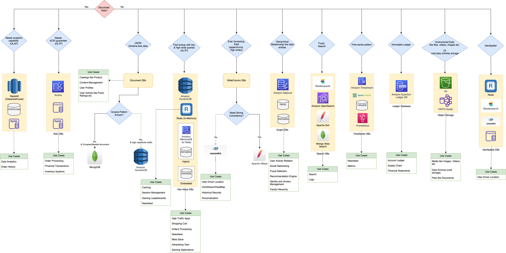
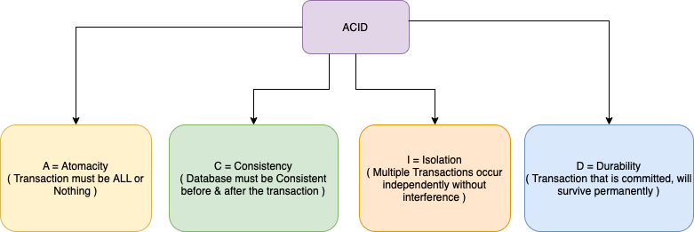

# Database Design Tips | Choosing the Best Database in a System Design

[Read more](https://www.youtube.com/watch?v=cODCpXtPHbQ)

# Key Parameters

| Title                  | Remarks                                                                                                                                                        |
|------------------------|----------------------------------------------------------------------------------------------------------------------------------------------------------------|
| :star: Query Patterns  | How complex are your query patterns?  - Do you just need retrieval by key, or also by various other parameters? Do you also need fuzzy search on the data? |
| Consistency            | Is strong consistency required (read after write, especially when you switch writes to a different data-center) or eventual consistency is OK?                 |
| Storage Capacity       | How much storage capacity is needed?                                                                                                                           |
| Performance            | What is the needed throughput and latency?                                                                                                                     |

[Read more](https://medium.com/wix-engineering/how-to-choose-the-right-database-for-your-service-97b1670c5632)

# Key Considerations

| Title                                                                                                | Category      | Remarks                                                                                                                                                                                                                                                                      |
|------------------------------------------------------------------------------------------------------|---------------|------------------------------------------------------------------------------------------------------------------------------------------------------------------------------------------------------------------------------------------------------------------------------|
| [SQL vs NoSQL](3_DatabaseServices/SQLvsNoSQL/Readme.md)                                                     | Comparison    |                                                                                                                                                                                                                                                                              |
| [DynamoDB vs MongoDB vs Casandra](3_DatabaseServices/NoSQL-Databases/DynamoDBVsMongoDBVsCasandra.md) | Comparison    |                                                                                                                                                                                                                                                                              |
| [NoSQL DB Types](3_DatabaseServices/NoSQL-Databases/Readme.md)                                       | NoSQL DB      |                                                                                                                                                                                                                                                                              |
| [Sharding of the database](3_DatabaseServices/Glossaries/PartitioningSharding/Readme.md)             | Sharding      | To scale the data store horizontally (& improve write scalability), shard the databases using [consistent hashing technique](3_DatabaseServices/Glossaries/PartitioningSharding/ConsistentHashing.md).                                                                       |
| [Partitioning Key Tip](3_DatabaseServices/Glossaries/PartitioningSharding/PartitionKeyTips.md)       | Sharding      | Decide partition key carefully (to prevent hot partition problem).                                                                                                                                                                                                           |
| [SQL Tunning](3_DatabaseServices/SQL-Databases/SQLTuning.md)                                         | SQL DB        | Tune queries, to improve performance of SQL Queries.                                                                                                                                                                                                                         |
| SQL - Read scalability                                                                               | SQL DB        | To improve read scalability of SQL queries, use [Redis](3_DatabaseServices/In-Memory-DB/Redis) or [single-leader technique](3_DatabaseServices/Glossaries/Consistency&Replication/SingleLeaderReplication.md) (in case dynamic input params like time).                      |
| Microservices - Purpose built DB for each microservice                                               | Microservices | With modern application design such as [microservice architectures](4_MicroServicesSOA/Readme.md), it is easier to scale and faster to develop applications with a denormalized schema because each service stores and processes data related to a single business function. |

# PACLEC Theorem

[Read more](3_DatabaseServices/Glossaries/PACELCTheorem/Readme.md)

# ACID Transactions

[Read more](3_DatabaseServices/Glossaries/ACIDTransactions/Readme.md)

# References
- :star: [AWS re:Invent 2021 - Which NoSQL database is right for you?](https://www.youtube.com/watch?v=ivBaro-8PhI)
- [How To Choose The Right Database?](https://www.youtube.com/watch?v=kkeFE6iRfMM)
- [AWS re:Invent 2022 - From RDBMS to NoSQL (PRT314)](https://www.youtube.com/watch?v=eEENrNKxCdw)
- [Databases on AWS: The Right Tool for the Right Job](https://www.youtube.com/watch?v=WE8N5BU5MeI&t=3710s)
- [Wix Engineering - How to choose the right database for your service](https://medium.com/wix-engineering/how-to-choose-the-right-database-for-your-service-97b1670c5632)
- [Wix Engineering - 5 Database technologies used by 2000 Wix microservices](https://medium.com/wix-engineering/5-database-technologies-used-by-2000-wix-microservices-e4769638b8c3)
- [AWS - What Is a Document Database?](https://aws.amazon.com/nosql/document/)