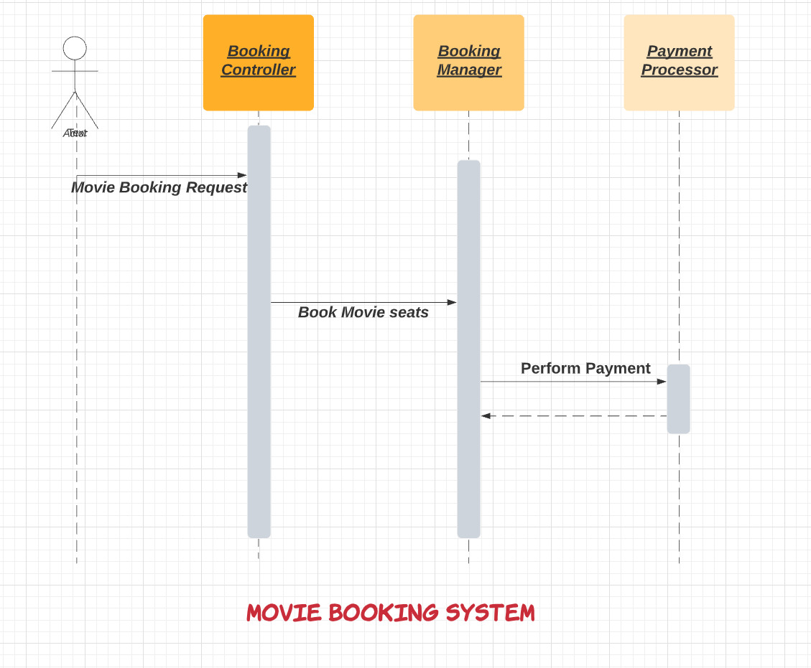
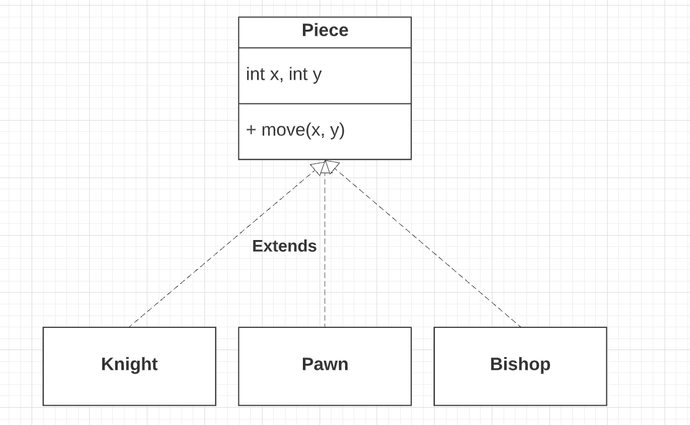

# System-Designs

This repo contains the various system design questions and solutions.

# Various components & Performance Metrics

| Component                                                                                                            | Component Type | Very Rough Throughput (QPS)                 | Latency | Free |
|----------------------------------------------------------------------------------------------------------------------|-----------------------------------------|----------------|----------------|------|
| [Kafka](https://github.com/Anshul619/System-Designs/tree/main/src/DesignComponents/Kafka)                            | Message Queue (Pub-Sub) - High-throughput | 1 million messages ( write ) per second | ~5ms | Yes   |
| [RabbitMQ](https://github.com/Anshul619/System-Designs/tree/main/src/DesignComponents/Kafka#kafka-vs-rabbitmq)       | Message Queue (Point-2-Point) | 20K messages per second | ~1ms |  Yes   |
| [Redis](https://github.com/Anshul619/System-Designs/tree/main/src/DesignComponents/Redis)                            | Caching        | 100K queries per second       | -|  Yes   |
| [MySQL](https://www.mysql.com/)                                                                                      | SQL DB | 1000 concurrent requests ( 100 as default )| [< 10ms ( to get a row from 1 million records )](https://www.quora.com/How-can-we-calculate-the-throughput-of-MySQL?share=1)|Yes|
| [DynomoDB](https://github.com/Anshul619/System-Designs/blob/main/src/DesignComponents/SQLvsNoSQL/ReadMe.md#dynomodb) | NoSQL DB as a Service ( AWS ) - Predictable performance and cost| More than 20 million requests per second | less than 10-20 ms | No  |
| [MongoDB](https://www.mongodb.com)                                                                                   | NoSQL DB       | - | -|  No                                      |
| [ElasticSearch](https://github.com/Anshul619/System-Designs/tree/main/src/DesignComponents/ElasticSearch)            | Search Engine|-|-|No|
| [Apache](https://apache.org/)                                                                                        | Web Server | 512 concurrent requests|-|Yes|

# Tech Decisions ( Scalability )
- Develop a microservice based architecture
- We must consider `cloud-agnostic approach` ( & onPerm customer approach ) while designing the solution.
- If it's a read heavy microservice, the best decision would be to use `Redis` or `multi-read database instances`.
- If it's write heavy microservice, the best decision would be to use either use `Kafka` ( as message queue ) or `DynmoDB`. Both can handle `HIGH throughput`.
- Generally, you should aim for `MAXIMAL throughput` with `ACCEPTABLE latency`.

# [LLD Design - Tips & Techniques](https://betterprogramming.pub/how-to-ace-the-low-level-design-interview-3f1be6401070)

1. `Requirements Gathering` 
   - What are use cases? What are business actors?
   - Every requirement will translate into action (`methods`) in the system.
   - Think from `user perspective` & `use cases`.

2. `Object Modelling` 
   - Define `composition` & `relationship` b/w entities
   - Establish the relationships between the classes / objects by observing the interactions among the classes / objects.
   - This is important perspective.
   - Most of the classes would have a composition with another domain class. This is natural.

3. Define `Main & Core Classes/Entities`
   - Make sure `SOLID` principals are followed.
   - Think of as many smaller & unit classes as possible.
   - A single feature might involve interaction between multiple entities.
   - Examples
     - In the case of a movie booking application, the booking will involve components such as `BookingController`, `BookingManager`, and `PaymentProcessor`.
     - The `BookingController` will handle the booking requests and send a request to the `BookingManager` to book movie seats. 
     - `BookingManager` will then interact with the `PaymentProcessor` for completing the payment.

4. Define `abstract classes`
   - Common, reusable classes which can be extended for various business Actors, UCS etc.
   - Examples 
     - `User Account` abstract class ( with first name, last name etc. ) can be extended for different user actors ( `Employee`, `Manager` etc. ). 
     - `Piece` abstract class ( with `move()`) in the chess game ( for pawn, knight, bishop classes ).

     
5. Define `interfaces`
   - Interfaces are core entities which can be implemented as per the needs.
   - Examples 
     - `Search` interface

6. Define `enums`
   - `Enums` are different types of entities which are hardcoded but at one place.
   - Examples 
     - `Payment status`
     - `entity status`
     - `reservation status`
     - `booking status` etc.

## Design Components
- [SQL vs NoSQL](https://github.com/Anshul619/System-Designs/blob/main/src/DesignComponents/SQLvsNoSQL/ReadMe.md)
- [Kafka](https://github.com/Anshul619/System-Designs/blob/main/src/DesignComponents/Kafka/ReadMe.md)
- [AWS](https://github.com/Anshul619/System-Designs/blob/main/src/DesignComponents/AWS.md)
- [Redis](https://github.com/Anshul619/System-Designs/blob/main/src/DesignComponents/Redis/Redis-ReadMe.md)
- [ElasticSearch](https://github.com/Anshul619/System-Designs/blob/main/src/DesignComponents/ElasticSearch/ReadMe.md)
- [EFS vs S3](https://github.com/Anshul619/System-Designs/blob/main/src/DesignComponents/EFSvsS3/ReadMe.md)

## Engineering Principles
- [SOLID](https://github.com/Anshul619/System-Designs/blob/main/src/DesignComponents/SOLID.md)
- [OOPS](https://github.com/Anshul619/System-Designs/blob/main/src/DesignComponents/OOPS.md)
- [Design Patterns](https://github.com/Anshul619/System-Designs/tree/main/src/DesignComponents/DesignPatterns)
- [DRY](https://github.com/Anshul619/System-Designs/blob/main/src/DesignComponents/DRY.md)

## Tech Skills
- [Spring Boot & Microservices](https://github.com/Anshul619/System-Designs/tree/main/src/DesignComponents/SpringBootAndMicroServices)
- [Java](https://github.com/Anshul619/System-Designs/tree/main/src/DesignComponents/Java)
- [Hibernate](https://github.com/Anshul619/System-Designs/blob/main/src/DesignComponents/Hiberate.md)
- [JS](https://github.com/Anshul619/System-Designs/tree/main/src/DesignComponents/JavaScript)
- [Testing](https://github.com/Anshul619/System-Designs/blob/main/src/DesignComponents/Testing.md)
- [JavaScript](https://github.com/Anshul619/System-Designs/blob/main/src/DesignComponents/JavaScript)
- [TypeScript](https://github.com/Anshul619/System-Designs/blob/main/src/DesignComponents/TypeScript.md)
- [Angular8](https://github.com/Anshul619/System-Designs/blob/main/src/DesignComponents/Angular8.md)

## HLD - Design Problems
- [Design a system that scales to million of users on AWS](https://github.com/Anshul619/System-Designs/tree/main/src/DesignComponents/DesignScalableSystemWithRDMS)
- [Zomoto HLD Design](https://github.com/Anshul619/System-Designs/tree/main/src/ZomatoDesignHLD)
- [Twillo Send Message API](https://github.com/Anshul619/System-Designs/tree/main/src/TwilloSendMessageAPI)
- [Rate Limiter API](https://github.com/Anshul619/System-Designs/tree/main/src/RateLimiterAPI)
- [Notification System](https://github.com/Anshul619/System-Designs/tree/main/src/NotificationSystem)
- [Logging Solution](https://github.com/Anshul619/System-Designs/tree/main/src/LoggingSolution)
- [Monolothic to MicroService](https://github.com/Anshul619/System-Designs/tree/main/src/MonolothicToMicroservice)
- [MakeMyTrip Search](https://github.com/Anshul619/System-Designs/tree/main/src/MakeMyTripSearch)

## LLD - Design Problems
- [Chess Game](https://github.com/Anshul619/System-Designs/tree/main/src/DesignLLDProblems/ChessGame)
- [Snack & Ladder Game](https://github.com/Anshul619/System-Designs/tree/main/src/DesignLLDProblems/SnackAndLadderGame)
- [Book My Show](https://github.com/Anshul619/System-Designs/tree/main/src/DesignLLDProblems/BookMyShow)
- [Car Rental System](https://github.com/Anshul619/System-Designs/tree/main/src/DesignLLDProblems/CarRentalSystem)
- [Vendor Machine](https://github.com/Anshul619/System-Designs/tree/main/src/DesignLLDProblems/VendorMachine)
- [Hotel Booking System](https://github.com/Anshul619/System-Designs/tree/main/src/DesignLLDProblems/HotelBookingSystem)
- [Parking Lot](https://github.com/Anshul619/System-Designs/tree/main/src/DesignLLDProblems/ParkingLot)
- [Generic Cache Implementation](https://github.com/Anshul619/System-Designs/tree/main/src/DesignLLDProblems/GenericCacheImpl)
- [Insurance Agent Flow](https://github.com/Anshul619/System-Designs/tree/main/src/DesignLLDProblems/InsuranceAgentFlow.md)

## System Design Glossaries

### Throughput
- Throughput is the number of actions executed or results produced per unit of time. 
- This is measured in units of whatever is being produced (cars, motorcycles, I/O samples, memory words, iterations) per unit of time.
- Example - `500 transactions per second` etc.

### Latency
- Latency is the time required to perform an action or to produce some result. 
- Latency is measured in units of time -- hours, minutes, seconds, nanoseconds or clock periods.
- Example - `50 secs to do a transaction`.

### What is TPS ( Transactions per Second )?
- The number of things to be transmitted every second, that is, the number of transactions per second processed by the server.
- The TPS includes a message entry and a message, plus a user database access. (Business TPS = CAPSX per call average TPs)

### What is QPS ( Queries per Second )?
- Every transaction might have multiple queries.
- Hence, QPS is the subset of TPS.

### [Atomicity](https://www.techopedia.com/definition/24729/atomicity)
- Atomicity is a feature of databases systems dictating where a transaction must be all-or-nothing. 
- That is, the transaction must either fully happen, or not happen at all. 
- It must not complete partially.

### [Language Agnostic](https://en.wikipedia.org/wiki/Language-agnostic)
- We should design the system considering agnostic feature (Language agnostic, AWS agnostic etc.) into the consideration.
- Language-agnostic - Language-agnostic programming or scripting (also called language-neutral, language-independent, or cross-language) is a software development paradigm where a particular language is chosen because of its appropriateness for a particular task (taking into consideration all factors, including ecosystem, developer skill-sets, performance, etc.), and not purely because of the skill-set available within a development team.

### Durability
- In database systems, durability is the ACID property which guarantees that `transactions that have committed will survive permanently`. 
- For example, if a flight booking reports that a seat has successfully been booked, then the seat will remain booked even if the system crashes.

### [High Availability](https://avinetworks.com/glossary/high-availability/)
- High Availability (HA) describes systems that are dependable enough to operate continuously without failing. 
- They are well-tested and sometimes equipped with redundant components.

# References
- https://www.youtube.com/watch?v=kKjm4ehYiMs
- https://www.youtube.com/watch?v=xpDnVSmNFX0&list=PLMCXHnjXnTnvo6alSjVkgxV-VH6EPyvoX
- https://www.educative.io/courses/grokking-the-system-design-interview/39RwZr5PBwn
- https://github.com/donnemartin/system-design-primer
- https://leetcode.com/discuss/interview-question/system-design?currentPage=1&orderBy=hot&query=
- https://www.mongodb.com/pricing
- https://stackoverflow.com/questions/20520492/how-to-minimize-the-latency-involved-in-kafka-messaging-framework
- https://www.confluent.io/blog/kafka-fastest-messaging-system/
- https://medium.com/explorium-ai/how-to-dramatically-increase-your-elasticsearch-throughput-and-concurrency-capacity-c32d7bb02ac2
- https://betterprogramming.pub/how-to-ace-the-low-level-design-interview-3f1be6401070?gi=b3a4a6e1bc7d