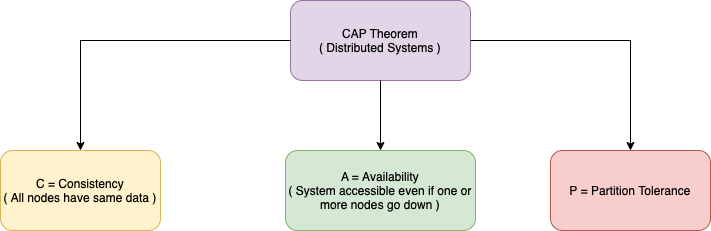

## :star: CAP Theorem of the Distributed Systems

The use of the word [Consistency](ReplicationOrConsistency.md) in [CAP](https://www.geeksforgeeks.org/the-cap-theorem-in-dbms/) and its use in [ACID](ACID.md) do not refer to the same identical concept.
- In [CAP](https://www.geeksforgeeks.org/the-cap-theorem-in-dbms/), the term [Consistency](ReplicationOrConsistency.md) refers to the data mismatch during `replication lag`.
- In [ACID](ACID.md), it refers to the fact that a transaction will not violate the integrity constraints specified on the database schema.