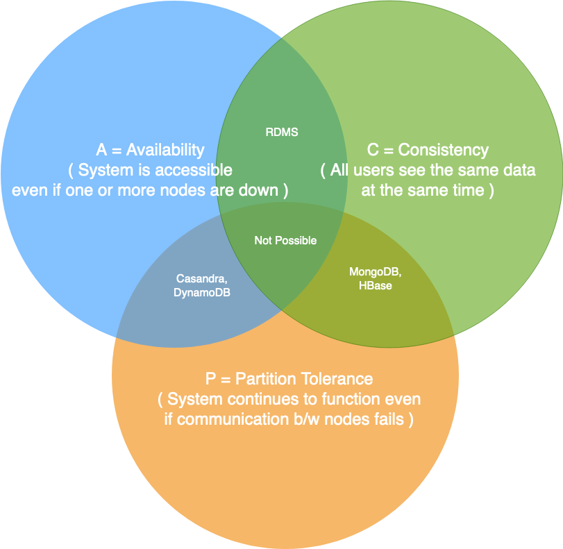

## :star: CAP Theorem of the Distributed Systems

- [Consistency](ReplicationAndDataConsistency.md)
- [Availability](HighAvailability.md)
- Partition Tolerance

We cannot build a general data store that is [highly available](HighAvailability.md), [sequentially consistent](ReplicationAndDataConsistency.md), and tolerant to any partition failures.

We can only build a system that has `any two of these three properties`.
- Because, to be consistent, all nodes should see the same set of updates in the same order.
- But if the network loses a partition, updates in one partition might not make it to the other partitions before a client reads from the out-of-date partition after having read from the up-to-date one.
- The only thing that can be done to cope with this possibility is to stop serving requests from the out-of-date partition, but then the service is no longer 100% available.

> Note - The use of the word [Consistency](ReplicationAndDataConsistency.md) in [CAP](https://www.geeksforgeeks.org/the-cap-theorem-in-dbms/) and its use in [ACID](ACIDPropertyTransaction.md) do not refer to the same identical concept.
> - In [CAP](https://www.geeksforgeeks.org/the-cap-theorem-in-dbms/), the term [Consistency](ReplicationAndDataConsistency.md) refers to the data mismatch during `replication lag`.
> - In [ACID](ACIDPropertyTransaction.md), it refers to the fact that a transaction will not violate the integrity constraints specified on the database schema.

# Reference
- [CAP Theorem](https://akshay-iyangar.github.io/system-design/grokking-system-design/system-design-basics/cap-theorem.html)