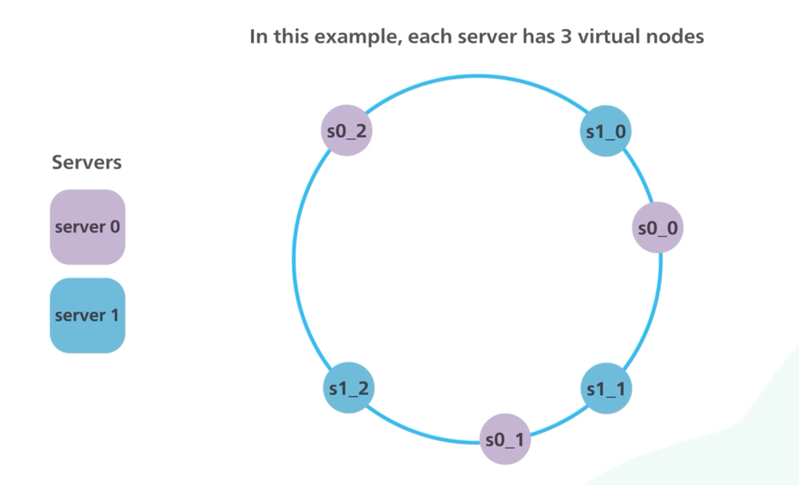

# Introduction
- This handles data sharding with dynamic number of servers.

[Read more](https://www.youtube.com/watch?v=UF9Iqmg94tk)

# Real-world usages
- [Amazon DynamoDB](../../2_AWSComponents/6_DatabaseServices/AmazonDynamoDB/Readme.md)
- [Apache Casandra](../3_DatabaseComponents/NoSQL-Databases/ApacheCasandra.md)

# References
- [A Guide to Consistent Hashing](https://www.toptal.com/big-data/consistent-hashing)
- [Interviewbit - Sharding a database](https://www.interviewbit.com/problems/sharding-a-database/)