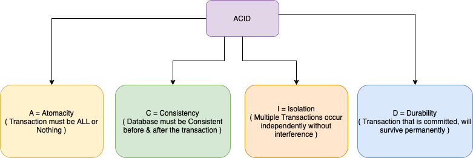

# :star: ACID Properties of the Transaction

[Read more](https://www.geeksforgeeks.org/acid-properties-in-dbms/)
 
# [Atomicity](Atomicity.md)

# Consistency
- [Consistency (or Correctness)](https://www.geeksforgeeks.org/acid-properties-in-dbms/) in database systems refers to the requirement that any given database transaction [must change affected data only](https://en.wikipedia.org/wiki/Consistency_(database_systems)) in allowed ways.
- This means that integrity constraints must be maintained so that the database is consistent before and after the transaction.
- Any data written to the database must be valid according to all defined rules, including constraints, cascades, triggers, and any combination thereof.

# Isolation
- [Isolation or Serializable](https://www.geeksforgeeks.org/acid-properties-in-dbms/) property ensures that multiple transactions can occur concurrently without leading to the inconsistency of the database state.
- Transactions occur independently without interference. (assuming there is no concurrency but in real world, there would be concurrency)
- Changes occurring in a particular transaction will not be visible to any other transaction until that particular change in that transaction is written to memory or has been committed.
- Generally, [concurrency control or transaction locks](https://medium.com/inspiredbrilliance/what-are-database-locks-1aff9117c290) are helpful to achieve isolation.

# [Durability](Durability.md)

# References
- [Martin Kleppmann | Kafka Summit London 2019 Keynote | Is Kafka a Database?](https://youtu.be/BuE6JvQE_CY)