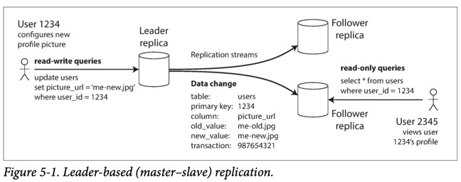

# Replication & Data Consistency
- [Replication](https://www.geeksforgeeks.org/data-replication-in-dbms/) is having multiple copies of the same data on different nodes.
- It is widely used in the [distributed](../Readme.md) & [highly available](../Reliability/HighAvailability.md) database management systems (DBMS).

# :+1: Advantages of Replication

| Advantage                                                                   | Description                                                                                                       |
|-----------------------------------------------------------------------------|-------------------------------------------------------------------------------------------------------------------|
| [High availability](../Reliability/HighAvailability.md)                     | Keeping the system running, even when one machine (or several machines, or an entire datacenter) goes down.       |
| [Disconnected operation](../Reliability/FaultTolerance&DisasterRecovery.md) | Allowing an application to continue working when there is a network interruption.                                 |
| [Latency](../Scalability/LatencyThroughput.md)                              | Placing data geographically close to users, so that users can interact with it faster                             |
| [Scalability](../Scalability/Readme.md)                                     | Being able to handle a higher volume of reads than a single machine could handle, by performing reads on replicas |

# Popular Algos of Replication

| Algo                                                                | Description                                                                                                                                                                                                                                                     | Use Cases                                                                                                                                                                                                 |
|---------------------------------------------------------------------|-----------------------------------------------------------------------------------------------------------------------------------------------------------------------------------------------------------------------------------------------------------------|-----------------------------------------------------------------------------------------------------------------------------------------------------------------------------------------------------------|
| :star: [Single-Leader replication](#star-single-leader-replication) | Clients send all writes to a single node (the leader), which sends a stream of data change events to the other replicas (followers).  - Reads can be performed on any replica, but reads from followers might be stale.                                     | SQL based databases ([Amazon Aurora](../../../2_AWSComponents/6_DatabaseServices/AmazonRDSAurora/Readme.md), PostgreSQL)  - Message Brokers like [Kafka](../../4_MessageBrokers/Kafka/Readme.md) etc. |
| Multi-Leader replication                                            | Clients send each write to one of several leader nodes, any of which can accept writes.  - The leaders send streams of data change events to each other and to any follower nodes. - Biggest problem with this algo is write conflict & its resolution. | - Data-center (a leader in each datacenter) - Clients with offline operation (like mobile apps) - Collaborative editing (like Google Docs) etc.                                                   |
| Leaderless Replication                                              | Clients send each write to several nodes, and read from several nodes in parallel in order to detect and correct nodes with stale data.                                                                                                                         | [Dynamo systems](../../3_DatabaseComponents/NoSQL-Databases/DynamoStyleDatabases.md) like [Casandra](../../3_DatabaseComponents/NoSQL-Databases/ApacheCasandra.md) etc.                                   |

# :star: Single-Leader replication

| Term                                                             | Description                                                                                                                                                                                                                                                                                                                                                                                                                                         |
|------------------------------------------------------------------|-----------------------------------------------------------------------------------------------------------------------------------------------------------------------------------------------------------------------------------------------------------------------------------------------------------------------------------------------------------------------------------------------------------------------------------------------------|
| Leader (also known as master or primary)                         | One of the replicas is designated the leader (also known as master or primary).  - When clients want to write to the database, they must send their requests to the leader, which first writes the new data to its local storage.                                                                                                                                                                                                               |
| Followers (read replicas, slaves, secondaries, or hot standbys)  | Whenever the leader writes new data to its local storage, it also sends the data change to all of its followers as part of a [replication log or change stream](https://www.stitchdata.com/docs/replication/replication-methods/log-based-incremental).  - Each follower takes the log from the leader and updates its local copy of the data‐ base accordingly, by applying all writes in the same order as they were processed on the leader. |

## Single-Leader replication as a Built-in Feature

Leader Based Replication is available as a built-in-feature in various technologies.

| Type                     | Tech                                                                                                                                                                                                                                                                                     |
|--------------------------|------------------------------------------------------------------------------------------------------------------------------------------------------------------------------------------------------------------------------------------------------------------------------------------|
| SQL/Relational Databases | [Amazon Aurora](../../../2_AWSComponents/6_DatabaseServices/AmazonRDSAurora/Readme.md), PostgresSQL, MySQL etc.                                                                                                                                                                          |
| NoSQL Databases          | [Amazon Elastic Cache (Cluster Disabled)](../../../2_AWSComponents/6_DatabaseServices/AmazonElasticCache.md#redis-cluster-mode-disabled-vs-redis-cluster-mode-enabled), [Redis - Master Slave Replication](../../3_DatabaseComponents/In-Memory-Cache/Redis/RedisMasterSlaveReplication.md), MongoDB, DynamoDB etc. |
| Message Brokers          | [Kafka Cluster](../../4_MessageBrokers/Kafka/Readme.md), RabbitMQ                                                                                                                                                                                                                                |

# Leader Election Process
- In case of failed leader, new leader would be chosen through an election process (where the leader is chosen by a majority of the remaining replicas), or by a previously [elected controller node](../ControllerNode.md).
- Technologies like [Zookeeper](../../6b_ClusterCoordinationService/ApacheZookeeper.md) service is helpful for coordinating the election process.

# Replica Lag - Major Problem  
- It takes time (known as [Replica Lag](https://cloud.google.com/sql/docs/mysql/replication/replication-lag)) for data to be replicated b/w replicas in [multiple highly available zones (or regions)](../../../2_AWSComponents/AWS-Global-Architecture-Region-AZ.md).
- Hence, [data consistency](https://en.wikipedia.org/wiki/Data_consistency) won't be there for those milliseconds, which is known as [replica lag](https://cloud.google.com/sql/docs/mysql/replication/replication-lag).
- [Replication lag - Amazon Aurora vs RDS](../../../2_AWSComponents/6_DatabaseServices/AmazonAuroraVsRDS.md).

# Consistency patterns

## :star: Eventual Consistency (async replication)
- In case of asynchronous replication, leader sends the message, but doesn’t wait for a response from the follower.
- Hence, Asynchronous Replication/Eventual Consistency Model maximizes [the read & write throughput](../Scalability/LatencyThroughput.md).
- Since the replication is asynchronous, changes might not reflect the results of a recently completed write.
- Fortunately, all the copies of data usually reach consistency within milliseconds/seconds.

## :star: Semi-synchronous replication
- To decrease delay in writes in fully-sync replication, we can have one of the follower replication as synchronous while others as asynchronous.
- If the synchronous follower becomes unavailable or slow, one of the asynchronous followers is made synchronous.
- This guarantees that you have an up-to-date copy of the data on at least two nodes: the leader and one synchronous follower.

## Strong Consistency (fully-sync replication)
- In case of synchronous replication, the leader waits until follower 1 has confirmed that it received the write before reporting success to the user, and before making the write visible to other clients.
- This model has a delay in writing the data, but it guarantees that you will always see the updated data every time you read it.
- This approach is seen in file systems and RDBMS. 
- Strong consistency works well in systems that need transactions.

## Weak consistency (not really consistent)
- After a write, reads may or may not see it. A best effort approach is taken.

# Source(s) and further reading
- [Consistency Patterns](https://github.com/donnemartin/system-design-primer#consistency-patterns)
- [Redundancy and Replication](https://github.com/jeremyyew/tech-prep-jeremy.io/blob/master/systems-design/topics/databases/redundancy-and-replication.md)
- [Google I/O 2009 - Transactions Across Datacenters..](http://snarfed.org/transactions_across_datacenters_io.html)
- [CAP by Jeremyyew](https://github.com/jeremyyew/tech-prep-jeremy.io/tree/master/systems-design/topics/consistency-availability-partition-tolerance-cap)