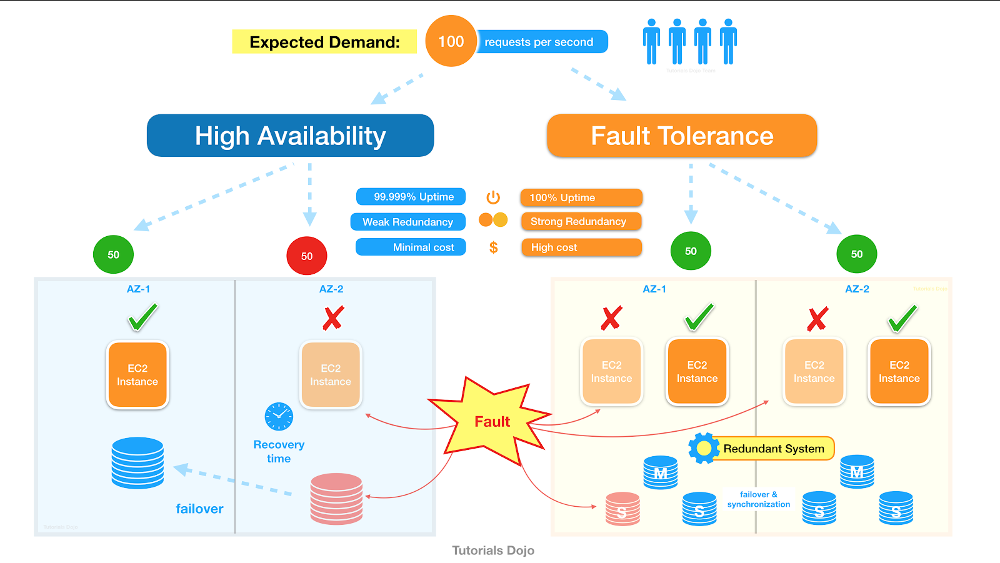

# Fault Tolerance
- [Fault Tolerance](https://www.linkedin.com/pulse/high-availability-vs-fault-tolerance-jon-bonso/) has the goal of keeping your application running with `zero downtime`. 
- It is an upgraded version of [High Availability](HighAvailability.md).
- It can tolerate any component fault to avoid any performance impact, data loss, or system crashes by having redundant resources beyond what is typically needed.

# Fault Tolerance vs [High Availability](HighAvailability.md)
- More complex design.
- Higher redundancy.
- Higher cost.
- `If an application is said to be fault-tolerant then it is also considered highly available`. But vice-verse is not true.
- In AWS, 100% fault tolerance (zero downtime) can be achieved through [active-active routing policy in Route53](../../2_AWSComponents/1_NetworkingAndContentDelivery/AmazonRoute53.md#routing-policy) with 2 regions (having same components & architecture).

# [Disaster Recovery](https://en.wikipedia.org/wiki/Disaster_recovery)
- In AWS, disaster recovery is done through [active-passive failover policy in Route53](../../2_AWSComponents/1_NetworkingAndContentDelivery/AmazonRoute53.md#failover-routing-policy) with 2 regions (having same components & architecture).

## [Recovery Point Objective (RPO)](https://docs.aws.amazon.com/whitepapers/latest/microservices-on-aws/disaster-recovery.html)
- Recovery time objective is the maximum acceptable delay between the interruption of service and restoration of service. 
- This objective determines what is considered an acceptable time window when service is unavailable and is defined by the organization.

## [Recovery Time Objective (RTO)](https://docs.aws.amazon.com/whitepapers/latest/microservices-on-aws/disaster-recovery.html)
- Recovery point objective is the maximum acceptable amount of time since the last data recovery point. 
- This objective determines what is considered an acceptable loss of data between the last recovery point and the interruption of service and is defined by the organization.
