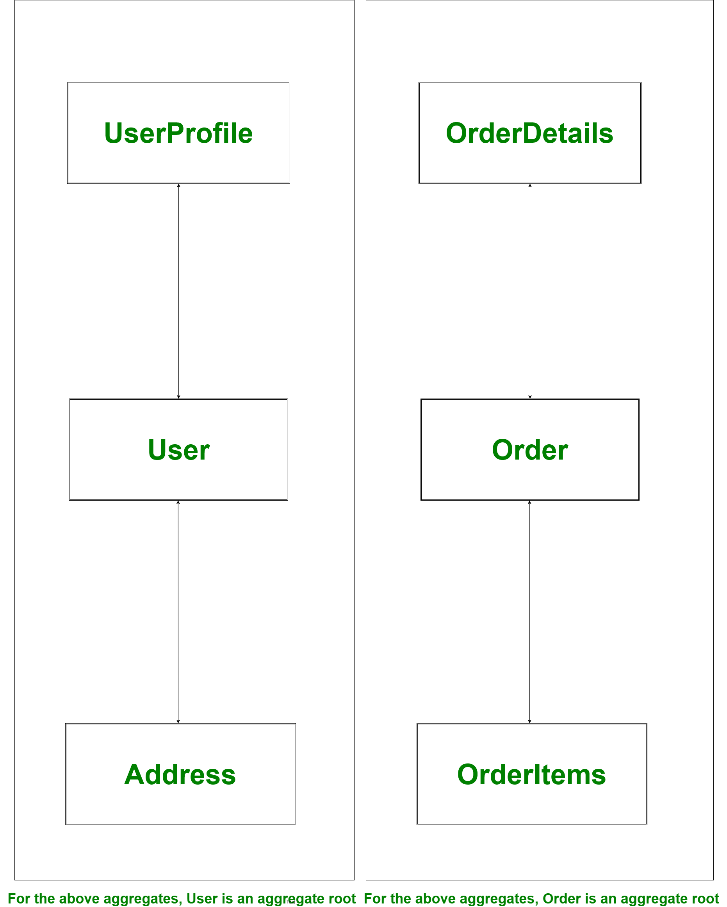

# System Design Glossaries
- [Distributed Systems](DistributedSystems.md)
  - [Scalability](Scalability.md)
  - [High Availability](HighAvailability.md)
  - [Reliability - Fault Tolerance, Disaster Recovery](FaultTolerance&DisasterRecovery.md)
  - [Efficiency - Latency, Throughput](LatencyThroughput.md)
  - [CAP Theorem of the Distributed Systems](CAP.md)
  - [EventDrivenArchitecture](EventDrivenArchitecture.md)
  - [Servers Cluster](ServersCluster.md)
- [ACID Properties of the Transaction](ACID.md)

## [Language Agnostic](https://en.wikipedia.org/wiki/Language-agnostic)
- We should design the system considering agnostic feature (Language agnostic, AWS agnostic etc.) into the consideration.
- Language-agnostic programming or scripting (also called language-neutral, language-independent, or cross-language) is a software development paradigm where a particular language is chosen because of its appropriateness for a particular task (taking into consideration all factors, including ecosystem, developer skill-sets, performance, etc.), and not purely because of the skill-set available within a development team.

## [Stateful vs Stateless](https://www.geeksforgeeks.org/difference-between-stateless-and-stateful-protocol/)
- `Stateless Protocol` does not require the server to retain the server information or session details.
- `Stateful Protocol` require server to save the status and session information.

## [Domain Driven Architecture](https://www.geeksforgeeks.org/domain-driven-design-ddd/)
- When we are developing software our focus should not be primarily on technology, rather it should be primarily on business/domain.
- Classes, modals, services, microservices, rest apis etc. should be designed according to the domains.

