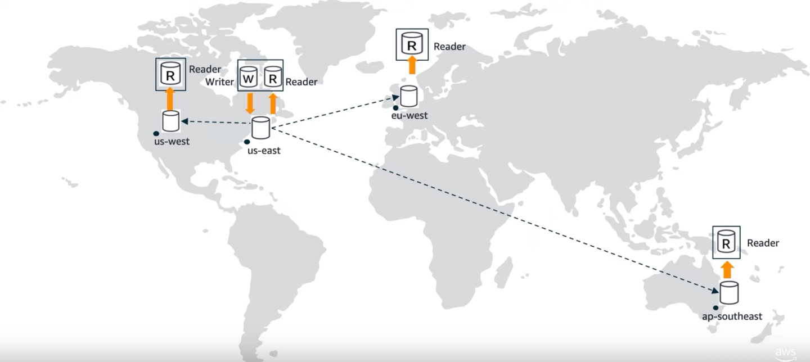

# Disaster Recovery
- In AWS, [Disaster Recovery](https://en.wikipedia.org/wiki/Disaster_recovery) is done through [active-passive failover policy in Route53](../../../2_AWSComponents/1_NetworkingAndContentDelivery/1_EdgeNetworking/AmazonRoute53/Readme.md#failover-routing-policy) with at-least 2 regions (having same components & architecture).

# Concepts

| Concept                                                                                                                      | Description                                                               |
|------------------------------------------------------------------------------------------------------------------------------|---------------------------------------------------------------------------|
| [Recovery Time Objective (RTO)](https://docs.aws.amazon.com/whitepapers/latest/microservices-on-aws/disaster-recovery.html)  | The time it takes a system to return to a working state after a disaster. |
| [Recovery Point Objective (RPO)](https://docs.aws.amazon.com/whitepapers/latest/microservices-on-aws/disaster-recovery.html) | The amount of data that can be lost (measured in time).                   |

# Global Architecture

