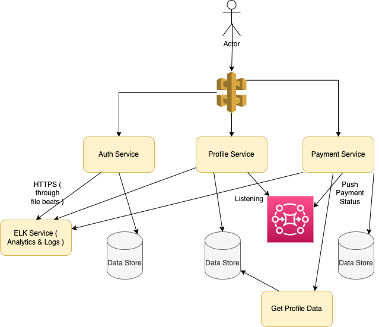

# Microservices design

## Introduction
- Easy microservice would have separate git code repo.
- Define contracts between microservices.
- Microservices are a modern [Service-Oriented Architecture](https://www.geeksforgeeks.org/service-oriented-architecture/).
- In a Microservice Architecture, each service is self-contained and implements a single business capability.
- Microservice architecture makes it easier and fastest way to build and work on individual parts of an application, and thus the application as a whole.
- [Implementing microServices on AWS](../../2_AWSComponents/0_AWSDesigns/MicroservicesOnAWS.md)

## Microservices - Design Principles
- Define contracts ( request/response ) between microservices.
- API Gateway ( For example - [AWS API Gateway](../../2_AWSComponents/1_NetworkingAndContentDelivery/) ) to route between microservices.
- Use [Docker](../6_DevOps/Docker.md), [Kubernates](../6_DevOps/Kubernates.md), Jenkins for the deployments.
- Logging using [ELK](../7_MonitoringTools/ELK.md), [Kafka Cluster](../4_MessageBrokers/Kafka.md) etc.

### How microservices communicate with each other?
- To asynchronously pass data b/w microservices, use [Message Brokers](../4_MessageBrokers) for [event-driven architecture](../0_SystemGlossaries/EventDrivenArchitecture.md) ( like [Kafka](../4_MessageBrokers/Kafka.md), [RabbitMQ](../4_MessageBrokers/RabbitMQ.md), [Amazon SQS](../../2_AWSComponents/5_MessageBrokerServices/AmazonSQS.md) etc.).
- To get the data from one microservice to another, use [REST](../2_APITechOptions/REST.md) or [gPRC](../2_APITechOptions/gPRC.md) api protocol.
- Use [Redis](../5_Redis) to share the session data between microservices.

## Benefits of Microservices design

### Separation of Concern
- Scalability would be easy. 
- Each service can be scaled independently and would have its team which owns the micro-service.
- For example - It would be easy to add a new payment gateway in Payment service.

### Engineering becomes easy
- Development becomes easy.
- Each service can be written in its own language or framework, and can have its own database or lack thereof.
- `Dedicated data store for every service` 
  - Every component should be single source of truth. 
  - And whenever needed, the microservice would ask the other microservice for the data. ( through network call )
- `Condense business responsibility to a single place` 
  - Every microservice should have proper responsibility and single purpose. 
  - And it should correspond to the business use case. ( Less is more )

### Deployment is easier
- If one service goes down, not complete product would be down.
- Deployment becomes easy, independent & fast. 
  - Example - With big code base & 100 engineers team in [Airbnb](https://www.infoq.com/presentations/airbnb-culture-soa/), it was taking `1 day to deploy monolothic code`.
- Instead of deploying complete code for any change, only corresponding microservice can be deployed.

## Disadvantages of Microservices design
- `Obviousness` - With large number of services, it would be a bit tricky to find the microservice for the required change.
- `Safety` - The contract should be defined properly between microservices.
- `Resilience` - Client should be able to handle failure scenarios properly.
- `Large Team` - `Monolothic is good for small team` while `Microservice is good for large team`.
- `Dependency` - Micro-servies would be dependent to each other. Sometimes, there can be circular dependencies also.

## Examples of MicroServices
- Search, Start Page, Recommendation etc. as separate components/services.
- Feed, Search, Product Details etc. services in [LinkedIn](https://www.linkedin.com/feed/).
- [Zomoto Design](../../3_HLDDesignProblems/ZomatoDesign)

## References
- [Difference between Microservice and API](https://www.geeksforgeeks.org/difference-between-microservice-and-api/)
- [Moving from Monoliths to Microservices](https://www.youtube.com/watch?v=rckfN7xFig0&list=PLMCXHnjXnTnvo6alSjVkgxV-VH6EPyvoX&index=34)
- [The Human Side of Airbnb’s Microservice Architecture](https://www.infoq.com/presentations/airbnb-culture-soa/)