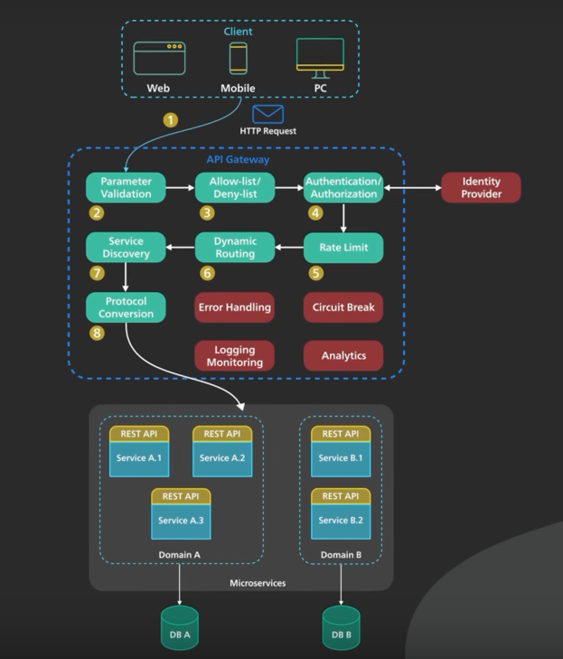

# API Gateway
- Use [API Gateway](https://microservices.io/patterns/apigateway.html) to route incoming request between microservices, like [AWS API Gateway](../../../2_AWSComponents/1_NetworkingAndContentDelivery/2_ApplicationNetworking/AmazonAPIGateway/Readme.md).

[Read more](https://www.youtube.com/watch?v=6ULyxuHKxg8)

# Various Technologies

| Tech                                                                                                                          |
|-------------------------------------------------------------------------------------------------------------------------------|
| [AWS API Gateway](../../../2_AWSComponents/1_NetworkingAndContentDelivery/2_ApplicationNetworking/AmazonAPIGateway/Readme.md) |
| [Zulu](ZuluAPIGateway.md)                                                                                                     |

# AWS API Gateway

[Read more about AWS API Gateway](../../../2_AWSComponents/1_NetworkingAndContentDelivery/2_ApplicationNetworking/AmazonAPIGateway/Readme.md)

# Read more
- [Mastering Chaos - A Netflix Guide to Microservices](https://www.youtube.com/watch?v=CZ3wIuvmHeM)
