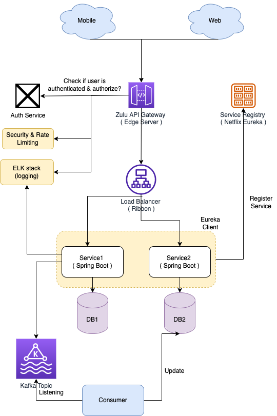

# Eureka Server - Service Registry & Discovery
- [Eureka naming server](https://www.tutorialspoint.com/spring_boot/spring_boot_eureka_server.htm) is a REST-based server that is used in the AWS Cloud services for load balancing and fail-over of middle-tier services.
- Eureka naming server is an application that holds information about all client service applications.
- Each microservice registers itself with the Eureka naming server.
- The naming server registers the client services with their port numbers and IP addresses.
- It is also known as `Discovery Server`.
- Eureka naming server comes with the bundle of Spring Cloud. It runs on the default port 8761.
- It also comes with a Java-based client component, the eureka client, which makes interactions with the service much easier.

[Read more](../../../6_ProgrammingLanguages/2_Java/SpringBootAndMicroServices/README.md)

# High Level Architecture

[Read more](https://netflixtechblog.com/netflix-shares-cloud-load-balancing-and-failover-tool-eureka-c10647ef95e5)