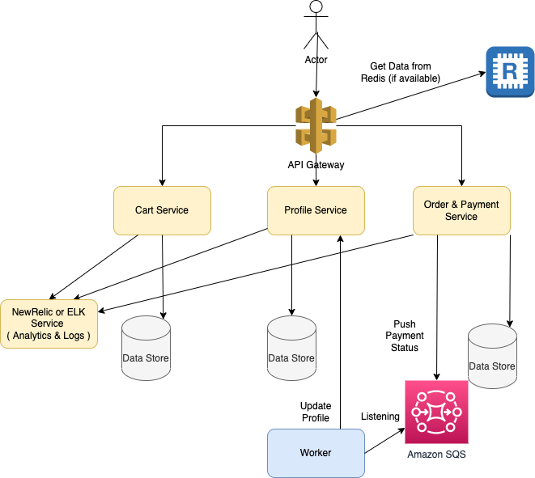
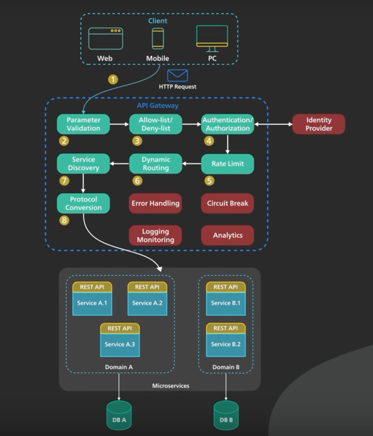
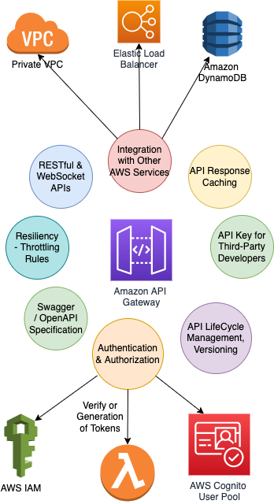

# Microservices design
- [Microservices](https://microservices.io/index.html) are a modern [Service-Oriented Architecture](https://www.geeksforgeeks.org/service-oriented-architecture/).
- In a Microservice Architecture, each service is self-contained and implements a single business capability.
- Microservice architecture makes it easier and fastest way to build and work on individual parts of an application, and thus the application as a whole.
- Example - User Management, Order Management, Checkout, Address etc.
- [Implementing MicroServices on AWS](../../2_AWSComponents/0_AWSDesigns/MicroservicesOnAWS.md)

# Design Principles
- Every microservice would have separate git code repo.
- Define contracts (request/response) between microservices.
- Use [API Gateway](https://microservices.io/patterns/apigateway.html) to route incoming request between microservices, like [AWS API Gateway](../../2_AWSComponents/1_NetworkingAndContentDelivery/AmazonAPIGateway/Readme.md).
- Use [Container orchestration service](../6a_ContainerOrchestrationServices/Readme.md) for deployments, like [Kubernates](../6a_ContainerOrchestrationServices/Kubernates.md).
- Logging & monitoring can be done using [New Relic](../7_MonitoringTools/NewRelic.md), [ELK](../7_MonitoringTools/ELK.md) etc.

# Key Features of API Gateway

[Read more](https://www.youtube.com/watch?v=6ULyxuHKxg8)

## About AWS API Gateway

[Read more about AWS API Gateway](../../2_AWSComponents/1_NetworkingAndContentDelivery/AmazonAPIGateway/Readme.md)

## How microservices communicate with each other?
- To get the data from one microservice to another, [gPRC](../2_APITechOptions/gRPC.md) or [REST](../2_APITechOptions/REST.md) api protocols can be used.
- To [asynchronously pass events](../0_SystemGlossaries/EventDrivenArchitecture.md) & data b/w microservices, [Message Brokers](../4_MessageBrokers) ( like [Kafka](../4_MessageBrokers/Kafka/Readme.md), [Amazon SQS](../../2_AWSComponents/5_MessageBrokerServices/AmazonSQS.md), [RabbitMQ](../4_MessageBrokers/RabbitMQ.md) etc.) can be used.
- [Redis](../3_DatabaseComponents/In-Memory-Cache/Redis) can be used to share the session data between microservices.
- [Handling Microservices with gRPC and REST API](https://fonradar.medium.com/ali-okan-kara-a3d0b61610d)

# :thumbsup: Advantages of Microservices design

## :star: Separation of Concern, loosely coupled
- Scalability would be easy. 
- Smaller components take up fewer resources and can be scaled to meet increasing demand of that component only.
- Each service can be scaled independently and would have its team which owns the microservice.
- For example - It would be easy to add a new payment gateway in Payment service.

## :sunglasses: Engineering becomes easy
- Development becomes easy.
- Each service can be written in its own language or framework, and can have its own database or lack thereof.
- Dedicated data store for every service
  - Every component should be single source of truth. 
  - And whenever needed, the microservice would ask the other microservice for the data ( through network call ).
- Condense business responsibility to a single place
  - Every microservice should have proper responsibility and single purpose. 
  - And it should correspond to the business use case (Less is more).

## :rocket: Deployment becomes independent & fast
- If one service goes down, not complete product would be down.
- Deployment becomes easy, independent & fast. 
- Example - With big code base & 100 engineers team in [Airbnb](https://www.infoq.com/presentations/airbnb-culture-soa/), it was taking `1 day to deploy monolothic code`.
- Instead of deploying complete code for any change, only corresponding microservice can be deployed.

# :thumbsdown: Disadvantages of Microservices design
- :family_man_woman_boy: `Team` - Monolothic is good for small team while Microservice is good for large team.
- :moneybag: `Increased Budget` - With microservices, the budget increases (deployment, time to make change, team size etc.)
- `Obviousness` - With large number of services, it would be a bit tricky to find the microservice for the required change.
- `Safety` - The contract should be defined properly between microservices.
- `Resilience` - Client should be able to handle failure scenarios properly.
- `Dependency` - Micro-services would be dependent to each other. Sometimes, there can be circular dependencies also.

# Examples of MicroServices
- Start Page, Recommendation, Feed, Search, Product Details, Orders etc. services in [LinkedIn](../../3_HLDDesignProblems/LinkedInDesign/Readme.md).
- [Zomoto Design](../../3_HLDDesignProblems/ZomatoDesign)

# References
- [What Are Microservices Really All About? (And When Not To Use It)](https://www.youtube.com/watch?v=lTAcCNbJ7KE)
- [Difference between Microservice and API](https://www.geeksforgeeks.org/difference-between-microservice-and-api/)
- [Moving from Monoliths to Microservices](https://www.youtube.com/watch?v=rckfN7xFig0&list=PLMCXHnjXnTnvo6alSjVkgxV-VH6EPyvoX&index=34)
- [The Human Side of Airbnb’s Microservice Architecture](https://www.infoq.com/presentations/airbnb-culture-soa/)
