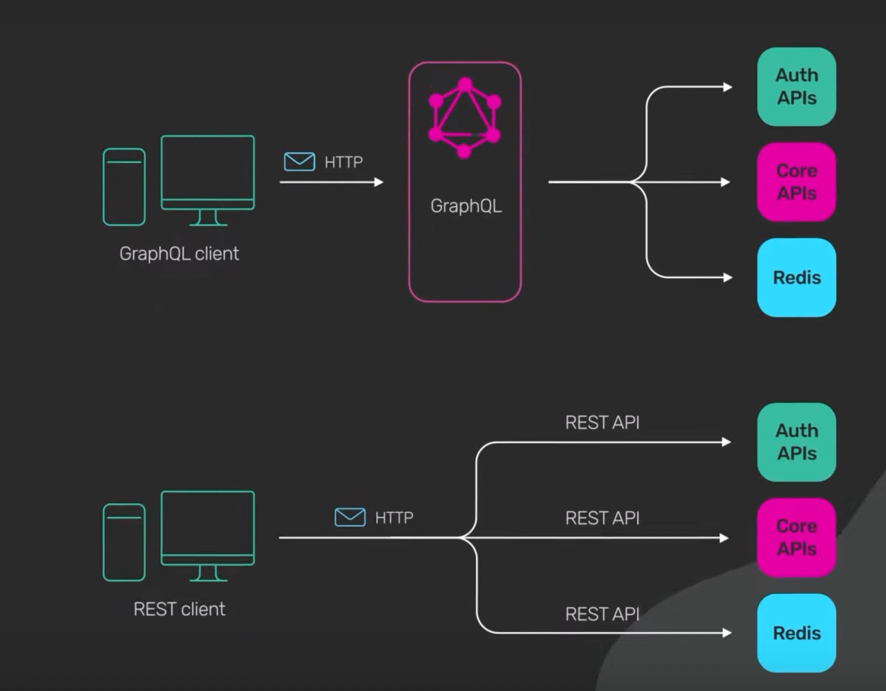

# GraphQL
- [GraphQL](https://graphql.org) can be used to dynamically get the data columns as needed.
- Client has control of what data it needs from server?
- GraphQL has a schema definition language for defining the types on a query.
- Additionally, with GraphQL, you can enquire multiple entities in one request, and because less bits will be transferred over the wire so your projects will perform faster than while using [REST](REST.md).

# Why GraphQL?
- There are some issues with the [REST Architecture](REST.md) style such as Multiple endpoints, Over-fetching, and Under-fetching of resources. 
- There is no efficient way of handling various versions of native applications.
- We can fetch multiple resources in a single endpoint. This reduces the time wasted in multiple round-trips from the browser. 
- With GraphQL, the client specifies the data it needs in the form of a query. 
- The server sends back the response in the exact same shape.
- This makes it easy to develop applications without making assumptions on the type of fields.

# REST vs GraphQL

Both [REST](REST.md) and [GraphQL]() are based on following,
- HTTP
- API URL
- Can return JSON response

| Feature                                    | GraphQL                                                                                                                                      | [REST](REST.md)                                                    |
|--------------------------------------------|----------------------------------------------------------------------------------------------------------------------------------------------|---------------------------------------------------------|
| Design                                     | :+1: Client specify exact resource & fields in GraphQL schema (query param), it wants.                                                       | -                                                       |
| Speed                                      | :+1: GraphQL is faster than REST because as you can pick the fields you want to query, so the request will always be the smallest possible.  | -                                                       |
| Prerequisites/Overheads                    | :-1: Extra-tools are needed on both client & server side.                                                                                    | :+1: Standard CURL is supported. No extra tools needed. |
| HTTP Cache (Browsers, CDNs, Proxy Servers) | :-1: Not-Supported                                                                                                                           | :+1: Supported                                          |
| Security                                   | :-1: Un-required table scan can be done, by client. This can be mitigated, but with maintenance overhead.                                    | :+1: Good.                                              |

[Read more](https://www.youtube.com/watch?v=yWzKJPw_VzM)

# :star: Real world use cases of GraphQL
- [Zomato - HLD Design](../../3_HLDDesignProblems/FoodOrderingZomatoSwiggyDesign/Readme.md#GraphQL)
- [Uber Driver Allocation](../../3_HLDDesignProblems/UberDriverAllocationDesign)
- [GraphQL with ElasticSearch](../3_DatabaseComponents/Search-Databases/ElasticSearch/ElasticSearchWithGraphQL.md)

# References
- [What is GraphQL and why Facebook felt the need to build it?](https://buddy.works/tutorials/what-is-graphql-and-why-facebook-felt-the-need-to-build-it#why-facebook-built-graphql)
- [GraphQL vs REST APIs | What's the Best Kind of API?](https://www.youtube.com/watch?v=F0_pkxQMZnc)
- [Using GraphQL with Microservices in Go](https://outcrawl.com/go-graphql-gateway-microservices)