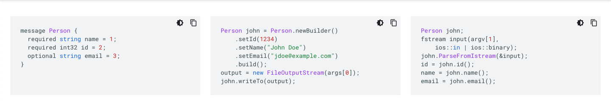

# Introduction

- A high performance, open source universal RPC framework.
- [gRPC](https://grpc.io) is a `modern open source high performance Remote Procedure Call` framework that can run in any environment.
- gRPC is contract-based: a contract needs to be available on both sides of communication to make sense of data going between them. 
- To define the contracts, gRPC uses a declarative language called `Protocol Buffers (Protobuf)`.

# Advantages of gRPC

## Built on HTTP 2 Instead of HTTP 1.1 
- In HTTP 2, when a microservice receives multiple requests from more than one client, it achieves multiplexing by serving many requests and responses simultaneously.

## [Protobuf](https://developers.google.com/protocol-buffers/) instead of JSON/XML 
- It allows to generate both client/server out of the box. 
- [Protobuf](https://developers.google.com/protocol-buffers/) is the contract itself and supports code-generation for many of the most popular programming languages.

## According to widely-cited tests, gRPC API connections are considerably faster than REST API connections.
- In fact, its reported that `GPRC is 7 to 10 times faster than HTTP`.

# Problems With gRPC
- gRPC is currently much less popular than REST, and experienced developers are harder to find.
- gRPC is not a native solution for customer-facing web applications because it requires `HTTP/2, which is not fully supported by browsers`. 
- For example, client streaming and bidirectional streaming are not supported in browsers at all.
- However, there’s a gRPC-Web project that enables using browser-to-backend communication over gRPC without creating a REST proxy.
