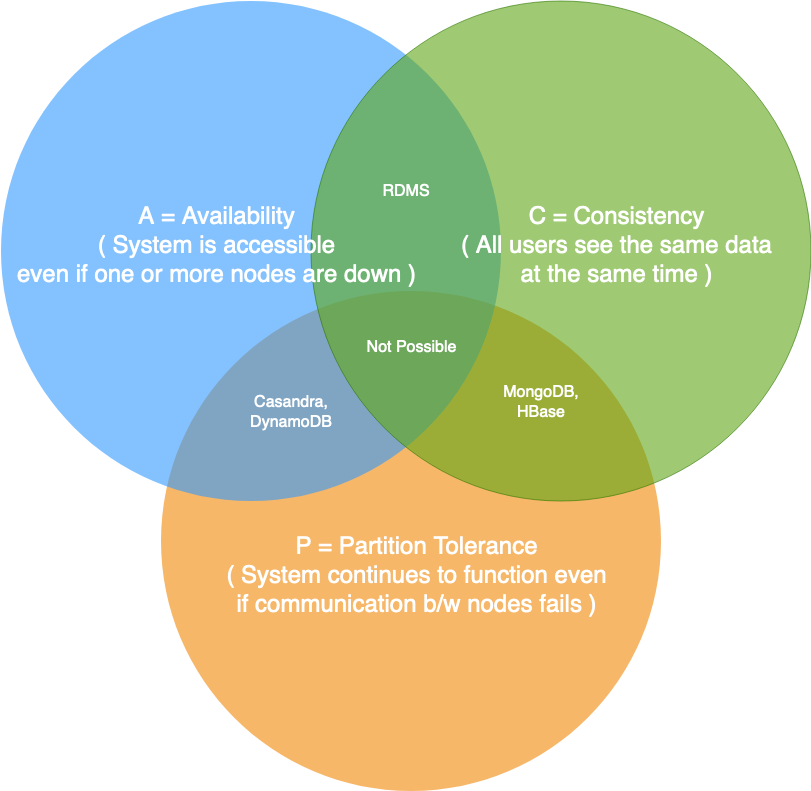
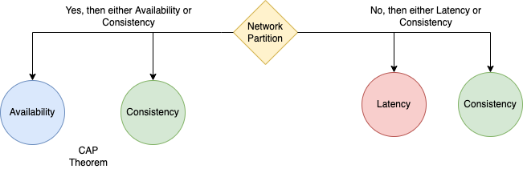

# :star: CAP Theorem of the Distributed Systems
- [Consistency](Replication&Consistency/Consistency.md)
- [Availability](../../0_SystemGlossaries/Reliability/HighAvailability.md)
- Partition Tolerance

> Note - The use of the word [Consistency](Replication&Consistency/Consistency.md) in [CAP](https://www.geeksforgeeks.org/the-cap-theorem-in-dbms/) and its use in [ACID](ACID/Readme.md) do not refer to the same identical concept.
> - In [CAP](), the term [Consistency](Replication&Consistency/Consistency.md) refers to the data mismatch during [replication lag](Replication&Consistency/Replication.md).
> - In [ACID](ACID/Readme.md), it refers to the fact that a transaction will not violate the integrity constraints specified on the database schema.

# Only 2 (of 3) possible in real system
We can only build a system that has any two of these three CAP properties.
- Because, to be [consistent](Replication&Consistency/Consistency.md), all nodes should see the same set of updates in the same order.
- But if the network loses a partition, updates in one partition might not make it to the other partitions before a client reads from the out-of-date partition after having read from the up-to-date one.
- The only thing that can be done to cope with this possibility is to stop serving requests from the out-of-date partition, but then the service is no longer 100% available.

# PACELC theorem
The PACELC theorem states that in a system that replicates data:
- If there is a network partition (‘P’), a distributed system can tradeoff between availability and consistency (i.e., ‘A’ and ‘C’);
- else (‘E’), when the system is running normally in the absence of partitions, the system can trade off between latency (‘L’) and consistency (‘C’).

| Theorem                                 | Remarks                                                                                                                                                                                                                                    |
|-----------------------------------------|--------------------------------------------------------------------------------------------------------------------------------------------------------------------------------------------------------------------------------------------|
| PA/EL systems - DynamoDB & Cassandra    | [DynamoDB](../../../2_AWSComponents/6_DatabaseServices/AmazonDynamoDB/Readme.md) and [Cassandra](../NoSQL-Databases/ApacheCasandra.md) choose availability over consistency when a partition occurs; otherwise, they choose lower latency. |
| PC/EC - HBase & BigTable                | [HBase](../NoSQL-Databases/ApacheHBase.md) & BigTable will always choose consistency, giving up availability and lower latency.                                                                                                            |
| PA/EC (default configuration) - MongoDB | In the case of a network partition, [MongoDB](../NoSQL-Databases/MongoDB) chooses availability, but otherwise guarantees consistency.                                                                                                      |

# Source(s) and further reading
- [The CAP Theorem in DBMS](https://www.geeksforgeeks.org/the-cap-theorem-in-dbms/)
- [CAP Theorem](https://akshay-iyangar.github.io/system-design/grokking-system-design/system-design-basics/cap-theorem.html)
- [Beyond CAP Theorem](https://www.grokkingsystemdesigns.com/beyond-cap-theorem/)