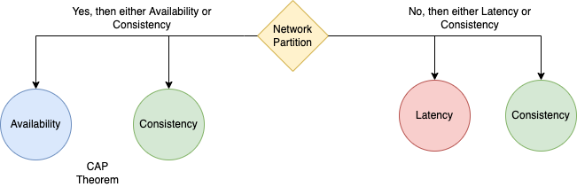

# PACELC theorem
The [PACELC](https://www.geeksforgeeks.org/the-cap-theorem-in-dbms/) theorem states that in a system that replicates data:
- If there is a network partition (‘P’), a distributed system can tradeoff between availability and consistency (i.e., ‘A’ and ‘C’);
- else (‘E’), when the system is running normally in the absence of partition failures, the system can trade off between latency (‘L’) and consistency (‘C’).

## Sub-Theorems
| Theorem                                                                             | Remarks                                                                                                                                                                                                                                    |
|-------------------------------------------------------------------------------------|--------------------------------------------------------------------------------------------------------------------------------------------------------------------------------------------------------------------------------------------|
| PA (Partition failure + Availability) / EL (No Partition Failure + Latency) systems | [DynamoDB](../../../../2_AWSComponents/6_DatabaseServices/AmazonDynamoDB/Readme.md) and [Cassandra](../../NoSQL-Databases/ApacheCasandra.md) choose availability over consistency when a partition occurs; otherwise, they choose lower latency. |
| PC (Partition failure + Consistency) / EC (No Partition Failure + Consistency)      | [HBase](../../NoSQL-Databases/ApacheHBase.md) & BigTable will always choose consistency, giving up availability and lower latency.                                                                                                            |
| PA (Partition failure + Availability) / EC (No Partition Failure + Consistency)     | In the case of a network partition, [MongoDB](../../NoSQL-Databases/MongoDB) chooses availability, but otherwise guarantees consistency.                                                                                                      |

# Source(s) and further reading
- [The CAP Theorem in DBMS](https://www.geeksforgeeks.org/the-cap-theorem-in-dbms/)