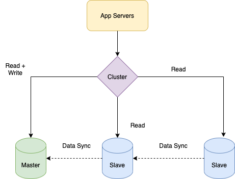

# :star: Single-Leader replication

> Also known as `Leader-Follower`, `Master-Slave`, `Primary-Replica` replication.

| Term                                                            | Description                                                                                                                                                                                                                                                                                                                                                                                                                                         |
|-----------------------------------------------------------------|-----------------------------------------------------------------------------------------------------------------------------------------------------------------------------------------------------------------------------------------------------------------------------------------------------------------------------------------------------------------------------------------------------------------------------------------------------|
| Leader (also known as master or primary)                        | One of the replicas is designated the leader (also known as `master or primary`).  - When clients want to write to the database, they must send their requests to the leader, which first writes the new data to its local storage.                                                                                                                                                                                                             |
| Followers (read replicas, slaves, secondaries, or hot standbys) | Whenever the leader writes new data to its local storage, it also sends the data change to all of its followers as part of a [replication log or change stream](https://www.stitchdata.com/docs/replication/replication-methods/log-based-incremental).  - Each follower takes the log from the leader and updates its local copy of the data‐ base accordingly, by applying all writes in the same order as they were processed on the leader. |

# :stopwatch: Replica Lag - A major problem
- It takes time (known as [Replica Lag](https://cloud.google.com/sql/docs/mysql/replication/replication-lag)) for data to be replicated b/w replicas in [multiple highly available zones (or regions)](../../../../2_AWSComponents/AWS-Global-Architecture-Region-AZ.md).
- Hence, [data consistency](Readme.md) won't be there for those milliseconds, which is known as [replica lag](https://cloud.google.com/sql/docs/mysql/replication/replication-lag).

| Application                                                                                                                        |
|------------------------------------------------------------------------------------------------------------------------------------|
| [Replication lag - Amazon Aurora vs RDS](../../../../2_AWSComponents/6_DatabaseServices/AmazonRDS/AmazonAuroraVsOtherDBEngines.md) |
| [Flipkart - MySQL Replication Lag Analysis](../../../../3_HLDDesignProblems/Others/FlipkartMySQLReplicationLagAnalysis/Readme.md)  |

# Supported services

This replication is available as a built-in-feature in various technologies.

| Type                     | Tech                                                                                                                                                                                                                                                 |
|--------------------------|------------------------------------------------------------------------------------------------------------------------------------------------------------------------------------------------------------------------------------------------------|
| SQL/Relational Databases | [Amazon Aurora](../../../../2_AWSComponents/6_DatabaseServices/AmazonRDS/AmazonAurora/Readme.md), PostgresSQL, MySQL etc.                                                                                                                            |
| NoSQL Databases          | [Amazon Elastic Cache (Cluster Disabled)](../../../../2_AWSComponents/6_DatabaseServices/AmazonElasticCache/ClusterMode.md), [Redis - Master Slave Replication](../../In-Memory-DB/Redis/RedisLeaderFollowReplication.md), MongoDB, DynamoDB etc. |
| Message Brokers          | [Kafka Cluster](../../../4_MessageBrokers/Kafka/Readme.md), RabbitMQ                                                                                                                                                                                 |

# Leader Election Process
- In case of failed leader, new leader would be chosen through an election process (where the leader is chosen by a majority of the remaining replicas), or by a previously [elected controller node](../../../7_ClusterCoordinationService/ControllerNode.md).
- Technologies like [Zookeeper](../../../7_ClusterCoordinationService/ApacheZookeeper.md) service is helpful for coordinating the election process.